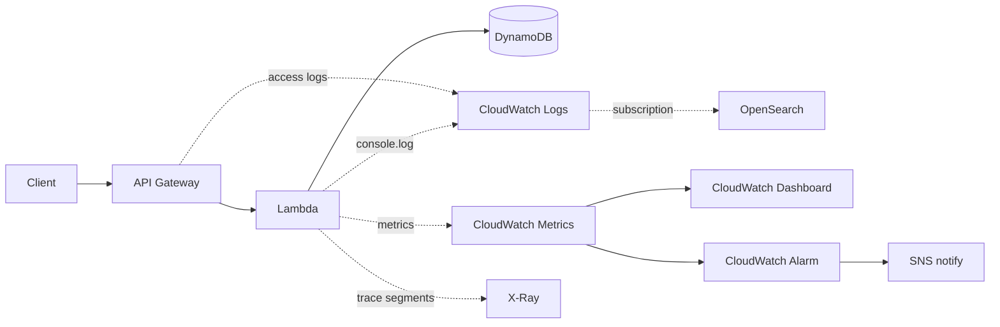

# J10: Observability

**TL;DR**: Tanpa observability, debug produksi adalah tebak-tebakan. Pasang tiga pillar (metrics, logs, traces) ke aplikasi Lambda + API. CloudWatch handle metrics + logs. X-Ray handle distributed tracing. OpenSearch untuk log search. Di Floci, X-Ray diganti Jaeger lokal.

Waktu estimasi: 40 menit.

## Apa yang kita bangun

Tambah observability ke API Notes dari [J2](/id/aws/journeys/j2-rest-api). Setelah selesai, kamu bisa jawab:
- "Endpoint mana paling sering dipanggil?" -> CloudWatch Metrics.
- "Request yang error tadi, error apa di line berapa?" -> CloudWatch Logs query.
- "Request ini lambat 5 detik, di Lambda atau DynamoDB?" -> X-Ray trace map.
- "User mana paling sering hit error?" -> OpenSearch log analytics.

## Tiga pillar observability

| Pillar | Pertanyaan yang dijawab | AWS service |
|---|---|---|
| **Metrics** | berapa rate request, latency p99, error rate | CloudWatch Metrics |
| **Logs** | apa output app saat request X | CloudWatch Logs + OpenSearch |
| **Traces** | jalur request melewati service mana, berapa lama tiap step | X-Ray |

Plus pillar tambahan (modern):
- **Events**: structured business event (order_created, payment_failed). Pakai EventBridge + log.
- **Profiles**: continuous profiling code level. CodeGuru Profiler.

## Arsitektur



## Floci coverage

| Service | Status | Catatan |
|---|---|---|
| CloudWatch Logs | ✅ full | log group, log stream, filter |
| CloudWatch Metrics | ✅ full | custom metric, alarm |
| OpenSearch | ✅ full | REST JSON, query |
| X-Ray | ❌ gap | pakai **Jaeger** lokal sebagai pengganti |
| Lambda, API Gateway, DynamoDB | ✅ full | dari journey lain |

X-Ray gap signifikan. Workaround: deploy Jaeger via Docker, instrument app pakai OpenTelemetry SDK (vendor-neutral, switch ke X-Ray di produksi dengan ganti exporter).

## Setup lokal

```bash
mkdir j10-observability && cd j10-observability
```

```yaml
# docker-compose.yml
services:
  floci:
    image: floci/floci:latest
    ports: ['4566:4566']
    volumes:
      - /var/run/docker.sock:/var/run/docker.sock

  jaeger:
    image: jaegertracing/all-in-one:latest
    ports:
      - '16686:16686'   # UI
      - '4317:4317'     # OTLP gRPC
      - '4318:4318'     # OTLP HTTP
    environment:
      COLLECTOR_OTLP_ENABLED: 'true'
```

```bash
docker compose up -d
alias awsl='aws --endpoint-url=http://localhost:4566'
```

Akses Jaeger UI: `http://localhost:16686`.

## Step build

### 1. Setup CloudWatch Logs untuk Lambda

Lambda auto-create log group `/aws/lambda/<function-name>` saat first invocation. Pre-create supaya bisa atur retention dari awal:

```bash
awsl logs create-log-group --log-group-name /aws/lambda/notes-api
awsl logs put-retention-policy \
  --log-group-name /aws/lambda/notes-api \
  --retention-in-days 7
```

Default retention infinite (mahal jangka panjang). Set 7-30 hari untuk produksi normal.

### 2. Lambda dengan structured logging + OTel tracing

Pakai pino untuk structured JSON log. Pakai `@opentelemetry/api` untuk trace.

```js
// handler.js
const pino = require('pino')
const { NodeSDK } = require('@opentelemetry/sdk-node')
const { OTLPTraceExporter } = require('@opentelemetry/exporter-trace-otlp-http')
const { Resource } = require('@opentelemetry/resources')
const { SemanticResourceAttributes } = require('@opentelemetry/semantic-conventions')
const { trace } = require('@opentelemetry/api')

const otel = new NodeSDK({
  resource: new Resource({
    [SemanticResourceAttributes.SERVICE_NAME]: 'notes-api'
  }),
  traceExporter: new OTLPTraceExporter({
    url: process.env.OTEL_EXPORTER_OTLP_ENDPOINT || 'http://jaeger:4318/v1/traces'
  })
})
otel.start()

const log = pino({
  level: process.env.LOG_LEVEL || 'info',
  base: { service: 'notes-api', env: process.env.NODE_ENV }
})

const tracer = trace.getTracer('notes-api')

exports.handler = async (event) => {
  return await tracer.startActiveSpan('handler', async (span) => {
    const requestId = event.requestContext.requestId
    const method = event.requestContext.http.method

    span.setAttributes({
      'http.method': method,
      'http.path': event.requestContext.http.path,
      'aws.request_id': requestId
    })

    log.info({ requestId, method, path: event.requestContext.http.path },
             'request started')

    try {
      const result = await processRequest(event, span)
      log.info({ requestId, status: result.statusCode }, 'request completed')
      span.end()
      return result
    } catch (err) {
      log.error({ requestId, err: err.message, stack: err.stack },
                'request failed')
      span.recordException(err)
      span.setStatus({ code: 2, message: err.message }) // ERROR
      span.end()
      throw err
    }
  })
}

async function processRequest(event, parentSpan) {
  return await tracer.startActiveSpan('processRequest', async (span) => {
    // Simulate DB call dengan child span
    await tracer.startActiveSpan('dynamodb.query', async (dbSpan) => {
      dbSpan.setAttributes({
        'db.system': 'dynamodb',
        'db.operation': 'Query'
      })
      await new Promise(r => setTimeout(r, 50))  // fake latency
      dbSpan.end()
    })

    span.end()
    return {
      statusCode: 200,
      body: JSON.stringify({ message: 'ok' })
    }
  })
}
```

Pattern penting:
- **Structured log**: JSON dengan field konsisten (`requestId`, `method`, `path`). Mudah di-query.
- **Correlation ID**: `requestId` muncul di tiap log line. Trace semua log untuk satu request.
- **Trace span hierarchy**: parent (handler) -> child (processRequest) -> grandchild (dynamodb.query). Visualisasi waterfall di Jaeger.
- **Span attributes**: tag dengan semantic convention OTel. Standard untuk cross-tool compatibility.

### 3. Deploy Lambda

```bash
npm init -y
npm install pino @opentelemetry/api @opentelemetry/sdk-node \
  @opentelemetry/exporter-trace-otlp-http @opentelemetry/resources \
  @opentelemetry/semantic-conventions

zip -r function.zip handler.js node_modules package.json

awsl lambda create-function --function-name notes-api \
  --runtime nodejs20.x --handler handler.handler \
  --role arn:aws:iam::000000000000:role/notes-lambda-role \
  --zip-file fileb://function.zip \
  --environment "Variables={NODE_ENV=dev,LOG_LEVEL=debug,OTEL_EXPORTER_OTLP_ENDPOINT=http://jaeger:4318/v1/traces}"
```

### 4. Generate traffic

```bash
API_ID=$(awsl apigatewayv2 create-api --name notes-api \
  --protocol-type HTTP \
  --target arn:aws:lambda:us-east-1:000000000000:function:notes-api \
  --query 'ApiId' --output text)

API_URL="http://localhost:4566/restapis/$API_ID/local/_user_request_"

for i in {1..20}; do
  curl -s -X GET $API_URL/notes > /dev/null
done
```

### 5. Lihat hasil

**Logs di CloudWatch**:

```bash
awsl logs tail /aws/lambda/notes-api --follow
```

Output JSON structured. Bisa di-query dengan CloudWatch Logs Insights syntax:

```bash
awsl logs start-query \
  --log-group-name /aws/lambda/notes-api \
  --start-time $(date -d '1 hour ago' +%s) \
  --end-time $(date +%s) \
  --query-string 'fields @timestamp, requestId, method, path
                  | filter level = "error"
                  | sort @timestamp desc
                  | limit 20'
```

**Traces di Jaeger**:

Buka `http://localhost:16686`. Pilih service `notes-api`, klik Find Traces. Tiap trace shows waterfall: handler -> processRequest -> dynamodb.query, dengan durasi tiap span.

**Metrics di CloudWatch**:

```bash
awsl cloudwatch get-metric-statistics \
  --namespace AWS/Lambda \
  --metric-name Invocations \
  --dimensions Name=FunctionName,Value=notes-api \
  --start-time $(date -d '1 hour ago' --iso-8601=seconds) \
  --end-time $(date --iso-8601=seconds) \
  --period 60 \
  --statistics Sum
```

Lambda otomatis emit metric: Invocations, Duration, Errors, Throttles. Tidak butuh code tambahan.

### 6. Custom metric

Untuk metric domain-specific (mis. orders_per_minute), pakai EMF (Embedded Metric Format). Tulis structured log dengan format khusus, CloudWatch ekstrak jadi metric.

```js
// di handler.js, tambahkan:
function emitMetric(name, value, unit = 'Count', dimensions = {}) {
  console.log(JSON.stringify({
    _aws: {
      Timestamp: Date.now(),
      CloudWatchMetrics: [{
        Namespace: 'NotesApp',
        Dimensions: [Object.keys(dimensions)],
        Metrics: [{ Name: name, Unit: unit }]
      }]
    },
    ...dimensions,
    [name]: value
  }))
}

// Pakai:
emitMetric('NotesCreated', 1, 'Count', { environment: 'dev' })
emitMetric('NotesSize', body.text.length, 'Bytes', { environment: 'dev' })
```

CloudWatch auto-parse log line ini, ekstrak ke metric `NotesApp/NotesCreated`. Tidak butuh `cloudwatch:PutMetricData` permission, tidak butuh API call extra.

### 7. CloudWatch Alarm

Alert kalau error rate naik:

```bash
awsl cloudwatch put-metric-alarm \
  --alarm-name notes-api-high-errors \
  --metric-name Errors \
  --namespace AWS/Lambda \
  --dimensions Name=FunctionName,Value=notes-api \
  --statistic Sum --period 60 \
  --threshold 5 --evaluation-periods 2 \
  --comparison-operator GreaterThanThreshold \
  --treat-missing-data notBreaching \
  --alarm-actions arn:aws:sns:us-east-1:000000000000:ops-alerts
```

`evaluation-periods 2` artinya kondisi harus true 2 periode berturut (2 menit) baru fire. Hindari false positive dari spike sesaat.

### 8. Log ke OpenSearch (untuk full-text search)

CloudWatch Logs Insights cocok untuk query terstruktur, tapi untuk full-text search atau dashboard kompleks pakai OpenSearch.

```bash
awsl opensearch create-domain \
  --domain-name app-logs \
  --engine-version "OpenSearch_2.11" \
  --cluster-config InstanceType=t3.small.search,InstanceCount=1
```

Subscribe log group ke OpenSearch:

```bash
awsl logs put-subscription-filter \
  --log-group-name /aws/lambda/notes-api \
  --filter-name to-opensearch \
  --filter-pattern '' \
  --destination-arn arn:aws:lambda:us-east-1:000000000000:function:logs-to-opensearch
```

(Butuh Lambda perantara yang parse log dan kirim ke OpenSearch. Template CloudFormation `cwl2es` sudah disediakan AWS, atau pakai Kinesis Firehose ke OpenSearch destination.)

Query di OpenSearch Dashboards: `http://opensearch-endpoint/_dashboards`.

## Deploy ke AWS asli

Ganti X-Ray flow:

1. **Hapus dependency Jaeger di code**: ganti exporter ke X-Ray, atau pakai AWS Distro for OpenTelemetry (ADOT) Lambda layer.
2. **Enable X-Ray active tracing di Lambda**:
   ```bash
   aws lambda update-function-configuration \
     --function-name notes-api \
     --tracing-config Mode=Active
   ```
3. **IAM role tambah X-Ray policy**:
   ```bash
   aws iam attach-role-policy --role-name notes-lambda-role \
     --policy-arn arn:aws:iam::aws:policy/AWSXRayDaemonWriteAccess
   ```
4. **API Gateway enable tracing** di stage settings.

Setelah ini, X-Ray service map muncul di console: visualisasi service-to-service call dengan latency, error rate.

### CloudWatch ServiceLens

Gabungan CloudWatch + X-Ray. Service map dengan metrics overlay (latency, errors, throughput) per node. Built-in untuk full-stack tracing.

### OpenSearch Serverless

Untuk traffic rendah, OpenSearch Serverless pay-per-OCU (collection unit). Murah untuk dev/staging, mahal di high-throughput.

## Gotcha

- **CloudWatch Logs cost mahal kalau verbose**: Lambda yang log setiap line bisa $50/bulan untuk 1 GB log. Kontrol via log level, retention, sampling.
- **Log line size limit 256 KB**: payload event Lambda kalau di-log full bisa truncated. Log selectively, jangan dump seluruh event.
- **X-Ray sampling default 1 request/detik + 5% rest**: bukan 100%. Untuk traffic tinggi tidak ekonomis trace semua, tapi sampling bisa miss issue jarang. Tweak sampling rule per request type.
- **CloudWatch Metrics latency 1-2 menit**: untuk real-time, pakai EMF custom metric dengan resolusi 1 detik (extra cost).
- **CloudWatch Alarm state stuck `INSUFFICIENT_DATA`**: `treat-missing-data notBreaching` penting untuk alarm berbasis count (Errors). Tanpa ini, alarm fire palsu setiap tidak ada traffic.
- **OpenSearch full-text query mahal**: cocok untuk forensic search post-incident, mahal untuk real-time. Pakai sampling atau Loki sebagai alternatif murah.
- **Correlation ID hilang antara service**: tanpa propagate trace header, X-Ray segment terpisah-pisah, susah connect. Pakai header `X-Amzn-Trace-Id` (X-Ray) atau `traceparent` (W3C / OTel).
- **Vendor lock-in dengan X-Ray native SDK**: pakai OpenTelemetry SDK saja, exporter ke X-Ray atau Jaeger atau Tempo. Switch tool tanpa rewrite app.
- **Sensitive data di log**: PII, password, token bisa lolos ke log. Set masking di structured logger, atau pakai CloudWatch Logs Data Protection (PII redaction managed).
- **Dashboard tidak shared antar akun**: CloudWatch Dashboard region-scoped + account-scoped. Untuk multi-account org, pakai cross-account observability (setup monitoring account).

## Cost (AWS asli)

Untuk Lambda 1M invocation/bulan dengan structured log + X-Ray active:

- CloudWatch Logs: 5 GB free, lalu $0.50/GB ingestion + $0.03/GB storage. Average 1 KB per log line, 5 line per invoke = 5 GB. Gratis untuk 1M invoke, $2-3 di luar itu.
- CloudWatch Metrics: 10 metric free, $0.30/metric/bulan setelah. Custom metric EMF, ~5-10 metric = gratis.
- CloudWatch Alarm: 10 free, $0.10/alarm/bulan.
- X-Ray: 100k trace gratis, $5/juta trace setelah. Dengan default sampling, biasanya cuma 5-10% dari traffic ter-trace.
- OpenSearch t3.small.search: $24/bulan + storage. Mahal untuk small workload. Skip kecuali beneran butuh full-text search.

Total tanpa OpenSearch: **sekitar $5/bulan untuk 1M invocation**. Dengan OpenSearch tambahan $24+.

Optimisasi:
- Set log retention 7-14 hari, bukan infinite.
- Pakai EMF custom metric, bukan PutMetricData (gratis vs $0.30/metric).
- Sampling X-Ray lebih rendah untuk endpoint high-traffic.
- Log JSON compact (1 line), bukan pretty-print (3-5 line per object).

## Cleanup

```bash
docker compose down -v
```

AWS asli:

```bash
aws logs delete-log-group --log-group-name /aws/lambda/notes-api
aws opensearch delete-domain --domain-name app-logs
aws cloudwatch delete-alarms --alarm-names notes-api-high-errors
```

## Next step

- Mau dashboard real-time? CloudWatch Dashboard, atau Grafana dengan CloudWatch datasource.
- Mau distributed tracing antar microservice? Setup OTel collector central, semua service emit ke sana.
- Mau log search yang lebih murah? Loki + Grafana (open-source) instead of OpenSearch.
- Mau APM proper (auto-instrument deeper)? Datadog, New Relic, Dynatrace. Vendor cost tinggi tapi insight jauh lebih dalam.
- Mau alert ke Slack, bukan email? SNS subscribe Lambda yang format dan POST ke Slack webhook.
