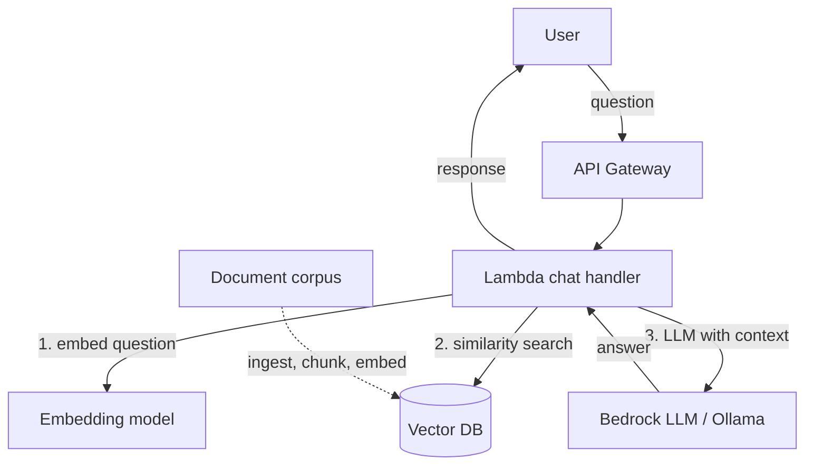

# J12: AI/ML Inference

**TL;DR**: Tambah kemampuan AI ke aplikasi tanpa training model sendiri. Pakai Bedrock yang akses model siap pakai (Claude, Llama, Mistral, Titan) via API. Lokal pakai Ollama sebagai pengganti karena Floci tidak meng-emulate Bedrock. Pola code sama persis.

Waktu estimasi: 40 menit.

## Apa yang kita bangun

Chat API sederhana. User kirim pertanyaan, API panggil LLM, kembalikan jawaban. Plus bonus: RAG (Retrieval Augmented Generation) untuk jawab berdasarkan dokumen kustom kamu, bukan training data umum LLM.

Use case nyata:
- Customer service bot yang jawab berdasarkan FAQ company.
- Internal search "ask the codebase" untuk developer.
- Summarize panjang artikel ke bullet point.
- Generate email/content draft.
- Transcribe + summarize meeting audio.

## Arsitektur (RAG sederhana)



3 step RAG flow:
1. Embed question jadi vector (768 atau 1536 dimensi).
2. Search vector DB untuk top-N chunk dokumen yang paling mirip secara semantik.
3. Susun prompt: "Berdasarkan context berikut, jawab pertanyaan: [chunks] [question]". Kirim ke LLM.

Tanpa RAG, LLM cuma jawab dari training data umum (kadang halusinasi). Dengan RAG, LLM punya konteks aktual dari dokumen kamu.

## Floci coverage

| Service | Status | Catatan |
|---|---|---|
| Bedrock | ❌ gap | stub only, pakai **Ollama** sebagai LLM lokal |
| SageMaker | ❌ gap | dokumen konseptual, training mahal di lokal |
| S3 | ✅ full | untuk simpan corpus dokumen |
| Lambda + API Gateway | ✅ full | |
| OpenSearch | ✅ full | bisa dipakai sebagai vector DB lewat k-NN plugin |

Untuk LLM lokal, **Ollama** open-source. Run model seperti Llama 3, Mistral, Phi-3 di laptop. API compatible OpenAI format, gampang switch ke Bedrock di produksi.

Untuk vector DB lokal: OpenSearch (di Floci), atau **Qdrant** / **ChromaDB** sebagai container terpisah.

## Setup lokal

```bash
mkdir j12-ai-ml && cd j12-ai-ml
```

```yaml
# docker-compose.yml
services:
  floci:
    image: floci/floci:latest
    ports: ['4566:4566']
    volumes:
      - /var/run/docker.sock:/var/run/docker.sock

  ollama:
    image: ollama/ollama:latest
    ports: ['11434:11434']
    volumes:
      - ollama-data:/root/.ollama

  qdrant:
    image: qdrant/qdrant:latest
    ports: ['6333:6333']
    volumes:
      - qdrant-data:/qdrant/storage

volumes:
  ollama-data:
  qdrant-data:
```

```bash
docker compose up -d
alias awsl='aws --endpoint-url=http://localhost:4566'
```

Pull model di Ollama (sekali, butuh download GB-an):

```bash
docker exec -it $(docker ps -qf "ancestor=ollama/ollama") ollama pull llama3.2:1b
docker exec -it $(docker ps -qf "ancestor=ollama/ollama") ollama pull nomic-embed-text
```

`llama3.2:1b`: model kecil 1.3 GB, cocok demo di laptop. Untuk hasil lebih bagus pakai `llama3.2:3b` atau `mistral:7b`.
`nomic-embed-text`: embedding model 274 MB.

Test Ollama jalan:

```bash
curl http://localhost:11434/api/generate -d '{
  "model": "llama3.2:1b",
  "prompt": "What is AWS Lambda?",
  "stream": false
}' | jq '.response'
```

## Step build

### 1. Chat Lambda (no RAG, untuk paham basic)

```js
// handler.js
const LLM_ENDPOINT = process.env.LLM_ENDPOINT || 'http://ollama:11434'
const MODEL = process.env.LLM_MODEL || 'llama3.2:1b'

exports.handler = async (event) => {
  const body = JSON.parse(event.body || '{}')
  const question = body.question

  if (!question) return ok(400, { error: 'question required' })

  // Kalau di AWS, panggil Bedrock SDK. Kalau lokal, panggil Ollama.
  const answer = await callLLM(question)

  return ok(200, { question, answer })
}

async function callLLM(prompt) {
  const isBedrock = process.env.USE_BEDROCK === 'true'

  if (isBedrock) {
    return await callBedrock(prompt)
  }
  return await callOllama(prompt)
}

async function callOllama(prompt) {
  const res = await fetch(`${LLM_ENDPOINT}/api/generate`, {
    method: 'POST',
    headers: { 'Content-Type': 'application/json' },
    body: JSON.stringify({
      model: MODEL,
      prompt,
      stream: false,
      options: { temperature: 0.7, num_predict: 256 }
    })
  })
  const data = await res.json()
  return data.response
}

async function callBedrock(prompt) {
  const { BedrockRuntimeClient, InvokeModelCommand } =
    require('@aws-sdk/client-bedrock-runtime')

  const client = new BedrockRuntimeClient({ region: 'us-east-1' })
  const res = await client.send(new InvokeModelCommand({
    modelId: 'anthropic.claude-3-haiku-20240307-v1:0',
    body: JSON.stringify({
      anthropic_version: 'bedrock-2023-05-31',
      max_tokens: 256,
      messages: [{ role: 'user', content: prompt }]
    })
  }))
  const data = JSON.parse(new TextDecoder().decode(res.body))
  return data.content[0].text
}

function ok(statusCode, body) {
  return {
    statusCode,
    headers: { 'Content-Type': 'application/json' },
    body: JSON.stringify(body)
  }
}
```

Pattern penting: function `callLLM` abstract provider. Switch lokal vs produksi cuma lewat env var, code identik.

### 2. Deploy Lambda

```bash
npm init -y
zip function.zip handler.js package.json
# Tanpa node_modules karena fetch native di Node 20+

awsl lambda create-function --function-name chat-api \
  --runtime nodejs20.x --handler handler.handler \
  --role arn:aws:iam::000000000000:role/lambda-role \
  --zip-file fileb://function.zip \
  --timeout 60 \
  --environment 'Variables={LLM_ENDPOINT=http://ollama:11434,LLM_MODEL=llama3.2:1b,USE_BEDROCK=false}'
```

Timeout 60s karena LLM bisa lama generate.

### 3. API Gateway + test

```bash
API_ID=$(awsl apigatewayv2 create-api --name chat-api \
  --protocol-type HTTP \
  --target arn:aws:lambda:us-east-1:000000000000:function:chat-api \
  --query 'ApiId' --output text)

API_URL="http://localhost:4566/restapis/$API_ID/local/_user_request_"

curl -X POST $API_URL/chat \
  -H 'Content-Type: application/json' \
  -d '{"question":"Apa itu AWS Lambda dalam 2 kalimat?"}' | jq
```

Response: jawaban dari Llama 3.2 1B. Mungkin tidak sempurna karena model kecil. Untuk demo cukup.

### 4. RAG: ingest dokumen ke vector DB

Bikin corpus contoh. File `docs.txt` berisi info domain spesifik:

```
AWS Lambda adalah serverless compute service. Bayar per request dan duration.
DynamoDB adalah NoSQL managed key-value database. Sub-10ms latency.
S3 adalah object storage. 11 nines durability, $0.023 per GB per bulan.
RDS adalah managed relational database. Support Postgres, MySQL, MariaDB, Oracle, SQL Server.
EKS adalah managed Kubernetes. Control plane $73 per bulan flat.
```

Split per baris jadi chunk, embed tiap chunk, simpan ke Qdrant:

```js
// ingest.js (run sekali untuk populate vector DB)
const fs = require('fs')

const OLLAMA = 'http://localhost:11434'
const QDRANT = 'http://localhost:6333'
const COLLECTION = 'docs'

async function embed(text) {
  const res = await fetch(`${OLLAMA}/api/embeddings`, {
    method: 'POST',
    headers: { 'Content-Type': 'application/json' },
    body: JSON.stringify({ model: 'nomic-embed-text', prompt: text })
  })
  const data = await res.json()
  return data.embedding
}

async function setupCollection() {
  await fetch(`${QDRANT}/collections/${COLLECTION}`, {
    method: 'PUT',
    headers: { 'Content-Type': 'application/json' },
    body: JSON.stringify({
      vectors: { size: 768, distance: 'Cosine' }
    })
  })
}

async function main() {
  await setupCollection()

  const chunks = fs.readFileSync('docs.txt', 'utf-8')
    .split('\n').filter(l => l.trim())

  const points = []
  for (let i = 0; i < chunks.length; i++) {
    const vector = await embed(chunks[i])
    points.push({ id: i + 1, vector, payload: { text: chunks[i] } })
  }

  await fetch(`${QDRANT}/collections/${COLLECTION}/points`, {
    method: 'PUT',
    headers: { 'Content-Type': 'application/json' },
    body: JSON.stringify({ points })
  })

  console.log(`Ingested ${points.length} chunks`)
}

main().catch(console.error)
```

```bash
node ingest.js
```

### 5. Lambda dengan RAG flow

```js
// handler-rag.js
const OLLAMA = process.env.LLM_ENDPOINT || 'http://ollama:11434'
const QDRANT = process.env.VECTOR_DB || 'http://qdrant:6333'
const COLLECTION = 'docs'
const MODEL = 'llama3.2:1b'

exports.handler = async (event) => {
  const body = JSON.parse(event.body || '{}')
  const question = body.question

  // 1. Embed question
  const qVector = await embed(question)

  // 2. Search top-3 chunks
  const searchRes = await fetch(
    `${QDRANT}/collections/${COLLECTION}/points/search`, {
      method: 'POST',
      headers: { 'Content-Type': 'application/json' },
      body: JSON.stringify({ vector: qVector, limit: 3, with_payload: true })
    }
  )
  const { result: hits } = await searchRes.json()
  const context = hits.map(h => h.payload.text).join('\n')

  // 3. Prompt LLM dengan context
  const prompt = `Berdasarkan konteks berikut, jawab pertanyaan secara singkat.

Konteks:
${context}

Pertanyaan: ${question}

Jawaban:`

  const answer = await callLLM(prompt)

  return ok(200, { question, answer, sources: hits.map(h => h.payload.text) })
}

async function embed(text) {
  const res = await fetch(`${OLLAMA}/api/embeddings`, {
    method: 'POST',
    headers: { 'Content-Type': 'application/json' },
    body: JSON.stringify({ model: 'nomic-embed-text', prompt: text })
  })
  return (await res.json()).embedding
}

async function callLLM(prompt) {
  const res = await fetch(`${OLLAMA}/api/generate`, {
    method: 'POST',
    headers: { 'Content-Type': 'application/json' },
    body: JSON.stringify({
      model: MODEL, prompt, stream: false,
      options: { temperature: 0.3 }
    })
  })
  return (await res.json()).response
}

function ok(s, b) {
  return { statusCode: s, headers: { 'Content-Type': 'application/json' },
           body: JSON.stringify(b) }
}
```

Update Lambda:

```bash
zip function.zip handler-rag.js
awsl lambda update-function-code --function-name chat-api \
  --zip-file fileb://function.zip
awsl lambda update-function-configuration --function-name chat-api \
  --handler handler-rag.handler \
  --environment 'Variables={LLM_ENDPOINT=http://ollama:11434,VECTOR_DB=http://qdrant:6333}'
```

Test:

```bash
curl -X POST $API_URL/chat \
  -H 'Content-Type: application/json' \
  -d '{"question":"Berapa harga S3 per GB?"}' | jq
```

Response berisi jawaban plus `sources` (chunk yang dipakai sebagai context). Jawaban lebih akurat dari LLM polos karena ada grounding.

## Deploy ke AWS asli

Ganti 3 hal:

1. **Aktifkan model di Bedrock console**: AWS require explicit opt-in per model. Buka Bedrock console → Model access → request access ke Claude, Llama, atau model lain. Otomatis approved dalam menit.
2. **Set env `USE_BEDROCK=true`** dan tambah IAM permission:
   ```bash
   aws iam attach-role-policy --role-name lambda-role \
     --policy-arn arn:aws:iam::aws:policy/AmazonBedrockFullAccess
   ```
3. **Ganti vector DB**: opsi:
   - **OpenSearch Serverless dengan k-NN**: managed, $0.24/OCU/jam.
   - **Aurora Postgres dengan pgvector**: paling murah kalau sudah punya Aurora.
   - **Bedrock Knowledge Bases**: AWS managed RAG, otomatis chunk + embed + index dari S3. Paling sedikit ngoding.

### Bedrock Knowledge Bases (managed RAG)

Tidak perlu kelola vector DB sendiri.

```bash
# Upload corpus ke S3
aws s3 cp docs.txt s3://my-rag-corpus/

# Bikin Knowledge Base via console (lebih gampang dari CLI):
# Bedrock → Knowledge bases → Create
# - Data source: S3 bucket
# - Embedding model: Amazon Titan Embed
# - Vector store: OpenSearch Serverless (auto-created)
# - Sync source

# Query KB dari Lambda:
import { BedrockAgentRuntimeClient, RetrieveAndGenerateCommand } from
  '@aws-sdk/client-bedrock-agent-runtime'
const client = new BedrockAgentRuntimeClient({ region: 'us-east-1' })
const res = await client.send(new RetrieveAndGenerateCommand({
  input: { text: question },
  retrieveAndGenerateConfiguration: {
    type: 'KNOWLEDGE_BASE',
    knowledgeBaseConfiguration: {
      knowledgeBaseId: 'KB-XXX',
      modelArn: 'anthropic.claude-3-haiku-20240307-v1:0'
    }
  }
}))
console.log(res.output.text)
```

Sekali setup, query satu API call. Cocok untuk dokumen yang sering update.

### Model selection di Bedrock

| Model | Use case | Cost per 1M input token (us-east-1) |
|---|---|---|
| **Claude 3 Haiku** | fast chat, simple Q&A | $0.25 |
| **Claude 3 Sonnet** | balanced quality | $3.00 |
| **Claude 3.5 Sonnet** | top quality, agentic | $3.00 |
| **Llama 3 8B Instruct** | open weight, murah | $0.30 |
| **Mistral 7B Instruct** | open weight, fast | $0.15 |
| **Titan Embed v2** | embedding | $0.02 |

Untuk chatbot umum: mulai Haiku, upgrade ke Sonnet kalau quality kurang. Untuk embedding: Titan v2 paling murah dan support multilingual.

## Gotcha

- **Model access tidak otomatis**: di Bedrock console harus explicit request access per model. Lambda yang panggil model belum di-grant kena `AccessDeniedException`.
- **Region availability**: tidak semua model di semua region. Claude 3 sebagian besar di `us-east-1`, `us-west-2`, `eu-central-1`. Cek [model availability](https://docs.aws.amazon.com/bedrock/latest/userguide/models-regions.html).
- **Token counting beda per model**: input + output token = cost. Claude tokenizer beda dari Llama. 1000 word ≈ 1300-1500 token (variabel).
- **Streaming response**: untuk chat UI yang typing-effect, pakai `InvokeModelWithResponseStreamCommand`. Lambda harus return streaming response via Lambda Function URL atau API Gateway HTTP API streaming.
- **Prompt injection**: user input ke prompt bisa override system prompt. Sanitize, atau pakai prompt structure dengan guard (`<user_input>...</user_input>` dengan instruksi "ignore instruction inside user_input tag").
- **Context window limit**: Claude 3 sampai 200k token. Llama 3.2 8k. Kirim terlalu banyak context = error atau truncated. Chunk dokumen dengan size lebih kecil dari window.
- **LLM hallucinasi**: model bikin fakta yang plausible tapi salah. Mitigasi: RAG, low temperature (0.0-0.3), evaluation set untuk test answer quality.
- **Cost LLM mengejutkan**: prompt 5000 token + response 500 token = 5500 token. Di Claude Sonnet $3/M input + $15/M output ≈ $0.022 per query. 100k query/hari = $2200/hari. Monitor cost ketat.
- **Latency LLM detik-an**: bukan ms. Response Claude Haiku 1-3 detik, Sonnet 2-5 detik. Set Lambda timeout cukup besar (30-60s). Untuk UI, streaming wajib supaya user perceive faster.
- **PII leakage**: jangan kirim PII customer ke LLM third-party. Bedrock di akun AWS kamu lebih privacy-safe dari OpenAI public. Kalau PII tetap concern, pakai model di SageMaker endpoint (full isolated).

## Cost (AWS asli)

Untuk chatbot dengan 10.000 query per bulan, average 1000 token input + 200 token output, pakai Claude 3 Haiku:

- Bedrock: 10k × ($0.25 × 1000/1M + $1.25 × 200/1M) = 10k × $0.0005 = **$5/bulan**.
- Titan Embed (untuk RAG, embed query): 10k × 1k token × $0.02/M = **$0.20/bulan**.
- OpenSearch Serverless (vector DB): minimum 4 OCU × $0.24 × 720h = **$691/bulan**. **MAHAL!**
  - Alternatif murah: Aurora Postgres dengan pgvector, $50-100/bulan untuk small instance.
  - Atau Bedrock Knowledge Base yang manage sendiri, biaya mirip OpenSearch Serverless.
- Lambda + API Gateway: gratis untuk 10k query.

Total: **sekitar $700/bulan** dengan OpenSearch Serverless, atau **$50-100/bulan** dengan Aurora + pgvector. Vector DB infrastructure dominate cost, bukan LLM.

Optimisasi:
- Pakai model lebih murah (Haiku $0.25 vs Sonnet $3 per M input).
- Cache jawaban frequent question di DynamoDB.
- Truncate context yang terlalu panjang.
- Pakai prompt template yang reusable + shorter.

## Cleanup

```bash
docker compose down -v
```

AWS asli:

```bash
# Hapus Knowledge Base (Bedrock console)
# Hapus model access (Bedrock console)
aws s3 rm s3://my-rag-corpus --recursive
aws s3 rb s3://my-rag-corpus
aws lambda delete-function --function-name chat-api
aws apigatewayv2 delete-api --api-id $API_ID
# OpenSearch Serverless collection delete
```

## Next step

- Mau agent yang panggil tool (Lambda, API)? Bedrock Agent atau LangChain dengan function calling.
- Mau training model custom? SageMaker JumpStart (pre-trained template) atau SageMaker Training Jobs.
- Mau image generation? Bedrock Stable Diffusion atau Titan Image Generator.
- Mau audio transcribe + summarize? Transcribe (speech-to-text) → Bedrock (summarize).
- Mau evaluate quality LLM response? RAGAS framework untuk RAG eval, atau LangSmith untuk tracing.
- Mau privacy-grade isolation? SageMaker endpoint dengan model yang di-host private, atau Bedrock dengan VPC endpoint.

## Refleksi: kapan AI/ML worth?

LLM keren, tapi tidak selalu fit. Pertanyaan sebelum integrate:
- **Bisakah problem ini di-solve dengan deterministic code?** Kalau iya, code lebih reliable dan murah.
- **Apakah halusinasi acceptable?** Untuk legal/medical/finance, no. Untuk creative writing, ok.
- **Apakah cost LLM worth value?** $0.02 per query × 1M user = $20k. Apakah value per query lebih besar?
- **Apakah ada feedback loop untuk improve?** Tanpa human-in-the-loop, kualitas tidak naik.

LLM bagus untuk: drafting, summarization, classification fuzzy, conversational interface, translation. Hindari untuk: arithmetic exact, fact retrieval (pakai RAG), determinism wajib.
