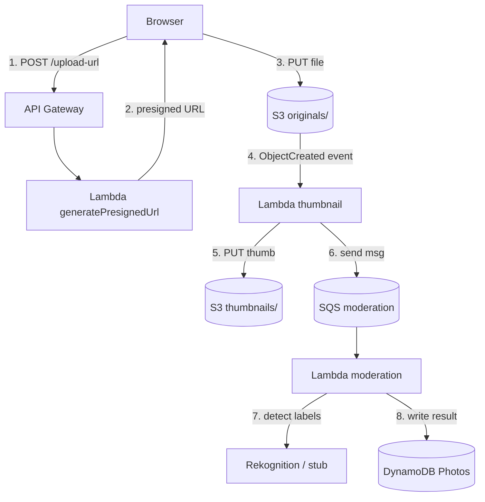

# J4: File Upload Pipeline

**TL;DR**: User upload foto langsung ke S3 (tanpa lewat server), trigger pipeline async: generate thumbnail, scan konten untuk konten tidak pantas, simpan metadata. Pola ini sama untuk avatar, dokumen, video, dan file lain.

Waktu estimasi: 45 menit.

## Apa yang kita bangun

Aplikasi photo gallery sederhana. Flow:

1. Browser minta presigned URL ke API.
2. Browser upload file langsung ke S3 pakai presigned URL itu (bypass backend).
3. S3 trigger Lambda thumbnail begitu file masuk.
4. Lambda thumbnail bikin versi kecil, simpan ke S3 di folder berbeda.
5. Lambda thumbnail kirim pesan ke SQS untuk moderation.
6. Lambda moderation consume dari SQS, panggil Rekognition (atau stub di Floci), simpan hasil di DynamoDB.

Hasil akhir di DynamoDB: `photo_id`, `original_key`, `thumbnail_key`, `status` (approved/rejected/pending), `labels` (apa yang dideteksi).

## Arsitektur



Kenapa pola ini bagus:
- **Decoupled**: upload tidak nunggu thumbnail selesai. User langsung terima response.
- **Resilient**: SQS retry kalau moderation Lambda fail. Tanpa SQS, satu error = data hilang.
- **Scalable**: tiap Lambda scale independen sesuai beban.

## Floci coverage

| Service | Status | Catatan |
|---|---|---|
| S3 | ✅ full | presigned URL, event notification |
| Lambda | ✅ full | Docker-native |
| SQS | ✅ full | standard queue |
| DynamoDB | ✅ full | |
| Rekognition | ❌ gap | pakai stub Lambda untuk simulasi |
| IAM | ✅ full | |

Gap Rekognition tidak menghalangi journey. Kode pipeline sama persis, cuma logic moderation diganti random response. Untuk produksi, ganti panggilan stub ke `rekognition.detectModerationLabels()` aslinya.

## Setup lokal

```bash
mkdir j4-file-upload && cd j4-file-upload
```

`docker-compose.yml`:

```yaml
services:
  floci:
    image: floci/floci:latest
    ports: ['4566:4566']
    volumes:
      - /var/run/docker.sock:/var/run/docker.sock
```

```bash
docker compose up -d
alias awsl='aws --endpoint-url=http://localhost:4566'
```

## Step build

### 1. Bikin bucket S3 dengan dua "folder"

S3 tidak punya folder beneran. Folder cuma prefix di object key. Kita pakai prefix `originals/` dan `thumbnails/`.

```bash
awsl s3 mb s3://photos-app
```

CORS supaya browser bisa PUT langsung dari domain berbeda:

```bash
cat > cors.json << 'EOF'
{
  "CORSRules": [{
    "AllowedOrigins": ["*"],
    "AllowedMethods": ["PUT", "GET"],
    "AllowedHeaders": ["*"],
    "ExposeHeaders": ["ETag"]
  }]
}
EOF

awsl s3api put-bucket-cors --bucket photos-app --cors-configuration file://cors.json
```

Untuk produksi, ganti `"*"` dengan origin spesifik (`https://app.example.com`).

### 2. Bikin DynamoDB table

```bash
awsl dynamodb create-table \
  --table-name Photos \
  --attribute-definitions AttributeName=photo_id,AttributeType=S \
  --key-schema AttributeName=photo_id,KeyType=HASH \
  --billing-mode PAY_PER_REQUEST
```

### 3. Bikin SQS queue

```bash
QUEUE_URL=$(awsl sqs create-queue --queue-name photo-moderation \
  --query 'QueueUrl' --output text)
QUEUE_ARN=$(awsl sqs get-queue-attributes --queue-url $QUEUE_URL \
  --attribute-names QueueArn --query 'Attributes.QueueArn' --output text)
echo "Queue ARN: $QUEUE_ARN"
```

Set visibility timeout 30 detik (waktu Lambda untuk process sebelum pesan muncul lagi):

```bash
awsl sqs set-queue-attributes --queue-url $QUEUE_URL \
  --attributes VisibilityTimeout=30
```

### 4. IAM role untuk Lambda

Pakai role dari journey sebelumnya (`notes-lambda-role`), atau bikin baru:

```bash
cat > trust-policy.json << 'EOF'
{
  "Version": "2012-10-17",
  "Statement": [{
    "Effect": "Allow",
    "Principal": { "Service": "lambda.amazonaws.com" },
    "Action": "sts:AssumeRole"
  }]
}
EOF

awsl iam create-role --role-name photos-lambda-role \
  --assume-role-policy-document file://trust-policy.json

for POLICY in AWSLambdaBasicExecutionRole AmazonS3FullAccess \
              AmazonSQSFullAccess AmazonDynamoDBFullAccess; do
  awsl iam attach-role-policy --role-name photos-lambda-role \
    --policy-arn arn:aws:iam::aws:policy/$POLICY
done

# Khusus Lambda execution: managed policy "AWSLambdaBasicExecutionRole" path-nya beda
awsl iam attach-role-policy --role-name photos-lambda-role \
  --policy-arn arn:aws:iam::aws:policy/service-role/AWSLambdaBasicExecutionRole
```

Production wajib scope ke resource spesifik bukan FullAccess (lihat [IAM](/id/aws/foundation/iam)).

### 5. Lambda 1: generatePresignedUrl

User panggil ini sebelum upload. Lambda bikin presigned URL valid 5 menit, return ke client.

```js
// handlers/generate-url.js
const { S3Client } = require('@aws-sdk/client-s3')
const { PutObjectCommand } = require('@aws-sdk/client-s3')
const { getSignedUrl } = require('@aws-sdk/s3-request-presigner')
const { randomUUID } = require('crypto')

const s3 = new S3Client({
  endpoint: process.env.AWS_ENDPOINT_URL,
  region: 'us-east-1',
  forcePathStyle: true
})

exports.handler = async (event) => {
  const body = JSON.parse(event.body || '{}')
  const ext = body.contentType?.split('/')[1] || 'jpg'
  const photoId = randomUUID()
  const key = `originals/${photoId}.${ext}`

  const cmd = new PutObjectCommand({
    Bucket: 'photos-app',
    Key: key,
    ContentType: body.contentType || 'image/jpeg'
  })
  const url = await getSignedUrl(s3, cmd, { expiresIn: 300 })

  return {
    statusCode: 200,
    headers: { 'Content-Type': 'application/json' },
    body: JSON.stringify({ photoId, key, uploadUrl: url })
  }
}
```

### 6. Lambda 2: thumbnail (S3 event trigger)

Saat object masuk ke `originals/`, S3 trigger Lambda ini. Lambda baca image, resize, tulis ke `thumbnails/`, kirim pesan ke SQS.

Pakai `sharp` untuk resize. Sharp punya native binary, install dengan platform Linux target:

```bash
mkdir handlers && cd handlers
npm init -y
npm install @aws-sdk/client-s3 @aws-sdk/client-sqs sharp \
  --platform=linux --arch=x64
cd ..
```

```js
// handlers/thumbnail.js
const { S3Client, GetObjectCommand, PutObjectCommand } =
  require('@aws-sdk/client-s3')
const { SQSClient, SendMessageCommand } =
  require('@aws-sdk/client-sqs')
const sharp = require('sharp')

const s3 = new S3Client({
  endpoint: process.env.AWS_ENDPOINT_URL,
  region: 'us-east-1',
  forcePathStyle: true
})
const sqs = new SQSClient({
  endpoint: process.env.AWS_ENDPOINT_URL,
  region: 'us-east-1'
})

exports.handler = async (event) => {
  for (const record of event.Records) {
    const bucket = record.s3.bucket.name
    const key = decodeURIComponent(record.s3.object.key.replace(/\+/g, ' '))

    const obj = await s3.send(new GetObjectCommand({ Bucket: bucket, Key: key }))
    const buffer = Buffer.concat(await collectChunks(obj.Body))

    const thumbBuffer = await sharp(buffer)
      .resize(200, 200, { fit: 'cover' })
      .jpeg({ quality: 80 })
      .toBuffer()

    const thumbKey = key.replace('originals/', 'thumbnails/')
    await s3.send(new PutObjectCommand({
      Bucket: bucket,
      Key: thumbKey,
      Body: thumbBuffer,
      ContentType: 'image/jpeg'
    }))

    const photoId = key.split('/')[1].split('.')[0]
    await sqs.send(new SendMessageCommand({
      QueueUrl: process.env.QUEUE_URL,
      MessageBody: JSON.stringify({ photoId, key, thumbKey, bucket })
    }))
  }
  return { statusCode: 200 }
}

async function collectChunks(stream) {
  const chunks = []
  for await (const chunk of stream) chunks.push(chunk)
  return chunks
}
```

### 7. Lambda 3: moderation (SQS trigger)

Konsumsi pesan dari SQS, panggil Rekognition (stub di Floci), tulis hasil ke DynamoDB.

```js
// handlers/moderate.js
const { DynamoDBClient } = require('@aws-sdk/client-dynamodb')
const { DynamoDBDocumentClient, PutCommand } =
  require('@aws-sdk/lib-dynamodb')

const ddb = DynamoDBDocumentClient.from(new DynamoDBClient({
  endpoint: process.env.AWS_ENDPOINT_URL,
  region: 'us-east-1'
}))

exports.handler = async (event) => {
  for (const record of event.Records) {
    const msg = JSON.parse(record.body)

    const result = await detectLabels(msg.bucket, msg.key)

    await ddb.send(new PutCommand({
      TableName: 'Photos',
      Item: {
        photo_id: msg.photoId,
        original_key: msg.key,
        thumbnail_key: msg.thumbKey,
        status: result.flagged ? 'rejected' : 'approved',
        labels: result.labels,
        moderatedAt: Date.now()
      }
    }))
  }
}

async function detectLabels(bucket, key) {
  // STUB: di Floci, Rekognition ga jalan beneran.
  // Production: panggil rekognition.detectModerationLabels({Image:{S3Object:{Bucket,Name:key}}}).
  // Random 90% approve untuk simulasi.
  const approved = Math.random() > 0.1
  return {
    flagged: !approved,
    labels: approved
      ? ['Person', 'Outdoor']
      : ['ExplicitContent']
  }
}
```

### 8. Package & deploy semua Lambda

```bash
cd handlers
zip -r ../generate-url.zip generate-url.js node_modules package.json
zip -r ../thumbnail.zip thumbnail.js node_modules package.json
zip -r ../moderate.zip moderate.js node_modules package.json
cd ..

ROLE_ARN="arn:aws:iam::000000000000:role/photos-lambda-role"
ENV="Variables={AWS_ENDPOINT_URL=http://floci:4566,QUEUE_URL=$QUEUE_URL}"

awsl lambda create-function --function-name photos-generate-url \
  --runtime nodejs20.x --handler generate-url.handler \
  --role $ROLE_ARN --zip-file fileb://generate-url.zip \
  --environment $ENV

awsl lambda create-function --function-name photos-thumbnail \
  --runtime nodejs20.x --handler thumbnail.handler \
  --role $ROLE_ARN --zip-file fileb://thumbnail.zip \
  --timeout 30 --memory-size 1024 \
  --environment $ENV

awsl lambda create-function --function-name photos-moderate \
  --runtime nodejs20.x --handler moderate.handler \
  --role $ROLE_ARN --zip-file fileb://moderate.zip \
  --environment $ENV
```

Thumbnail Lambda butuh memory lebih besar (sharp pakai banyak RAM) dan timeout lebih panjang.

### 9. Hubungkan S3 → Lambda thumbnail

Tambah izin S3 untuk invoke Lambda:

```bash
awsl lambda add-permission --function-name photos-thumbnail \
  --statement-id s3-invoke --action lambda:InvokeFunction \
  --principal s3.amazonaws.com \
  --source-arn arn:aws:s3:::photos-app
```

Bikin notification config:

```bash
cat > notification.json << 'EOF'
{
  "LambdaFunctionConfigurations": [{
    "LambdaFunctionArn": "arn:aws:lambda:us-east-1:000000000000:function:photos-thumbnail",
    "Events": ["s3:ObjectCreated:*"],
    "Filter": {
      "Key": { "FilterRules": [{ "Name": "prefix", "Value": "originals/" }] }
    }
  }]
}
EOF

awsl s3api put-bucket-notification-configuration \
  --bucket photos-app --notification-configuration file://notification.json
```

Filter `originals/` penting. Tanpa ini, thumbnail yang ditulis ke `thumbnails/` akan trigger Lambda lagi = infinite loop.

### 10. Hubungkan SQS → Lambda moderate

```bash
awsl lambda create-event-source-mapping \
  --function-name photos-moderate \
  --event-source-arn $QUEUE_ARN \
  --batch-size 5
```

### 11. Bikin API Gateway untuk generate-url

```bash
API_ID=$(awsl apigatewayv2 create-api \
  --name photos-api --protocol-type HTTP \
  --target arn:aws:lambda:us-east-1:000000000000:function:photos-generate-url \
  --query 'ApiId' --output text)

API_URL="http://localhost:4566/restapis/$API_ID/local/_user_request_"
echo "API: $API_URL"
```

### 12. Test full flow

```bash
# 1. Request presigned URL
RESP=$(curl -s -X POST $API_URL/upload-url \
  -H 'Content-Type: application/json' \
  -d '{"contentType":"image/jpeg"}')
echo $RESP | jq

PHOTO_ID=$(echo $RESP | jq -r '.photoId')
UPLOAD_URL=$(echo $RESP | jq -r '.uploadUrl')

# 2. Upload file pakai presigned URL
curl -X PUT "$UPLOAD_URL" \
  --data-binary @sample.jpg \
  -H 'Content-Type: image/jpeg'

# 3. Tunggu pipeline (thumbnail + moderation)
sleep 5

# 4. Cek thumbnail exists
awsl s3 ls s3://photos-app/thumbnails/

# 5. Cek DynamoDB
awsl dynamodb get-item --table-name Photos \
  --key "{\"photo_id\":{\"S\":\"$PHOTO_ID\"}}"
```

Hasil DynamoDB harus berisi `status: approved` atau `rejected`, plus `labels`.

Sample image: pakai foto JPEG apa saja di working directory, atau download:

```bash
curl -o sample.jpg https://picsum.photos/800
```

## Deploy ke AWS asli

Tiga perubahan dari pola lokal:

1. **Endpoint**: hapus `awsl` alias.
2. **Account ID di ARN**: ganti `000000000000`.
3. **Ganti stub Rekognition**: hapus `detectLabels()` fake, panggil API beneran:

```js
const { RekognitionClient, DetectModerationLabelsCommand } =
  require('@aws-sdk/client-rekognition')
const rek = new RekognitionClient({ region: 'us-east-1' })

async function detectLabels(bucket, key) {
  const res = await rek.send(new DetectModerationLabelsCommand({
    Image: { S3Object: { Bucket: bucket, Name: key } },
    MinConfidence: 70
  }))
  return {
    flagged: res.ModerationLabels.length > 0,
    labels: res.ModerationLabels.map(l => l.Name)
  }
}
```

Tambah `AmazonRekognitionReadOnlyAccess` policy ke role moderation.

## Gotcha

- **Infinite loop S3-Lambda**: filter prefix di event notification wajib. Thumbnail tulis ke bucket sama = re-trigger Lambda tanpa filter.
- **Presigned URL bocor di log**: URL berisi signature, kalau di-log bisa di-replay sebelum expire. Set expiry pendek (1-5 menit), jangan log.
- **CORS issue di browser**: kalau `PUT` dari browser kena CORS error, pastikan `AllowedHeaders` di S3 CORS config include semua header yang dikirim klien.
- **Sharp tidak portable**: install di Mac, deploy ke Lambda Linux, crash. Pakai `--platform=linux --arch=x64` saat `npm install`, atau pakai Lambda Layer dengan sharp pre-compiled.
- **Lambda timeout < waktu sharp**: foto besar (15+ MB) butuh waktu lama resize. Tingkatkan memory (sharp scale dengan RAM) dan timeout.
- **SQS message lebih besar dari 256 KB**: max payload SQS. Untuk passing image, kirim S3 key saja, jangan body image.
- **At-least-once delivery SQS**: pesan bisa di-deliver lebih dari sekali. Lambda harus idempotent. Pakai `photo_id` sebagai key DynamoDB, `PutItem` overwrite tanpa side-effect.
- **Dead letter queue belum di-setup**: kalau Lambda moderation crash 3x untuk pesan yang sama, default SQS infinite retry. Setup DLQ untuk inspect pesan yang gagal.
- **Rekognition cost**: $1 per 1000 image. Untuk app dengan jutaan upload, mahal. Mitigasi: rate limit user upload, atau pre-filter via Lambda image-hash matching ke blacklist sebelum panggil Rekognition.

## Cost (AWS asli)

Untuk 10.000 upload foto per bulan, average 2 MB:

- S3 storage (original + thumbnail, asumsi 90% retained 1 tahun): ~25 GB total tahun pertama, $0.60/bulan terus naik.
- S3 PUT: 20k request (upload + thumbnail write) = $0.10.
- Lambda: 30k invocation total, durasi rata 500 ms 1 GB = $0.25 di luar free tier.
- SQS: 10k pesan = gratis (free tier 1 juta).
- DynamoDB: 10k write = cents.
- Rekognition: 10k image = $10. **Ini biaya dominan.**

Total: **sekitar $11/bulan untuk 10k upload**, dominated by Rekognition. Tanpa moderation, di bawah $2.

Tip cost: kalau use case tidak butuh moderation otomatis (mis. app private), skip Rekognition, save $10. Pakai Lambda yang manual flag dengan rule sederhana, atau queue ke human reviewer.

## Cleanup

```bash
docker compose down -v
```

AWS asli, urutan delete penting karena dependency:

```bash
# Hapus event mapping dulu
aws lambda list-event-source-mappings --function-name photos-moderate \
  --query 'EventSourceMappings[*].UUID' --output text | \
  xargs -I {} aws lambda delete-event-source-mapping --uuid {}

# Hapus S3 notification config
aws s3api put-bucket-notification-configuration \
  --bucket photos-app --notification-configuration '{}'

# Empty bucket lalu hapus
aws s3 rm s3://photos-app --recursive
aws s3 rb s3://photos-app

# Hapus resource lain
aws apigatewayv2 delete-api --api-id $API_ID
aws lambda delete-function --function-name photos-generate-url
aws lambda delete-function --function-name photos-thumbnail
aws lambda delete-function --function-name photos-moderate
aws sqs delete-queue --queue-url $QUEUE_URL
aws dynamodb delete-table --table-name Photos
```

## Next step

- Mau real-time notification ke user saat moderation selesai? Tambah WebSocket via API Gateway, atau SNS push.
- Mau resize ke banyak ukuran (mobile/tablet/desktop)? Lambda thumbnail loop semua size.
- Mau scan video bukan cuma image? Rekognition Video, async job dengan polling. Atau MediaConvert untuk format conversion.
- Mau event arsitektur lebih sophisticated? Lanjut ke J5: Event-Driven Backend dengan EventBridge.
