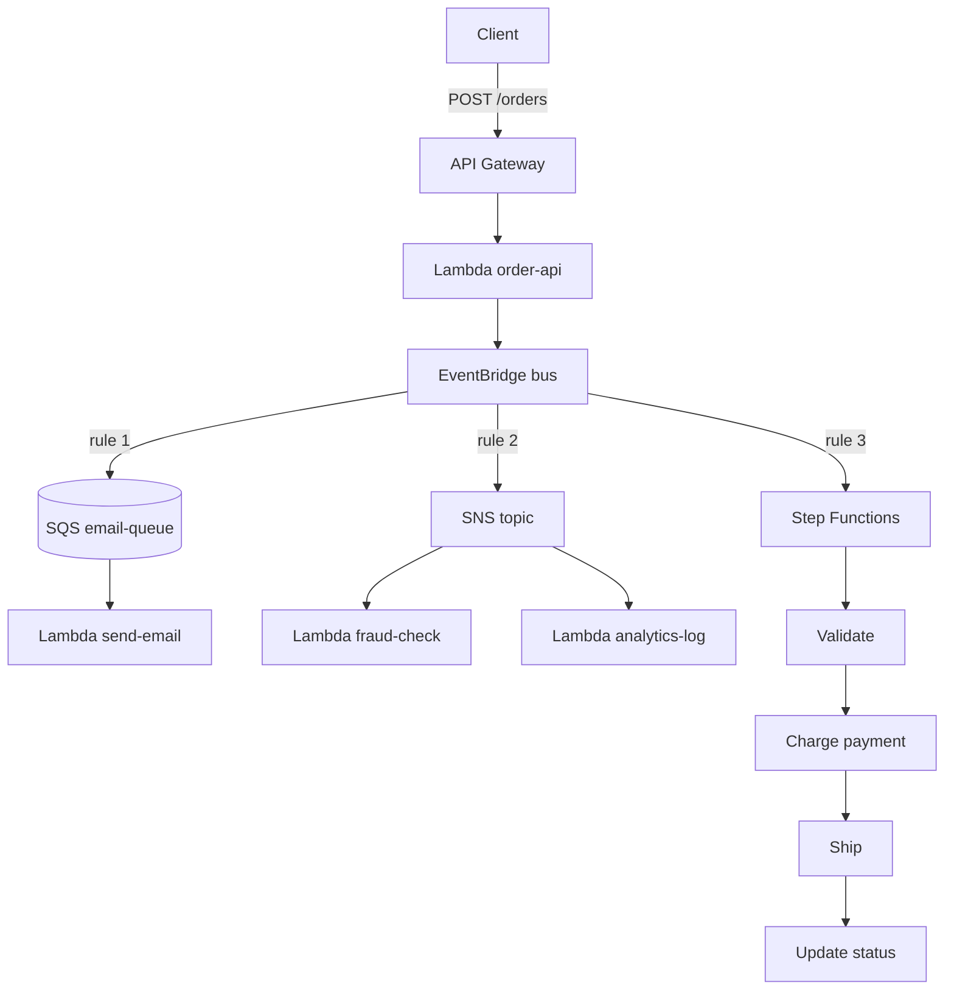

# J5: Event-Driven Backend

**TL;DR**: Daripada satu Lambda lakukan 5 hal sekaligus (kirim email, update inventory, fraud check, log analytics, fulfillment), publish event sekali, biarkan banyak consumer subscribe dan kerja paralel. Lebih maintainable, scale independen, gampang tambah feature baru tanpa ubah code lama.

Waktu estimasi: 50 menit.

## Apa yang kita bangun

Pipeline order untuk e-commerce kecil. Flow:

1. User POST order ke API.
2. Lambda publish event `order.created` ke EventBridge.
3. EventBridge routing event ke 3 target paralel:
   - **SQS** queue → Lambda kirim email konfirmasi
   - **SNS** topic → fanout ke 2 Lambda: fraud check + analytics log
   - **Step Functions** → workflow multi-step: validate → charge → ship → update status

Hasil: satu request POST trigger 5+ Lambda yang masing-masing punya tanggung jawab tunggal.

## Arsitektur



### Kenapa pakai EventBridge, bukan langsung SQS/SNS?

| Aspek | EventBridge | SQS/SNS langsung |
|---|---|---|
| Publisher tahu consumer | tidak (decoupled) | iya (harus tahu queue/topic ARN) |
| Filter routing | rule pattern-matching JSON | tidak (semua subscriber terima semua) |
| Multiple source | iya (banyak app publish ke 1 bus) | tidak natural |
| Schema discovery | ada (`PutEvents` auto-detect schema) | tidak |
| Replay event | bisa (event archive) | tidak |
| Cost | $1 per 1 juta event | $0.40 (SQS), $0.50 (SNS) per juta |

Pakai SQS/SNS langsung kalau cuma 1-2 consumer dan tidak butuh filter. Pakai EventBridge kalau arsitektur tumbuh, banyak event type, banyak consumer.

### Kapan pakai Step Functions vs Lambda biasa?

| Aspek | Step Functions | Lambda chain |
|---|---|---|
| Multi-step workflow | iya, native | manual orchestrate |
| State persisted | iya, sampai 1 tahun | tidak, max 15 menit per Lambda |
| Retry per step | declarative | manual try-catch |
| Parallel branch | declarative | manual fan-out |
| Visual debug | iya, di console | tidak |
| Cost | $25 per 1 juta state transition | murah, $0.20 per juta invocation |

Pakai Step Functions untuk workflow lebih dari 3 step, butuh state, atau workflow lebih dari 15 menit. Lambda chain cukup untuk pipeline pendek tanpa state.

## Floci coverage

| Service | Status | Catatan |
|---|---|---|
| EventBridge | ✅ full | rule + scheduler |
| SQS | ✅ full | |
| SNS | ✅ full | |
| Lambda | ✅ full | |
| Step Functions | ✅ full | ASL (Amazon States Language) support |
| DynamoDB | ✅ full | |
| API Gateway | ✅ full | |

Semua jalan. Salah satu showcase paling lengkap untuk Floci.

## Setup lokal

```bash
mkdir j5-event-driven && cd j5-event-driven
```

```yaml
# docker-compose.yml
services:
  floci:
    image: floci/floci:latest
    ports: ['4566:4566']
    volumes:
      - /var/run/docker.sock:/var/run/docker.sock
```

```bash
docker compose up -d
alias awsl='aws --endpoint-url=http://localhost:4566'
```

## Step build

### 1. DynamoDB table untuk Orders

```bash
awsl dynamodb create-table \
  --table-name Orders \
  --attribute-definitions AttributeName=order_id,AttributeType=S \
  --key-schema AttributeName=order_id,KeyType=HASH \
  --billing-mode PAY_PER_REQUEST
```

### 2. IAM role untuk Lambda

```bash
cat > trust-policy.json << 'EOF'
{
  "Version": "2012-10-17",
  "Statement": [{
    "Effect": "Allow",
    "Principal": { "Service": "lambda.amazonaws.com" },
    "Action": "sts:AssumeRole"
  }]
}
EOF

awsl iam create-role --role-name orders-lambda-role \
  --assume-role-policy-document file://trust-policy.json

# Untuk simplicity, kasih full access ke service yang dipakai
for P in AmazonDynamoDBFullAccess AmazonEventBridgeFullAccess \
         AmazonSQSFullAccess AmazonSNSFullAccess \
         AWSStepFunctionsFullAccess; do
  awsl iam attach-role-policy --role-name orders-lambda-role \
    --policy-arn arn:aws:iam::aws:policy/$P
done

awsl iam attach-role-policy --role-name orders-lambda-role \
  --policy-arn arn:aws:iam::aws:policy/service-role/AWSLambdaBasicExecutionRole
```

### 3. Bikin EventBridge custom bus

Default bus juga bisa, tapi custom bus lebih clean untuk app spesifik.

```bash
awsl events create-event-bus --name orders-bus
```

### 4. Bikin SQS queue + SNS topic

```bash
QUEUE_URL=$(awsl sqs create-queue --queue-name email-queue \
  --query 'QueueUrl' --output text)
QUEUE_ARN=$(awsl sqs get-queue-attributes --queue-url $QUEUE_URL \
  --attribute-names QueueArn --query 'Attributes.QueueArn' --output text)

TOPIC_ARN=$(awsl sns create-topic --name order-fanout \
  --query 'TopicArn' --output text)

echo "Queue: $QUEUE_ARN"
echo "Topic: $TOPIC_ARN"
```

### 5. Step Functions state machine

Definisikan workflow pakai Amazon States Language (ASL), format JSON.

```bash
cat > order-workflow.json << 'EOF'
{
  "Comment": "Order fulfillment workflow",
  "StartAt": "Validate",
  "States": {
    "Validate": {
      "Type": "Pass",
      "Result": { "validated": true },
      "ResultPath": "$.validation",
      "Next": "Charge"
    },
    "Charge": {
      "Type": "Task",
      "Resource": "arn:aws:lambda:us-east-1:000000000000:function:charge-payment",
      "Retry": [{
        "ErrorEquals": ["States.TaskFailed"],
        "IntervalSeconds": 2,
        "MaxAttempts": 3,
        "BackoffRate": 2.0
      }],
      "Catch": [{
        "ErrorEquals": ["States.ALL"],
        "Next": "MarkFailed"
      }],
      "Next": "Ship"
    },
    "Ship": {
      "Type": "Pass",
      "Result": { "shipped": true, "trackingId": "FAKE-123" },
      "ResultPath": "$.shipping",
      "Next": "UpdateStatus"
    },
    "UpdateStatus": {
      "Type": "Task",
      "Resource": "arn:aws:states:::dynamodb:updateItem",
      "Parameters": {
        "TableName": "Orders",
        "Key": { "order_id": { "S.$": "$.order_id" } },
        "UpdateExpression": "SET #s = :s",
        "ExpressionAttributeNames": { "#s": "status" },
        "ExpressionAttributeValues": { ":s": { "S": "fulfilled" } }
      },
      "End": true
    },
    "MarkFailed": {
      "Type": "Task",
      "Resource": "arn:aws:states:::dynamodb:updateItem",
      "Parameters": {
        "TableName": "Orders",
        "Key": { "order_id": { "S.$": "$.order_id" } },
        "UpdateExpression": "SET #s = :s",
        "ExpressionAttributeNames": { "#s": "status" },
        "ExpressionAttributeValues": { ":s": { "S": "failed" } }
      },
      "End": true
    }
  }
}
EOF
```

Konsep ASL:
- **Type**: `Task` (panggil resource), `Pass` (data transform tanpa side-effect), `Choice` (branching), `Parallel`, `Map`, `Wait`, `Succeed`, `Fail`.
- **Retry**: declarative retry dengan backoff exponential.
- **Catch**: fallback state kalau error.
- **ResultPath**: dimana taro hasil di JSON input untuk next state.
- **$.field**: JSONPath ke input. `S.$` artinya value dari path, bukan literal.

Step Functions bisa panggil banyak service langsung tanpa Lambda perantara (DynamoDB, SNS, SQS, Lambda, ECS, dll). Hemat cost karena tidak perlu Lambda perantara.

### 6. Bikin Lambda charge-payment (stub)

Lambda ini di-call oleh Step Functions di state Charge.

```js
// handlers/charge.js
exports.handler = async (event) => {
  console.log('charging order:', event.order_id, 'amount:', event.amount)

  // STUB: di production, panggil Stripe/Midtrans/dll
  // Random fail 10% untuk test retry logic
  if (Math.random() < 0.1) {
    throw new Error('Payment gateway timeout')
  }

  return {
    paymentId: 'PAY-' + Date.now(),
    charged: event.amount
  }
}
```

Deploy:

```bash
mkdir -p handlers && cd handlers
zip ../charge.zip charge.js
cd ..

awsl lambda create-function --function-name charge-payment \
  --runtime nodejs20.x --handler charge.handler \
  --role arn:aws:iam::000000000000:role/orders-lambda-role \
  --zip-file fileb://charge.zip
```

### 7. Bikin state machine

Role untuk Step Functions:

```bash
cat > sfn-trust.json << 'EOF'
{
  "Version": "2012-10-17",
  "Statement": [{
    "Effect": "Allow",
    "Principal": { "Service": "states.amazonaws.com" },
    "Action": "sts:AssumeRole"
  }]
}
EOF

awsl iam create-role --role-name orders-sfn-role \
  --assume-role-policy-document file://sfn-trust.json

for P in AWSLambda_FullAccess AmazonDynamoDBFullAccess; do
  awsl iam attach-role-policy --role-name orders-sfn-role \
    --policy-arn arn:aws:iam::aws:policy/$P
done

SFN_ARN=$(awsl stepfunctions create-state-machine \
  --name OrderWorkflow \
  --definition file://order-workflow.json \
  --role-arn arn:aws:iam::000000000000:role/orders-sfn-role \
  --query 'stateMachineArn' --output text)

echo "State Machine: $SFN_ARN"
```

Test invoke manual:

```bash
awsl stepfunctions start-execution \
  --state-machine-arn $SFN_ARN \
  --input '{"order_id":"test-1","amount":150000}'
```

Cek hasil:

```bash
awsl stepfunctions list-executions --state-machine-arn $SFN_ARN
awsl dynamodb get-item --table-name Orders \
  --key '{"order_id":{"S":"test-1"}}'
```

Status di DynamoDB harus `fulfilled` (atau `failed` kalau random gagal).

### 8. Bikin Lambda send-email (SQS consumer)

```js
// handlers/email.js
exports.handler = async (event) => {
  for (const record of event.Records) {
    const body = JSON.parse(record.body)
    const detail = body.detail || body  // EventBridge wrap di body.detail
    console.log('Sending email for order:', detail.order_id, 'to:', detail.email)
    // STUB: production panggil SES sendEmail
  }
}
```

Deploy:

```bash
cd handlers && zip ../email.zip email.js && cd ..

awsl lambda create-function --function-name send-email \
  --runtime nodejs20.x --handler email.handler \
  --role arn:aws:iam::000000000000:role/orders-lambda-role \
  --zip-file fileb://email.zip

awsl lambda create-event-source-mapping \
  --function-name send-email --event-source-arn $QUEUE_ARN --batch-size 5
```

### 9. Bikin Lambda fraud-check + analytics (SNS subscribers)

```js
// handlers/fraud.js
exports.handler = async (event) => {
  for (const record of event.Records) {
    const sns = JSON.parse(record.Sns.Message)
    const order = sns.detail || sns
    const suspicious = order.amount > 10000000  // 10 juta rupiah
    console.log('Fraud check:', order.order_id, 'suspicious:', suspicious)
  }
}
```

```js
// handlers/analytics.js
exports.handler = async (event) => {
  for (const record of event.Records) {
    const sns = JSON.parse(record.Sns.Message)
    const order = sns.detail || sns
    console.log('Analytics:', { type: 'order_created', order_id: order.order_id, amount: order.amount })
  }
}
```

Deploy keduanya:

```bash
cd handlers
zip ../fraud.zip fraud.js
zip ../analytics.zip analytics.js
cd ..

for FN in fraud analytics; do
  awsl lambda create-function --function-name $FN-check \
    --runtime nodejs20.x --handler $FN.handler \
    --role arn:aws:iam::000000000000:role/orders-lambda-role \
    --zip-file fileb://$FN.zip
done

# Subscribe ke SNS
for FN in fraud-check analytics-check; do
  awsl sns subscribe --topic-arn $TOPIC_ARN \
    --protocol lambda \
    --notification-endpoint arn:aws:lambda:us-east-1:000000000000:function:$FN

  awsl lambda add-permission --function-name $FN \
    --statement-id sns-invoke --action lambda:InvokeFunction \
    --principal sns.amazonaws.com --source-arn $TOPIC_ARN
done
```

### 10. Bikin EventBridge rules untuk routing

3 rule, satu pattern, 3 target berbeda.

```bash
cat > pattern.json << 'EOF'
{ "source": ["orders.api"], "detail-type": ["order.created"] }
EOF

# Rule 1: target SQS email-queue
awsl events put-rule --name route-to-email \
  --event-bus-name orders-bus \
  --event-pattern file://pattern.json

awsl events put-targets --rule route-to-email \
  --event-bus-name orders-bus \
  --targets "Id=1,Arn=$QUEUE_ARN"

# Rule 2: target SNS topic
awsl events put-rule --name route-to-fanout \
  --event-bus-name orders-bus \
  --event-pattern file://pattern.json

awsl events put-targets --rule route-to-fanout \
  --event-bus-name orders-bus \
  --targets "Id=1,Arn=$TOPIC_ARN"

# Rule 3: target Step Functions
awsl events put-rule --name route-to-workflow \
  --event-bus-name orders-bus \
  --event-pattern file://pattern.json

awsl events put-targets --rule route-to-workflow \
  --event-bus-name orders-bus \
  --targets "Id=1,Arn=$SFN_ARN,RoleArn=arn:aws:iam::000000000000:role/orders-sfn-role,InputPath=\$.detail"
```

`InputPath: $.detail` artinya Step Functions terima cuma payload `detail` dari event, bukan envelope EventBridge lengkap. Lebih bersih.

Filter event pattern: kalau mau cuma route order amount tertentu:

```json
{
  "source": ["orders.api"],
  "detail-type": ["order.created"],
  "detail": { "amount": [{ "numeric": [">", 1000000] }] }
}
```

### 11. Bikin Lambda order-api (publish event)

```js
// handlers/order-api.js
const { EventBridgeClient, PutEventsCommand } =
  require('@aws-sdk/client-eventbridge')
const { DynamoDBClient } = require('@aws-sdk/client-dynamodb')
const { DynamoDBDocumentClient, PutCommand } =
  require('@aws-sdk/lib-dynamodb')
const { randomUUID } = require('crypto')

const eb = new EventBridgeClient({
  endpoint: process.env.AWS_ENDPOINT_URL, region: 'us-east-1'
})
const ddb = DynamoDBDocumentClient.from(new DynamoDBClient({
  endpoint: process.env.AWS_ENDPOINT_URL, region: 'us-east-1'
}))

exports.handler = async (event) => {
  const body = JSON.parse(event.body || '{}')
  const order = {
    order_id: randomUUID(),
    customer_email: body.email,
    amount: body.amount,
    items: body.items || [],
    status: 'pending',
    createdAt: Date.now()
  }

  // Persist dulu, baru publish event
  await ddb.send(new PutCommand({ TableName: 'Orders', Item: order }))

  await eb.send(new PutEventsCommand({
    Entries: [{
      EventBusName: 'orders-bus',
      Source: 'orders.api',
      DetailType: 'order.created',
      Detail: JSON.stringify({
        order_id: order.order_id,
        email: order.customer_email,
        amount: order.amount
      })
    }]
  }))

  return {
    statusCode: 201,
    headers: { 'Content-Type': 'application/json' },
    body: JSON.stringify({ order_id: order.order_id, status: 'pending' })
  }
}
```

Penting: persist dulu ke DB, baru publish event. Kalau dibalik dan DB write gagal, event sudah terlanjur fanout = inconsistency.

```bash
cd handlers
npm install @aws-sdk/client-eventbridge @aws-sdk/client-dynamodb @aws-sdk/lib-dynamodb
zip -r ../order-api.zip order-api.js node_modules package.json
cd ..

awsl lambda create-function --function-name order-api \
  --runtime nodejs20.x --handler order-api.handler \
  --role arn:aws:iam::000000000000:role/orders-lambda-role \
  --zip-file fileb://order-api.zip \
  --environment "Variables={AWS_ENDPOINT_URL=http://floci:4566}"
```

### 12. API Gateway

```bash
API_ID=$(awsl apigatewayv2 create-api --name orders-api \
  --protocol-type HTTP \
  --target arn:aws:lambda:us-east-1:000000000000:function:order-api \
  --query 'ApiId' --output text)

API_URL="http://localhost:4566/restapis/$API_ID/local/_user_request_"
echo "API: $API_URL"
```

### 13. Test full flow

```bash
curl -X POST $API_URL/orders \
  -H 'Content-Type: application/json' \
  -d '{"email":"alice@example.com","amount":250000,"items":["item-1","item-2"]}'
```

Output: `{"order_id":"abc-123","status":"pending"}`.

Tunggu beberapa detik untuk pipeline complete. Cek hasil:

```bash
# Status order di DynamoDB harus 'fulfilled'
ORDER_ID=$(curl ... | jq -r '.order_id')  # dari response sebelumnya
awsl dynamodb get-item --table-name Orders \
  --key "{\"order_id\":{\"S\":\"$ORDER_ID\"}}"

# Log Lambda email, fraud, analytics
awsl logs tail /aws/lambda/send-email --follow
```

Verify 5 Lambda kena trigger dari satu POST:
1. `order-api` (publish event)
2. `send-email` (via SQS)
3. `fraud-check` (via SNS)
4. `analytics-check` (via SNS)
5. `charge-payment` (via Step Functions)

## Deploy ke AWS asli

Sama seperti journey lain: hapus endpoint, ganti account ID. Plus:
- **EventBridge schema discovery**: enable di console untuk auto-detect event schema dari traffic.
- **DLQ untuk target gagal**: EventBridge bisa setup DLQ per target kalau invoke gagal berkali-kali.
- **Step Functions Express vs Standard**: Standard (yang kita pakai) untuk workflow lama, $25/1M state transition. Express untuk workflow pendek di bawah 5 menit, $1/1M transition, billed by duration bukan transition.

## Gotcha

- **Event format envelope vs detail**: EventBridge wrap payload di field `detail`. Consumer harus tahu kapan parse `.detail` vs raw. SQS terima envelope lengkap, Step Functions bisa pakai `InputPath: $.detail` untuk strip envelope.
- **Tidak ada urutan jamin**: 5 consumer trigger paralel. Jangan asumsi email kirim setelah Step Functions selesai.
- **At-least-once delivery**: SQS dan SNS dua-duanya at-least-once. Consumer harus idempotent.
- **EventBridge rate limit**: 10.000 PutEvents per detik per region default. Naikkan via service quota kalau butuh.
- **Step Functions state size**: input/output max 256 KB. Untuk data besar (image, file), pakai S3 sebagai backing storage, kirim S3 key lewat workflow.
- **Step Functions billed per state transition**: workflow dengan 10 state = 10 transition per execution. 100k order/bulan = 1M transition = $25.
- **Lambda invoke dari Step Functions**: setiap Task Lambda invoke kena cost Step Functions transition PLUS Lambda invocation. Mungkin lebih murah pakai service integration langsung (Step Functions panggil DynamoDB tanpa Lambda perantara).
- **EventBridge bus per environment**: bikin bus terpisah untuk dev/staging/prod. Hindari pollute prod traffic dengan event dev.
- **Replay event**: enable EventBridge archive saat bikin bus. Tanpa archive, event yang lewat hilang. Archive simpan event sampai 1 tahun, bisa replay untuk reprocess.

## Cost (AWS asli)

Untuk 100.000 order/bulan, average workflow 5 step:

- API Gateway: 100k request = $0.10
- Lambda (5 function): ~500k invocation = gratis (free tier 1M)
- EventBridge: 100k PutEvents + 300k delivery (3 target per event) = $0.40
- SQS: 100k pesan = gratis
- SNS: 200k delivery (2 subscriber × 100k) = gratis (free tier 1M)
- Step Functions Standard: 100k × 5 transition = 500k = $12.50
- DynamoDB: 200k write = $0.25
- CloudWatch Logs: ~2 GB = $1

Total: **sekitar $15/bulan untuk 100k order**, di mana Step Functions dominant.

Kalau ganti ke Step Functions Express (workflow di bawah 5 menit): $1.00 + $0.50 duration = $1.50 total. **Cek workflow duration, switch ke Express kalau memungkinkan, save 90%.**

## Cleanup

```bash
docker compose down -v
```

AWS asli urutan:

```bash
# Hapus event source mapping
aws lambda list-event-source-mappings --function-name send-email \
  --query 'EventSourceMappings[*].UUID' --output text | \
  xargs -I {} aws lambda delete-event-source-mapping --uuid {}

# Hapus SNS subscriptions
aws sns list-subscriptions-by-topic --topic-arn $TOPIC_ARN \
  --query 'Subscriptions[*].SubscriptionArn' --output text | \
  xargs -I {} aws sns unsubscribe --subscription-arn {}

# Hapus EventBridge targets dan rule
for R in route-to-email route-to-fanout route-to-workflow; do
  aws events remove-targets --rule $R --event-bus-name orders-bus --ids 1
  aws events delete-rule --name $R --event-bus-name orders-bus
done
aws events delete-event-bus --name orders-bus

# Hapus state machine
aws stepfunctions delete-state-machine --state-machine-arn $SFN_ARN

# Hapus resource lain
aws lambda delete-function --function-name order-api
aws lambda delete-function --function-name send-email
aws lambda delete-function --function-name fraud-check
aws lambda delete-function --function-name analytics-check
aws lambda delete-function --function-name charge-payment
aws sqs delete-queue --queue-url $QUEUE_URL
aws sns delete-topic --topic-arn $TOPIC_ARN
aws apigatewayv2 delete-api --api-id $API_ID
aws dynamodb delete-table --table-name Orders
```

## Next step

- Mau API gateway authorize order dengan JWT? Kombinasi J3 + J5: pasang JWT Authorizer di API order, ekstrak user dari claim.
- Mau workflow lebih kompleks (retry tiered, parallel branch, human approval)? Eksplor Step Functions Map state dan callback pattern.
- Mau replay event dari archive untuk reprocess? Setup archive saat bikin bus, pakai `start-replay`.
- Mau scheduled job (mis. retry order pending tiap jam)? Pakai EventBridge Scheduler (bukan SQS DelaySeconds yang max 15 menit).
