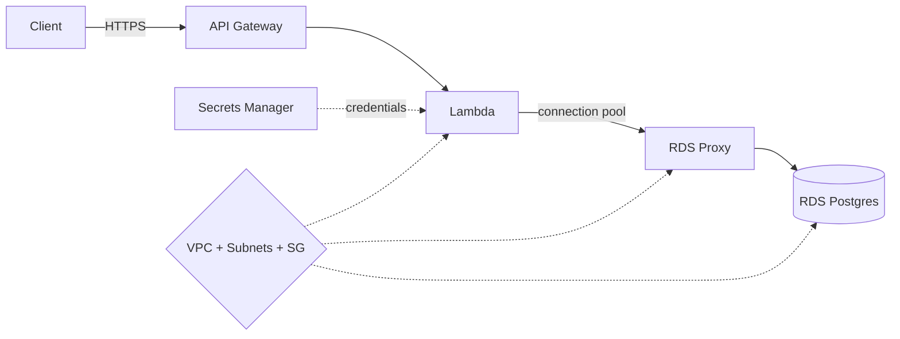

# J6: Relational App (RDS Postgres)

**TL;DR**: Build aplikasi inventory dengan database relational beneran (PostgreSQL), bukan NoSQL. JOIN, transaction ACID, foreign key, semua jalan native. Pelajari kenapa kadang relational lebih cocok dari DynamoDB, plus pattern khusus Lambda + RDS (connection pooling, RDS Proxy).

Waktu estimasi: 45 menit.

## Apa yang kita bangun

Sistem inventory sederhana dengan 3 tabel ber-relasi:
- `products` (id, name, sku, price)
- `suppliers` (id, name, contact)
- `product_suppliers` (product_id, supplier_id, supply_price)

API endpoint:
- `GET /products` (list dengan supplier info via JOIN)
- `POST /products` (insert dalam transaction dengan supplier mapping)
- `GET /products/:id/suppliers` (query 1-to-many)

Use case yang JUSTRU butuh relational, bukan NoSQL:
- Banyak query JOIN antar entity.
- Schema stable, relasi banyak.
- Transactional integrity (multi-table update harus all-or-nothing).
- Reporting dan analytics dengan SQL.

Kalau use case kamu cuma key-value lookup atau dokumen, DynamoDB lebih cocok dan murah.

## Arsitektur



Detail penting:
- **RDS**: managed Postgres. Tidak perlu install, patch, atau backup manual.
- **RDS Proxy**: connection pooler di depan RDS. Wajib untuk Lambda yang scale tinggi.
- **VPC**: RDS hidup di private subnet, tidak exposed ke internet. Lambda harus di VPC yang sama untuk akses.
- **Secrets Manager**: simpan database credentials, rotate otomatis. Lambda fetch saat runtime.

Di Floci, VPC dan Secrets Manager bisa di-skip untuk simplicity (semua reachable di host). Pattern ini wajib di production.

## Floci coverage

| Service | Status | Catatan |
|---|---|---|
| RDS Postgres | ✅ full | Postgres real (Floci-exclusive, LocalStack Free tidak ada) |
| RDS MySQL/MariaDB | ✅ full | |
| Lambda + API Gateway | ✅ full | |
| Secrets Manager | ✅ full | |
| RDS Proxy | ⚠️ partial | bisa create, behavior pooling tidak 1:1 dengan AWS |
| VPC | ❌ skip | tidak relevan di Floci, semua reachable di host network |

## Setup lokal

```bash
mkdir j6-relational && cd j6-relational
```

```yaml
# docker-compose.yml
services:
  floci:
    image: floci/floci:latest
    ports: ['4566:4566']
    volumes:
      - /var/run/docker.sock:/var/run/docker.sock
```

```bash
docker compose up -d
alias awsl='aws --endpoint-url=http://localhost:4566'
```

## Step build

### 1. Bikin RDS Postgres instance

```bash
awsl rds create-db-instance \
  --db-instance-identifier inventory-db \
  --db-instance-class db.t3.micro \
  --engine postgres \
  --engine-version 15.4 \
  --master-username postgres \
  --master-user-password 'TempPassw0rd!' \
  --allocated-storage 20 \
  --db-name inventory
```

Tunggu beberapa detik. Cek status:

```bash
awsl rds describe-db-instances \
  --db-instance-identifier inventory-db \
  --query 'DBInstances[0].DBInstanceStatus'
```

Status `available` artinya siap. Di Floci spawn container Postgres beneran, biasanya 10-30 detik.

Dapatkan endpoint:

```bash
ENDPOINT=$(awsl rds describe-db-instances \
  --db-instance-identifier inventory-db \
  --query 'DBInstances[0].Endpoint.Address' --output text)
PORT=$(awsl rds describe-db-instances \
  --db-instance-identifier inventory-db \
  --query 'DBInstances[0].Endpoint.Port' --output text)
echo "DB endpoint: $ENDPOINT:$PORT"
```

### 2. Connect via psql, bikin schema

Pakai client psql lokal (install via `choco install postgresql-client` di Windows atau `brew install libpq` di Mac).

```bash
PGPASSWORD='TempPassw0rd!' psql -h $ENDPOINT -p $PORT -U postgres -d inventory
```

Di prompt psql, jalankan schema:

```sql
CREATE TABLE suppliers (
  id SERIAL PRIMARY KEY,
  name TEXT NOT NULL,
  contact TEXT,
  created_at TIMESTAMP DEFAULT NOW()
);

CREATE TABLE products (
  id SERIAL PRIMARY KEY,
  sku TEXT UNIQUE NOT NULL,
  name TEXT NOT NULL,
  price NUMERIC(10, 2) NOT NULL,
  stock INT NOT NULL DEFAULT 0,
  created_at TIMESTAMP DEFAULT NOW()
);

CREATE TABLE product_suppliers (
  product_id INT NOT NULL REFERENCES products(id) ON DELETE CASCADE,
  supplier_id INT NOT NULL REFERENCES suppliers(id) ON DELETE CASCADE,
  supply_price NUMERIC(10, 2) NOT NULL,
  PRIMARY KEY (product_id, supplier_id)
);

CREATE INDEX idx_products_sku ON products(sku);
CREATE INDEX idx_products_price ON products(price);
```

Insert sample data:

```sql
INSERT INTO suppliers (name, contact) VALUES
  ('Toko Buku Gramedia', 'sales@gramedia.com'),
  ('Distributor ABC', 'abc@dist.com');

INSERT INTO products (sku, name, price, stock) VALUES
  ('BK-001', 'Atomic Habits', 89000, 50),
  ('BK-002', 'Filosofi Teras', 75000, 30);

INSERT INTO product_suppliers (product_id, supplier_id, supply_price) VALUES
  (1, 1, 65000),
  (1, 2, 68000),
  (2, 1, 55000);
```

Verifikasi dengan JOIN:

```sql
SELECT p.sku, p.name, s.name AS supplier, ps.supply_price
FROM products p
JOIN product_suppliers ps ON ps.product_id = p.id
JOIN suppliers s ON s.id = ps.supplier_id
ORDER BY p.sku;
```

Keluar psql: `\q`.

### 3. Simpan credentials di Secrets Manager

Hardcode password di Lambda env var anti-pattern. Pakai Secrets Manager.

```bash
SECRET_ARN=$(awsl secretsmanager create-secret \
  --name inventory-db-creds \
  --secret-string "{\"username\":\"postgres\",\"password\":\"TempPassw0rd!\",\"host\":\"$ENDPOINT\",\"port\":$PORT,\"database\":\"inventory\"}" \
  --query 'ARN' --output text)

echo "Secret: $SECRET_ARN"
```

### 4. IAM role untuk Lambda

```bash
cat > trust-policy.json << 'EOF'
{
  "Version": "2012-10-17",
  "Statement": [{
    "Effect": "Allow",
    "Principal": { "Service": "lambda.amazonaws.com" },
    "Action": "sts:AssumeRole"
  }]
}
EOF

awsl iam create-role --role-name inventory-lambda-role \
  --assume-role-policy-document file://trust-policy.json

awsl iam attach-role-policy --role-name inventory-lambda-role \
  --policy-arn arn:aws:iam::aws:policy/service-role/AWSLambdaBasicExecutionRole

awsl iam attach-role-policy --role-name inventory-lambda-role \
  --policy-arn arn:aws:iam::aws:policy/SecretsManagerReadWrite
```

### 5. Lambda dengan pg connection pool

Pattern penting: cache connection pool di luar handler. Tiap warm invocation pakai pool sama, tidak buka koneksi baru.

```js
// handler.js
const { Pool } = require('pg')
const {
  SecretsManagerClient,
  GetSecretValueCommand
} = require('@aws-sdk/client-secrets-manager')

const sm = new SecretsManagerClient({
  endpoint: process.env.AWS_ENDPOINT_URL,
  region: 'us-east-1'
})

let pool = null

async function getPool() {
  if (pool) return pool

  const secret = await sm.send(new GetSecretValueCommand({
    SecretId: process.env.SECRET_ARN
  }))
  const creds = JSON.parse(secret.SecretString)

  pool = new Pool({
    host: creds.host,
    port: creds.port,
    user: creds.username,
    password: creds.password,
    database: creds.database,
    max: 5,                  // Lambda concurrent low, pool kecil cukup
    idleTimeoutMillis: 30000,
    connectionTimeoutMillis: 5000
  })

  return pool
}

exports.handler = async (event) => {
  const method = event.requestContext.http.method
  const path = event.requestContext.http.path
  const productId = event.pathParameters?.id

  try {
    const db = await getPool()

    if (method === 'GET' && path === '/products') {
      const { rows } = await db.query(`
        SELECT
          p.id, p.sku, p.name, p.price, p.stock,
          COALESCE(json_agg(
            json_build_object('supplier', s.name, 'supply_price', ps.supply_price)
          ) FILTER (WHERE s.id IS NOT NULL), '[]') AS suppliers
        FROM products p
        LEFT JOIN product_suppliers ps ON ps.product_id = p.id
        LEFT JOIN suppliers s ON s.id = ps.supplier_id
        GROUP BY p.id
        ORDER BY p.sku
      `)
      return ok(200, rows)
    }

    if (method === 'POST' && path === '/products') {
      const body = JSON.parse(event.body)
      const client = await db.connect()
      try {
        await client.query('BEGIN')
        const { rows } = await client.query(
          'INSERT INTO products (sku, name, price, stock) VALUES ($1, $2, $3, $4) RETURNING id',
          [body.sku, body.name, body.price, body.stock || 0]
        )
        const productId = rows[0].id

        for (const sup of body.suppliers || []) {
          await client.query(
            'INSERT INTO product_suppliers (product_id, supplier_id, supply_price) VALUES ($1, $2, $3)',
            [productId, sup.supplier_id, sup.supply_price]
          )
        }
        await client.query('COMMIT')
        return ok(201, { id: productId })
      } catch (err) {
        await client.query('ROLLBACK')
        throw err
      } finally {
        client.release()
      }
    }

    if (method === 'GET' && productId && path.endsWith('/suppliers')) {
      const { rows } = await db.query(`
        SELECT s.id, s.name, s.contact, ps.supply_price
        FROM suppliers s
        JOIN product_suppliers ps ON ps.supplier_id = s.id
        WHERE ps.product_id = $1
      `, [productId])
      return ok(200, rows)
    }

    return ok(404, { error: 'not found' })
  } catch (err) {
    console.error(err)
    return ok(500, { error: err.message })
  }
}

function ok(statusCode, body) {
  return {
    statusCode,
    headers: { 'Content-Type': 'application/json' },
    body: JSON.stringify(body)
  }
}
```

Pattern penting:
- **Pool di module scope**: bertahan antar invocation di container warm.
- **Lazy init**: connect di first invocation, bukan cold start. Hindari blocking init.
- **Transaction pakai client manual**: `BEGIN`, `COMMIT`, `ROLLBACK`. Pool auto-release di `finally`.
- **Parameterized query**: pakai `$1, $2` placeholder. Anti-SQL injection.

### 6. Deploy Lambda

```bash
npm init -y
npm install pg @aws-sdk/client-secrets-manager
zip -r function.zip handler.js node_modules package.json

awsl lambda create-function \
  --function-name inventory-api \
  --runtime nodejs20.x --handler handler.handler \
  --role arn:aws:iam::000000000000:role/inventory-lambda-role \
  --zip-file fileb://function.zip \
  --timeout 30 \
  --environment "Variables={AWS_ENDPOINT_URL=http://floci:4566,SECRET_ARN=$SECRET_ARN}"
```

### 7. API Gateway

```bash
API_ID=$(awsl apigatewayv2 create-api --name inventory-api \
  --protocol-type HTTP \
  --target arn:aws:lambda:us-east-1:000000000000:function:inventory-api \
  --query 'ApiId' --output text)

API_URL="http://localhost:4566/restapis/$API_ID/local/_user_request_"
```

### 8. Test

```bash
# List products dengan supplier
curl $API_URL/products | jq

# Insert produk baru dalam transaction
curl -X POST $API_URL/products \
  -H 'Content-Type: application/json' \
  -d '{
    "sku": "BK-003",
    "name": "Sapiens",
    "price": 125000,
    "stock": 25,
    "suppliers": [{"supplier_id": 1, "supply_price": 90000}]
  }'

# Suppliers untuk produk id=1
curl $API_URL/products/1/suppliers | jq
```

## Deploy ke AWS asli (penting beda dari journey lain)

RDS hidup di VPC. Lambda harus juga di VPC untuk reach RDS. Beberapa hal yang harus di-setup di AWS asli, tidak relevan di Floci:

### VPC + subnet

Minimal 2 private subnet di AZ berbeda (untuk Multi-AZ RDS). Plus 1 public subnet untuk NAT Gateway (kalau Lambda butuh internet).

```bash
# Bikin VPC, subnet, route table, NAT GW
# Pakai CloudFormation atau Terraform untuk produksi
# Sketsa pakai aws-cli:
aws ec2 create-vpc --cidr-block 10.0.0.0/16
aws ec2 create-subnet --vpc-id vpc-xxx --cidr-block 10.0.1.0/24 --availability-zone ap-southeast-3a
aws ec2 create-subnet --vpc-id vpc-xxx --cidr-block 10.0.2.0/24 --availability-zone ap-southeast-3b
```

### Security group

3 SG umum:
- `sg-lambda`: outbound ke port 5432 (Postgres) saja
- `sg-rds`: inbound dari `sg-lambda` saja di port 5432
- `sg-bastion`: inbound SSH dari IP kamu saja

```bash
aws ec2 create-security-group --group-name rds-sg --description "RDS access" --vpc-id vpc-xxx
aws ec2 authorize-security-group-ingress --group-id sg-rds \
  --protocol tcp --port 5432 --source-group sg-lambda
```

### Bastion host (untuk debug dari laptop)

Lambda di VPC tidak reachable dari laptop. Untuk debug dari psql, butuh bastion EC2:

```bash
# Launch EC2 t3.nano di public subnet
aws ec2 run-instances --image-id ami-xxx --instance-type t3.nano \
  --subnet-id subnet-public --security-group-ids sg-bastion \
  --key-name my-key

# SSH tunnel port forward
ssh -i my-key.pem -L 5432:rds-endpoint:5432 ec2-user@bastion-ip
# Lalu psql localhost:5432 di laptop, jalan via bastion
```

Alternatif: **SSM Session Manager**, tidak perlu SSH atau IP publik. Lebih aman.

### RDS Proxy

Lambda yang scale tinggi (mis. 1000 concurrent) bisa kuras connection pool RDS (default Postgres max_connections 100). RDS Proxy adalah connection pooler managed yang sit di antara Lambda dan RDS.

```bash
aws rds create-db-proxy \
  --db-proxy-name inventory-proxy \
  --engine-family POSTGRESQL \
  --auth '[{"AuthScheme":"SECRETS","SecretArn":"<secret-arn>","IAMAuth":"DISABLED"}]' \
  --role-arn arn:aws:iam::xxx:role/rds-proxy-role \
  --vpc-subnet-ids subnet-1 subnet-2
```

Lambda connect ke proxy endpoint (bukan RDS langsung). Proxy multiplex banyak Lambda invocation ke pool koneksi RDS yang stabil.

Kapan butuh RDS Proxy:
- Lambda concurrent execution > 50.
- Atau pakai burst traffic pattern (idle lalu spike).
- Atau pakai Postgres yang max_connections rendah.

Cost: $0.015 per vCPU-hour RDS instance + flat $0.01/hour. Untuk db.t3.micro (1 vCPU): ~$18/bulan.

## Backup dan recovery

RDS auto-backup default 7 hari retention. Point-in-time recovery: restore ke timestamp manapun dalam 7 hari.

Snapshot manual untuk milestone (sebelum migration besar):

```bash
aws rds create-db-snapshot --db-instance-identifier inventory-db \
  --db-snapshot-identifier inventory-pre-migration-2026-05-26
```

Snapshot tetap walau instance dihapus. Untuk archive long-term, copy snapshot ke S3.

## Gotcha

- **Cold start + first DB connect lama**: Lambda cold + Postgres handshake = 2-5 detik. Mitigasi: provisioned concurrency, atau pakai Aurora Serverless v2 (faster connect).
- **Connection storm**: Lambda scale 0 ke 1000 dalam 1 detik = 1000 connection request ke RDS. Tanpa RDS Proxy, Postgres tolak setelah max_connections terlampaui. Lambda kena ConnectionError mysterious. Pakai RDS Proxy.
- **Idle connection consume slot**: Postgres tidak otomatis close idle connection. Lambda pakai `idleTimeoutMillis` di pool, plus Postgres `idle_in_transaction_session_timeout` parameter group.
- **Multi-AZ standby tidak read replica**: Multi-AZ untuk failover (high availability), standby tidak terima query. Untuk skala read, pakai read replica terpisah.
- **Aurora vs RDS Postgres**: Aurora 3-5x throughput, faster failover (di bawah 60 detik), backup tanpa pause. Tapi lebih mahal (~20%) dan butuh `aurora-postgresql` engine. Pakai RDS standard untuk dev/staging, Aurora untuk produksi traffic tinggi.
- **Parameter group tidak default-mutable**: ubah Postgres setting (max_connections, shared_buffers) butuh bikin custom parameter group, attach ke instance, reboot. Default group read-only.
- **Major version upgrade non-trivial**: PG 14 ke 15 bisa break aplikasi. Test di staging dulu, baca [release notes](https://www.postgresql.org/docs/release/) untuk breaking change.
- **Storage auto-grow tidak free**: enable `auto-minor-version-upgrade` dan `storage-encrypted` saat create. Sulit di-enable belakangan.
- **VPC Lambda cold start dulu lebih lama**: pre-2019 era, Lambda di VPC kena cold start tambahan 10-15 detik untuk ENI setup. Sekarang sudah jauh lebih cepat (~100 ms), tapi tetap ada overhead. Kalau Lambda tidak butuh akses VPC resource lain, jangan masukkan ke VPC.

## Cost (AWS asli)

Untuk app produksi kecil dengan db.t4g.micro Multi-AZ Postgres:

- RDS instance: db.t4g.micro Multi-AZ ~$25/bulan (2 instance).
- Storage: gp3 20 GB ~$2.30/bulan.
- Backup: 20 GB free, di luar itu $0.095/GB.
- RDS Proxy: $0.01/jam ~$7/bulan.
- Lambda + API Gateway: sub-$1/bulan untuk traffic rendah.
- Secrets Manager: $0.40/secret/bulan.
- Data transfer cross-AZ: $0.01/GB tiap arah. Multi-AZ replikasi otomatis transfer ini.

Total minimum: **sekitar $35/bulan untuk produksi dengan HA**.

Untuk dev: single-AZ db.t4g.micro = ~$12/bulan, atau db.t4g.nano lebih murah lagi. Stop instance saat tidak dipakai (tapi tetap charged storage). Atau pakai Aurora Serverless v2 yang scale ke 0 ACU.

## Cleanup

```bash
docker compose down -v
```

AWS asli urutan:

```bash
# Skip final snapshot kalau dev
aws rds delete-db-instance --db-instance-identifier inventory-db \
  --skip-final-snapshot

# Tunggu deleted
aws rds wait db-instance-deleted --db-instance-identifier inventory-db

aws rds delete-db-proxy --db-proxy-name inventory-proxy
aws secretsmanager delete-secret --secret-id inventory-db-creds \
  --force-delete-without-recovery

aws lambda delete-function --function-name inventory-api
aws apigatewayv2 delete-api --api-id $API_ID

# VPC + subnet + SG kalau bikin manual
```

## Next step

- Mau Aurora Serverless v2 (auto-scale, billed per ACU)? Ganti `--engine postgres` ke `--engine aurora-postgresql --serverless-v2-scaling-configuration MinCapacity=0,MaxCapacity=2`.
- Mau database migration tool? `node-pg-migrate`, Prisma Migrate, Flyway. Run di CI sebelum deploy Lambda.
- Mau analytics workload (heavy aggregate query) tanpa ganggu OLTP? Read replica, atau export ke S3 + query via Athena.
- Mau cache layer di depan RDS untuk reduce load? Lanjut ke pattern ElastiCache Redis + cache-aside.
