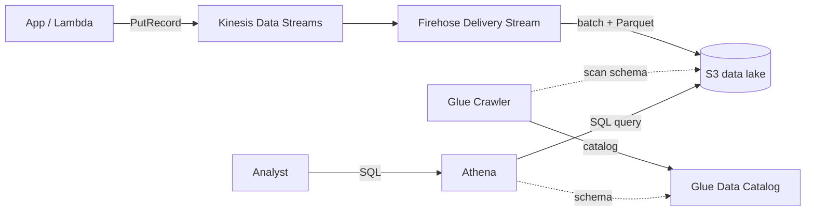

# J7: Data Pipeline / Analytics

**TL;DR**: Ingest jutaan event per detik dari aplikasi, simpan di S3 sebagai data lake yang query-able pakai SQL biasa. Tanpa setup database, tanpa cluster Hadoop. Stack: Kinesis -> Firehose -> S3 Parquet -> Athena. Floci jalankan Athena via DuckDB, query SQL beneran di laptop.

Waktu estimasi: 40 menit.

## Apa yang kita bangun

Web analytics pipeline. Setiap pageview di aplikasi emit event ke Kinesis. Firehose batch + convert ke Parquet, drop ke S3 dengan partitioning by date. Athena query S3 langsung dengan SQL untuk analytics: pageview per hari, top page, unique visitor.

Schema event:

```json
{
  "event_id": "uuid",
  "user_id": "anonymous-or-logged-in-id",
  "session_id": "uuid",
  "page": "/products/123",
  "referrer": "https://google.com",
  "user_agent": "Mozilla/5.0...",
  "country": "ID",
  "ts": 1716700000000
}
```

Query Athena yang ingin dijalankan:

```sql
SELECT date_trunc('day', from_unixtime(ts/1000)) AS day, COUNT(*) AS pageviews
FROM analytics_events
WHERE date_partition = '2026-05-26'
GROUP BY 1 ORDER BY 1;
```

## Arsitektur



Konsep penting:
- **Kinesis Data Streams**: real-time event ingestion. Shard = unit throughput (1 MB/s atau 1000 record/s write, 2 MB/s read).
- **Firehose**: deliver Kinesis data ke destination (S3, Redshift, OpenSearch). Batch, buffer, format conversion.
- **Parquet**: columnar storage. 10x lebih kecil dari JSON, 100x lebih cepat untuk analytic query.
- **Glue Data Catalog**: metastore. Skema tabel virtual yang point ke file S3.
- **Athena**: serverless SQL engine. Query S3 langsung pakai engine Presto/Trino.

### Kenapa Parquet, bukan JSON?

| Metric | JSON | Parquet |
|---|---|---|
| Size 1 juta row | ~500 MB | ~50 MB |
| Athena scan cost | $0.005 / 1 GB scanned | $0.005 / 1 GB |
| Analytic query speed | lambat (full row read) | cepat (cuma kolom yang relevant di-baca) |
| Compression | gzip optional | built-in (Snappy default) |

Hemat 90% storage dan 90% query cost cuma dengan ganti format. Wajib untuk data lake serius.

### Kenapa partitioning?

```
s3://analytics/events/year=2026/month=05/day=26/file.parquet
```

Query dengan `WHERE year=2026 AND month=05` cuma scan folder tertentu. Tanpa partitioning, Athena scan semua file, mahal dan lambat.

## Floci coverage

| Service | Status | Catatan |
|---|---|---|
| Kinesis Data Streams | ✅ full | JSON 1.1 |
| Firehose | ✅ full | REST JSON |
| S3 | ✅ full | |
| Glue | ✅ full | crawler + catalog |
| Athena | ✅ full | **backend DuckDB**, query SQL beneran jalan |
| Lambda + API Gateway | ✅ full | |

Athena di Floci pakai DuckDB sebagai engine. Query SQL jalan native. Result `SELECT ... FROM ...` keluar beneran, bukan stub. Salah satu showcase paling impressive Floci.

## Setup lokal

```bash
mkdir j7-data-pipeline && cd j7-data-pipeline
```

```yaml
# docker-compose.yml
services:
  floci:
    image: floci/floci:latest
    ports: ['4566:4566']
    volumes:
      - /var/run/docker.sock:/var/run/docker.sock
```

```bash
docker compose up -d
alias awsl='aws --endpoint-url=http://localhost:4566'
```

## Step build

### 1. Bikin S3 bucket data lake

```bash
awsl s3 mb s3://analytics-lake
```

### 2. Bikin Kinesis Data Stream

```bash
awsl kinesis create-stream \
  --stream-name pageview-events \
  --shard-count 1

# Tunggu active
awsl kinesis wait stream-exists --stream-name pageview-events

STREAM_ARN=$(awsl kinesis describe-stream \
  --stream-name pageview-events \
  --query 'StreamDescription.StreamARN' --output text)
echo "Stream: $STREAM_ARN"
```

1 shard cukup untuk dev. Production scale dengan tambah shard (`update-shard-count`).

### 3. IAM role untuk Firehose

Firehose butuh role untuk write S3 dan read Kinesis.

```bash
cat > fh-trust.json << 'EOF'
{
  "Version": "2012-10-17",
  "Statement": [{
    "Effect": "Allow",
    "Principal": { "Service": "firehose.amazonaws.com" },
    "Action": "sts:AssumeRole"
  }]
}
EOF

awsl iam create-role --role-name firehose-role \
  --assume-role-policy-document file://fh-trust.json

for P in AmazonS3FullAccess AmazonKinesisFullAccess AWSGlueServiceRole; do
  awsl iam attach-role-policy --role-name firehose-role \
    --policy-arn arn:aws:iam::aws:policy/$P
done
```

### 4. Bikin Glue Database + Table (untuk Parquet conversion)

Firehose butuh tahu schema target untuk convert JSON ke Parquet.

```bash
awsl glue create-database --database-input Name=analytics

awsl glue create-table --database-name analytics --table-input '{
  "Name": "events",
  "TableType": "EXTERNAL_TABLE",
  "Parameters": { "classification": "parquet" },
  "PartitionKeys": [
    { "Name": "year", "Type": "string" },
    { "Name": "month", "Type": "string" },
    { "Name": "day", "Type": "string" }
  ],
  "StorageDescriptor": {
    "Columns": [
      { "Name": "event_id", "Type": "string" },
      { "Name": "user_id", "Type": "string" },
      { "Name": "session_id", "Type": "string" },
      { "Name": "page", "Type": "string" },
      { "Name": "referrer", "Type": "string" },
      { "Name": "user_agent", "Type": "string" },
      { "Name": "country", "Type": "string" },
      { "Name": "ts", "Type": "bigint" }
    ],
    "Location": "s3://analytics-lake/events/",
    "InputFormat": "org.apache.hadoop.hive.ql.io.parquet.MapredParquetInputFormat",
    "OutputFormat": "org.apache.hadoop.hive.ql.io.parquet.MapredParquetOutputFormat",
    "SerdeInfo": {
      "SerializationLibrary": "org.apache.hadoop.hive.ql.io.parquet.serde.ParquetHiveSerDe"
    }
  }
}'
```

Definisi kolom + partition key + location. Athena akan baca data dari `s3://analytics-lake/events/year=.../month=.../day=...`.

### 5. Bikin Firehose Delivery Stream

```bash
cat > fh-config.json << 'EOF'
{
  "DeliveryStreamName": "pageview-firehose",
  "DeliveryStreamType": "KinesisStreamAsSource",
  "KinesisStreamSourceConfiguration": {
    "KinesisStreamARN": "STREAM_ARN_PLACEHOLDER",
    "RoleARN": "arn:aws:iam::000000000000:role/firehose-role"
  },
  "ExtendedS3DestinationConfiguration": {
    "BucketARN": "arn:aws:s3:::analytics-lake",
    "Prefix": "events/year=!{timestamp:yyyy}/month=!{timestamp:MM}/day=!{timestamp:dd}/",
    "ErrorOutputPrefix": "errors/",
    "BufferingHints": { "SizeInMBs": 5, "IntervalInSeconds": 60 },
    "CompressionFormat": "UNCOMPRESSED",
    "RoleARN": "arn:aws:iam::000000000000:role/firehose-role",
    "DataFormatConversionConfiguration": {
      "SchemaConfiguration": {
        "DatabaseName": "analytics",
        "TableName": "events",
        "RoleARN": "arn:aws:iam::000000000000:role/firehose-role"
      },
      "InputFormatConfiguration": {
        "Deserializer": { "OpenXJsonSerDe": {} }
      },
      "OutputFormatConfiguration": {
        "Serializer": { "ParquetSerDe": {} }
      },
      "Enabled": true
    }
  }
}
EOF

# Substitute stream ARN
sed -i "s|STREAM_ARN_PLACEHOLDER|$STREAM_ARN|" fh-config.json

awsl firehose create-delivery-stream --cli-input-json file://fh-config.json
```

Buffering hints: Firehose akumulasi data sampai 5 MB atau 60 detik (yang dulu), baru flush ke S3. Trade-off antara latency dan jumlah file kecil.

`!{timestamp:yyyy}` adalah Firehose template untuk dynamic partitioning. Otomatis arahkan record ke folder berdasarkan tanggal.

### 6. Lambda untuk publish event ke Kinesis

```js
// handler.js
const { KinesisClient, PutRecordCommand } =
  require('@aws-sdk/client-kinesis')
const { randomUUID } = require('crypto')

const kinesis = new KinesisClient({
  endpoint: process.env.AWS_ENDPOINT_URL,
  region: 'us-east-1'
})

exports.handler = async (event) => {
  const body = JSON.parse(event.body || '{}')

  const record = {
    event_id: randomUUID(),
    user_id: body.user_id || 'anonymous',
    session_id: body.session_id || randomUUID(),
    page: body.page,
    referrer: body.referrer || '',
    user_agent: event.headers?.['user-agent'] || '',
    country: event.headers?.['cloudfront-viewer-country'] || 'unknown',
    ts: Date.now()
  }

  await kinesis.send(new PutRecordCommand({
    StreamName: 'pageview-events',
    PartitionKey: record.session_id,
    Data: Buffer.from(JSON.stringify(record))
  }))

  return {
    statusCode: 202,
    body: JSON.stringify({ event_id: record.event_id })
  }
}
```

PartitionKey menentukan ke shard mana record masuk. Pakai session_id supaya event dari session sama masuk shard sama (order preserved).

Untuk traffic tinggi, batch via `PutRecordsCommand` (sampai 500 record sekali call). Hemat cost dan API call.

### 7. Deploy Lambda + API Gateway

```bash
npm init -y
npm install @aws-sdk/client-kinesis
zip -r function.zip handler.js node_modules package.json

# Pakai role yang ada policy KinesisFullAccess
# (atau bikin baru seperti journey sebelumnya)

awsl lambda create-function --function-name pageview-track \
  --runtime nodejs20.x --handler handler.handler \
  --role arn:aws:iam::000000000000:role/firehose-role \
  --zip-file fileb://function.zip \
  --environment "Variables={AWS_ENDPOINT_URL=http://floci:4566}"

API_ID=$(awsl apigatewayv2 create-api --name analytics-api \
  --protocol-type HTTP \
  --target arn:aws:lambda:us-east-1:000000000000:function:pageview-track \
  --query 'ApiId' --output text)

API_URL="http://localhost:4566/restapis/$API_ID/local/_user_request_"
```

### 8. Generate sample traffic

Bikin script untuk simulasi 1000 pageview:

```bash
for i in {1..1000}; do
  curl -s -X POST $API_URL/track \
    -H 'Content-Type: application/json' \
    -d "{
      \"user_id\": \"user-$((RANDOM % 100))\",
      \"page\": \"/products/$((RANDOM % 50))\",
      \"referrer\": \"https://example.com\"
    }" > /dev/null
done
echo "Sent 1000 events"
```

Tunggu 60 detik supaya Firehose flush buffer ke S3.

### 9. Verifikasi data di S3

```bash
awsl s3 ls s3://analytics-lake/events/ --recursive
```

Output: file Parquet di partition `year=2026/month=05/day=26/`. File size kecil karena cuma 1000 record. Production traffic akan generate file lebih besar dan sering.

### 10. Query via Athena

Bikin workgroup dan S3 output location untuk Athena result:

```bash
awsl s3 mb s3://athena-results
```

Run query:

```bash
QUERY_ID=$(awsl athena start-query-execution \
  --query-string "SELECT page, COUNT(*) AS pageviews FROM analytics.events GROUP BY page ORDER BY pageviews DESC LIMIT 10" \
  --result-configuration "OutputLocation=s3://athena-results/" \
  --query 'QueryExecutionId' --output text)

# Tunggu selesai
sleep 3

# Ambil hasil
awsl athena get-query-results --query-execution-id $QUERY_ID \
  --output table
```

Output: top 10 page dengan pageview terbanyak. Query jalan di DuckDB di balik layar di Floci, tapi syntax dan response sama persis dengan Athena AWS.

Query analytic lain yang bisa dicoba:

```sql
-- Unique user per hari
SELECT
  date_trunc('day', from_unixtime(ts/1000)) AS day,
  COUNT(DISTINCT user_id) AS unique_users
FROM analytics.events
GROUP BY 1;

-- Funnel: berapa user dari /products/1 ke /products/2
WITH sessions AS (
  SELECT session_id, array_agg(page ORDER BY ts) AS path
  FROM analytics.events
  GROUP BY session_id
)
SELECT COUNT(*) AS funnel_count
FROM sessions
WHERE contains(path, '/products/1') AND contains(path, '/products/2');
```

## Deploy ke AWS asli

Sama seperti journey lain: endpoint, account ID. Plus:

- **Athena butuh workgroup**: bikin workgroup terpisah per environment, set query result location, encryption.
- **Cost guard di Athena**: setting `WorkGroupConfiguration.BytesScannedCutoffPerQuery` untuk cap query yang scan banyak data ($0.005 per GB scan, tidak cap = bahaya).
- **Glue Crawler**: untuk discover schema dari data yang sudah ada (bukan dari Firehose target). Schedule crawler kalau partition baru harus auto-detect.

### Athena cost monitoring

```bash
aws athena get-query-execution --query-execution-id $QUERY_ID \
  --query 'QueryExecution.Statistics.DataScannedInBytes'
```

Tiap query log byte yang di-scan. Set alarm di CloudWatch untuk query yang scan lebih dari threshold.

## Gotcha

- **Small file problem**: Firehose default flush per 5 MB atau 60 detik. Traffic rendah = ribuan file kecil per hari. Setiap file punya overhead read. Mitigasi: compaction job harian dengan Glue ETL atau Lambda yang merge file Parquet.
- **Partition projection lebih cepat dari crawler**: untuk partition yang predictable (year/month/day), enable partition projection di table properties. Athena generate partition dari config, tidak perlu crawler scan.
- **JSON to Parquet conversion butuh schema**: schema di Glue Catalog harus match struktur JSON. Field baru di event yang tidak ada di schema = di-drop saat konversi. Update schema sebelum tambah field.
- **Kinesis shard limit**: 1 shard = 1 MB/s atau 1000 record/s. Traffic spike yang lewat limit kena `ProvisionedThroughputExceededException`. Monitor `IncomingBytes` dan scale shard via `update-shard-count`.
- **Firehose latency 60+ detik**: data dari Kinesis ke S3 ada delay buffering. Tidak cocok untuk real-time dashboard. Untuk real-time, Lambda subscribe Kinesis langsung dan write ke OpenSearch atau DynamoDB.
- **Athena 30 menit timeout per query**: query lama harus pakai EMR atau Redshift. Atau optimize: filter dengan partition, pakai LIMIT, pre-aggregate.
- **Predicate pushdown**: query `WHERE col = 'x'` cuma efisien kalau col di partition atau di sorted columnar. Untuk filter field non-partition yang sering, sort data Parquet di Glue ETL.
- **Glue Catalog Lake Formation permission**: di akun yang enable Lake Formation, butuh grant tambahan untuk query Athena. Bisa bikin confusing kalau setup pertama.
- **Egress cost dari Athena result**: Athena result di S3, kalau di-download ke laptop = egress charge. Untuk dashboard, query dari Lambda atau QuickSight yang in-VPC.

## Cost (AWS asli)

Untuk 100 juta event per bulan, average 500 bytes per event (50 GB total raw, ~5 GB Parquet):

- Kinesis Data Streams: 1 shard $11/bulan + $0.014 per juta PUT = ~$13/bulan.
- Firehose: $0.029 per GB ingested + $0.018 per GB format conversion = ~$2.50/bulan.
- S3 storage: 5 GB Parquet = $0.12/bulan. Plus history bertambah tiap bulan.
- Athena: per query cost. 100 query/bulan, average scan 1 GB = $0.50/bulan.
- Glue Data Catalog: 100k object gratis. Crawler $0.44 per DPU-hour, jarang.

Total: **sekitar $16/bulan untuk 100 juta event**. Cost ingestion (Kinesis + Firehose) dominant, Athena murah karena scan kecil thanks to Parquet + partitioning.

Optimisasi:
- **Direct PUT Firehose**: skip Kinesis, app push langsung ke Firehose. Lebih murah (~30%), trade-off kehilangan event replay capability.
- **On-demand Kinesis**: pay-per-throughput model, tidak provisioned shard. Cocok traffic tidak prediktabel.
- **S3 Intelligent-Tiering**: untuk data lama yang jarang di-query, auto-pindah ke IA/Glacier.

## Cleanup

```bash
docker compose down -v
```

AWS asli urutan:

```bash
aws firehose delete-delivery-stream --delivery-stream-name pageview-firehose
aws kinesis delete-stream --stream-name pageview-events
aws glue delete-table --database-name analytics --name events
aws glue delete-database --name analytics
aws s3 rm s3://analytics-lake --recursive
aws s3 rb s3://analytics-lake
aws s3 rm s3://athena-results --recursive
aws s3 rb s3://athena-results
aws lambda delete-function --function-name pageview-track
aws apigatewayv2 delete-api --api-id $API_ID
```

## Next step

- Mau dashboard visual? QuickSight connect ke Athena, drag-drop chart.
- Mau ETL transform (clean data, enrich dengan lookup table)? Glue Job dengan PySpark.
- Mau machine learning di atas data ini? SageMaker Notebook query Athena, train model.
- Mau cost lebih turun untuk analytic query? Redshift Serverless punya better $/scan untuk volume tinggi.
- Mau real-time analytic (bukan delay 60s Firehose)? Lambda subscribe Kinesis langsung, write ke OpenSearch.
