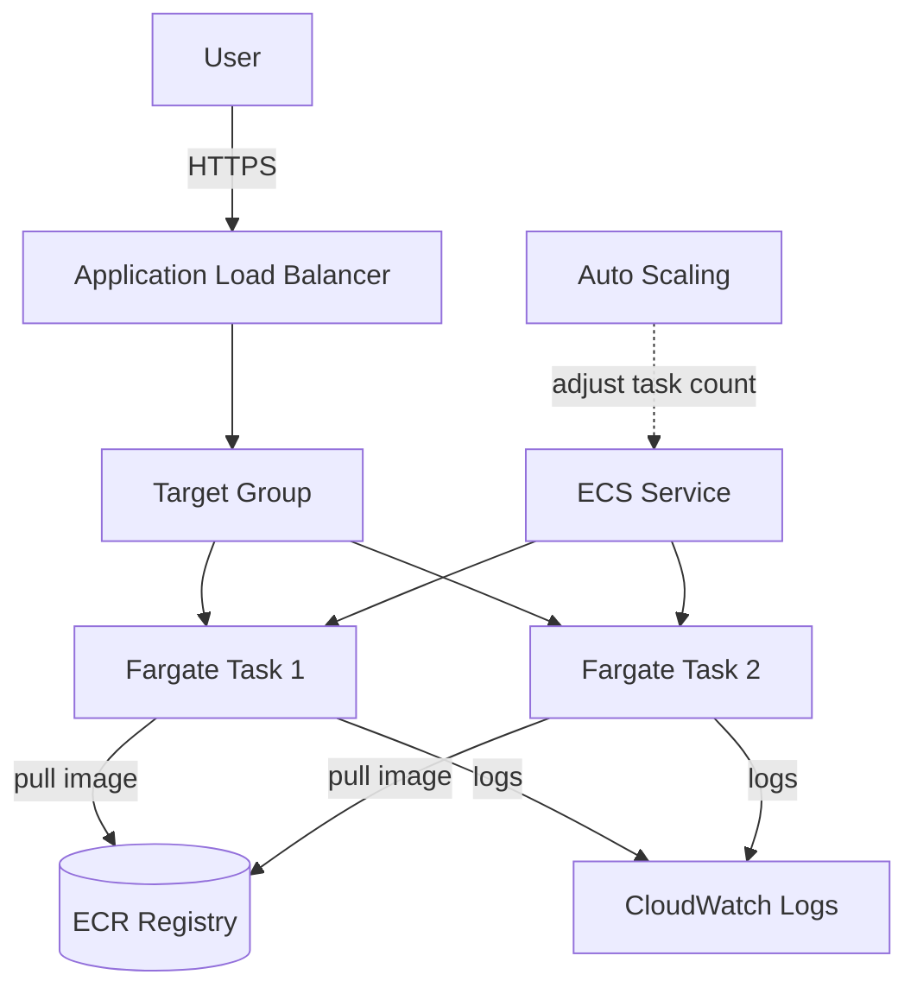

# J8: Container Workload (ECS Fargate)

**TL;DR**: Deploy aplikasi Docker tanpa manage server. Push image ke ECR, ECS Fargate run container, ALB jadi pintu HTTP. Tidak ada EC2 yang harus patch, tidak ada Kubernetes yang harus operate. Floci jalanin Docker container beneran untuk ECS task.

Waktu estimasi: 40 menit.

## Apa yang kita bangun

Web API sederhana di Node.js, di-container-kan, run di ECS Fargate. Akses via ALB di port 80. Auto-scale berdasarkan CPU. Logs ke CloudWatch.

Workload yang cocok untuk Fargate:
- API server yang butuh persistent connection (WebSocket, SSE).
- Long-running background worker.
- Aplikasi non-serverless (legacy app, framework yang butuh always-on).
- Workload dengan startup time lama (Spring Boot, .NET) yang Lambda cold start tidak acceptable.

Kalau workload kamu cocok serverless (per-request, stateless, sub-15-menit), Lambda lebih murah dan lebih simpel.

## Arsitektur



Komponen:
- **ECR**: Docker registry private AWS. Tempat simpan image kamu.
- **ECS Cluster**: logical grouping. Cluster sendiri tidak punya cost (Fargate tanpa EC2).
- **Task Definition**: blueprint container (image, CPU, memory, port, env var). Versioned.
- **Service**: long-running task spec. Maintain N task running, auto-restart kalau crash.
- **Fargate**: launch type serverless. AWS manage host instance, kamu cuma fokus container.
- **ALB**: distribute request ke task. Health check, SSL termination.

## Floci coverage

| Service | Status | Catatan |
|---|---|---|
| ECR | ✅ full | OCI registry beneran (Floci-exclusive vs LocalStack Free) |
| ECS | ✅ full | Real Docker container spawn (Floci-exclusive) |
| ELB v2 (ALB + NLB) | ✅ full | Floci-exclusive |
| CloudWatch Logs | ✅ full | |
| IAM | ✅ full | |

Salah satu showcase Floci paling impressive. Task ECS beneran spawn Docker container di host Docker, bisa di-`docker ps`, bisa di-`docker logs`.

## Setup lokal

```bash
mkdir j8-container && cd j8-container
```

```yaml
# docker-compose.yml
services:
  floci:
    image: floci/floci:latest
    ports: ['4566:4566']
    volumes:
      - /var/run/docker.sock:/var/run/docker.sock
```

```bash
docker compose up -d
alias awsl='aws --endpoint-url=http://localhost:4566'
```

## Step build

### 1. Tulis aplikasi

Express server simpel yang return JSON. Real production app pakai stack favorit kamu (Spring Boot, Django, dll).

```js
// app.js
const express = require('express')
const app = express()
const PORT = process.env.PORT || 3000

app.get('/health', (req, res) => res.json({ status: 'ok' }))

app.get('/', (req, res) => {
  res.json({
    message: 'Hello from Fargate',
    hostname: require('os').hostname(),
    timestamp: new Date().toISOString()
  })
})

app.listen(PORT, () => console.log(`Listening on ${PORT}`))
```

```json
// package.json
{
  "name": "fargate-demo",
  "version": "1.0.0",
  "main": "app.js",
  "scripts": { "start": "node app.js" },
  "dependencies": { "express": "^4.18.0" }
}
```

### 2. Dockerfile multi-stage build

```dockerfile
# Dockerfile
FROM node:20-alpine AS deps
WORKDIR /app
COPY package*.json ./
RUN npm install --omit=dev

FROM node:20-alpine
WORKDIR /app
COPY --from=deps /app/node_modules ./node_modules
COPY app.js ./
EXPOSE 3000
USER node
CMD ["node", "app.js"]
```

Best practice:
- Alpine base (kecil, sekitar 50 MB) atau distroless (lebih kecil, no shell).
- Multi-stage: build dependency di stage terpisah, copy hasil ke runtime image. Image final tidak include dev dependency atau build tool.
- `USER node`: jangan jalan sebagai root.
- `EXPOSE 3000`: deklaratif, tidak open port otomatis.

### 3. Bikin ECR repository

```bash
awsl ecr create-repository --repository-name fargate-demo
REPO_URI=$(awsl ecr describe-repositories \
  --repository-names fargate-demo \
  --query 'repositories[0].repositoryUri' --output text)
echo "Repo: $REPO_URI"
```

### 4. Build image dan push ke ECR

```bash
# Login Docker ke ECR Floci
awsl ecr get-login-password | docker login --username AWS \
  --password-stdin $(echo $REPO_URI | cut -d/ -f1)

# Build
docker build -t fargate-demo .

# Tag dan push
docker tag fargate-demo:latest $REPO_URI:latest
docker push $REPO_URI:latest
```

Verifikasi:

```bash
awsl ecr list-images --repository-name fargate-demo
```

### 5. Bikin CloudWatch Log Group

```bash
awsl logs create-log-group --log-group-name /ecs/fargate-demo
```

### 6. IAM execution role untuk task

Fargate butuh role untuk pull image dari ECR dan write logs ke CloudWatch.

```bash
cat > task-trust.json << 'EOF'
{
  "Version": "2012-10-17",
  "Statement": [{
    "Effect": "Allow",
    "Principal": { "Service": "ecs-tasks.amazonaws.com" },
    "Action": "sts:AssumeRole"
  }]
}
EOF

awsl iam create-role --role-name ecsTaskExecutionRole \
  --assume-role-policy-document file://task-trust.json

awsl iam attach-role-policy --role-name ecsTaskExecutionRole \
  --policy-arn arn:aws:iam::aws:policy/service-role/AmazonECSTaskExecutionRolePolicy
```

### 7. Bikin ECS Cluster

```bash
awsl ecs create-cluster --cluster-name demo-cluster
```

Cluster di Fargate cuma logical grouping. Tidak ada instance EC2 yang di-provision, tidak ada cost.

### 8. Task Definition

Blueprint container.

```bash
cat > task-def.json << EOF
{
  "family": "fargate-demo",
  "networkMode": "awsvpc",
  "requiresCompatibilities": ["FARGATE"],
  "cpu": "256",
  "memory": "512",
  "executionRoleArn": "arn:aws:iam::000000000000:role/ecsTaskExecutionRole",
  "containerDefinitions": [{
    "name": "app",
    "image": "$REPO_URI:latest",
    "portMappings": [{ "containerPort": 3000, "protocol": "tcp" }],
    "essential": true,
    "logConfiguration": {
      "logDriver": "awslogs",
      "options": {
        "awslogs-group": "/ecs/fargate-demo",
        "awslogs-region": "us-east-1",
        "awslogs-stream-prefix": "app"
      }
    },
    "environment": [
      { "name": "PORT", "value": "3000" },
      { "name": "NODE_ENV", "value": "production" }
    ]
  }]
}
EOF

awsl ecs register-task-definition --cli-input-json file://task-def.json
```

CPU/Memory combination Fargate fix:
- 256 CPU (0.25 vCPU): 512 MB - 2 GB
- 512 CPU (0.5 vCPU): 1 GB - 4 GB
- 1024 CPU (1 vCPU): 2 GB - 8 GB
- Sampai 16384 CPU (16 vCPU) dengan 120 GB RAM

Tidak bisa pakai 256 CPU dengan 256 MB, atau kombinasi lain di luar matrix. Lihat [Fargate task size docs](https://docs.aws.amazon.com/AmazonECS/latest/developerguide/fargate-task-defs.html).

### 9. Bikin Service

Service jaga task tetap running.

```bash
awsl ecs create-service \
  --cluster demo-cluster \
  --service-name demo-service \
  --task-definition fargate-demo \
  --desired-count 2 \
  --launch-type FARGATE \
  --network-configuration 'awsvpcConfiguration={subnets=[subnet-dummy],securityGroups=[sg-dummy],assignPublicIp=ENABLED}'
```

Di Floci, subnet dan security group fictional (`subnet-dummy`, `sg-dummy`) diterima. AWS asli butuh subnet beneran di VPC kamu.

Cek task running:

```bash
awsl ecs list-tasks --cluster demo-cluster
awsl ecs describe-services --cluster demo-cluster --services demo-service \
  --query 'services[0].{Running:runningCount,Desired:desiredCount}'
```

Di host:

```bash
docker ps | grep fargate-demo
```

Container beneran spawn. Bisa `docker logs <id>` lihat output.

### 10. Bikin ALB

```bash
ALB_ARN=$(awsl elbv2 create-load-balancer \
  --name demo-alb \
  --subnets subnet-dummy-1 subnet-dummy-2 \
  --security-groups sg-dummy \
  --scheme internet-facing \
  --type application \
  --query 'LoadBalancers[0].LoadBalancerArn' --output text)

# Tunggu active
sleep 3

# Target group untuk task
TG_ARN=$(awsl elbv2 create-target-group \
  --name demo-tg \
  --protocol HTTP --port 3000 \
  --target-type ip \
  --vpc-id vpc-dummy \
  --health-check-path /health \
  --query 'TargetGroups[0].TargetGroupArn' --output text)

# Listener di port 80 yang forward ke target group
awsl elbv2 create-listener \
  --load-balancer-arn $ALB_ARN \
  --protocol HTTP --port 80 \
  --default-actions Type=forward,TargetGroupArn=$TG_ARN
```

`target-type ip` wajib untuk Fargate (task pakai ENI dengan IP private, bukan EC2 instance).
`health-check-path /health` artinya ALB ping `/health` tiap interval. Task yang return non-2xx 3x berturut-turut dianggap unhealthy, ALB stop route ke task itu.

### 11. Hubungkan ALB ke Service

Update service untuk register task ke target group otomatis:

```bash
awsl ecs update-service \
  --cluster demo-cluster \
  --service demo-service \
  --load-balancers "targetGroupArn=$TG_ARN,containerName=app,containerPort=3000"
```

### 12. Test

Ambil ALB DNS name:

```bash
ALB_DNS=$(awsl elbv2 describe-load-balancers \
  --load-balancer-arns $ALB_ARN \
  --query 'LoadBalancers[0].DNSName' --output text)
echo "ALB: $ALB_DNS"
```

Di Floci, ALB di-expose lewat host port. Cek listener port:

```bash
curl http://localhost:4566/_aws/elbv2/$ALB_DNS/
# Atau cek docker ps untuk container ALB yang expose port
```

Test endpoint:

```bash
curl http://$ALB_DNS/
curl http://$ALB_DNS/health
```

Response berisi hostname container. Coba beberapa kali, hostname berganti antara task1 dan task2 (load balancing).

### 13. Logs

```bash
awsl logs tail /ecs/fargate-demo --follow
```

Atau log container langsung:

```bash
docker ps | grep fargate-demo
docker logs -f <container-id>
```

## Deploy ke AWS asli

3 perubahan utama dari pola lokal:

1. **VPC beneran**: butuh VPC dengan public subnet untuk ALB, private subnet untuk task (kalau task tidak butuh internet langsung). Plus NAT Gateway atau VPC endpoint kalau task butuh pull ECR/CloudWatch.
2. **Security Group beneran**:
   - `sg-alb`: inbound 80/443 dari internet
   - `sg-task`: inbound 3000 dari `sg-alb` only
3. **ECR auth flow**: `aws ecr get-login-password` panggil ke regional endpoint, balance auto-rotate tiap 12 jam.

Plus opsi production:

### Auto-scaling

```bash
aws application-autoscaling register-scalable-target \
  --service-namespace ecs \
  --resource-id service/demo-cluster/demo-service \
  --scalable-dimension ecs:service:DesiredCount \
  --min-capacity 2 --max-capacity 10

aws application-autoscaling put-scaling-policy \
  --service-namespace ecs \
  --resource-id service/demo-cluster/demo-service \
  --scalable-dimension ecs:service:DesiredCount \
  --policy-name cpu-scaling \
  --policy-type TargetTrackingScaling \
  --target-tracking-scaling-policy-configuration '{
    "TargetValue": 70.0,
    "PredefinedMetricSpecification": { "PredefinedMetricType": "ECSServiceAverageCPUUtilization" }
  }'
```

Target tracking: jaga CPU average 70%. Scale up kalau lewat, scale down kalau di bawah.

### HTTPS via ACM

Bikin cert di ACM (region sama dengan ALB), attach ke listener port 443. Redirect port 80 ke 443 via listener rule.

```bash
aws elbv2 create-listener \
  --load-balancer-arn $ALB_ARN \
  --protocol HTTPS --port 443 \
  --certificates CertificateArn=$ACM_ARN \
  --default-actions Type=forward,TargetGroupArn=$TG_ARN
```

### Service Discovery (CloudMap)

Untuk microservice yang panggil microservice lain, pakai CloudMap. Service A `service-a.local`, service B `service-b.local`. ECS auto-register ke DNS.

```bash
aws servicediscovery create-private-dns-namespace --name local --vpc vpc-xxx
```

Lalu attach service discovery ke ECS service. Service lain query `http://service-b.local:3000` dari dalam VPC.

## Gotcha

- **Task tidak start, tapi tidak ada error jelas**: cek "stopped tasks" di console atau `aws ecs describe-tasks`. Reason field kasih hint: image pull error (ECR permission), task tidak punya akses internet (NAT Gateway), health check fail, env var missing.
- **Cold start Fargate 60-90 detik**: lama dari container pull sampai task running + ALB health check pass. Untuk traffic burst, pre-provision desired count.
- **Image size bikin start lambat**: image 1 GB butuh 30+ detik pull dari ECR. Optimize image (multi-stage, alpine, distroless). Target di bawah 200 MB.
- **awsvpc network mode = 1 ENI per task**: tiap task pakai 1 IP private di subnet. Subnet kecil = limit task. Pakai /24 atau lebih besar.
- **Fargate vs EC2 launch type**: Fargate tidak punya akses host (tidak bisa pakai docker-in-docker, GPU, atau host volume). Workload yang butuh ini pakai EC2 launch type, atau ECS on EKS, atau bare EC2.
- **Spot Fargate**: $0.040/hour vs on-demand $0.040/hour (sama, tergantung region). Tapi Spot bisa di-terminate dengan 2 menit warning. Cocok untuk batch job, tidak untuk API.
- **Log driver awslogs vs FireLens**: `awslogs` log ke CloudWatch langsung, gampang. FireLens (Fluent Bit) bisa route ke multiple destination, filter, transform. Pakai FireLens untuk produksi serius.
- **Task definition immutable**: ubah CPU, memory, image = bikin revision baru (`fargate-demo:2`). Update service untuk pakai revision baru. Lama task tetap running sampai service di-update.
- **Container terminate gracefully**: kirim SIGTERM, kasih 30 detik (default `stopTimeout`), baru SIGKILL. App harus handle SIGTERM untuk graceful shutdown (drain connection, save state).
- **ALB target deregistration delay default 300 detik**: kalau scale down, ALB stop route ke task, tapi tunggu 5 menit sebelum hard-terminate. Sesuaikan kalau aplikasi punya request lama (download, upload).

## Cost (AWS asli)

Untuk service dengan 2 task 24/7, masing-masing 0.25 vCPU + 0.5 GB RAM:

- Fargate: 2 task × (0.25 × $0.04048/vCPU-hour + 0.5 × $0.004445/GB-hour) × 24 × 30
  ≈ 2 × ($0.0101 + $0.00222) × 720 = **$17.7/bulan**
- ALB: $0.0225/hour + $0.008/LCU-hour. Idle ~$16/bulan, plus traffic-dependent.
- ECR: storage gratis 500 MB pertama, lalu $0.10/GB/bulan. Image 100 MB = gratis.
- CloudWatch Logs: 5 GB gratis, lalu $0.50/GB.
- Data transfer egress: standard rate.

Total minimum: **sekitar $35/bulan** untuk 2-task service dengan ALB.

Vs Lambda + API Gateway untuk traffic equivalent (100k request/bulan): bisa di bawah $1. Container menang untuk traffic high atau workload long-running, kalah untuk traffic low atau bursty.

Optimisasi:
- **Fargate Spot**: 70% diskon, cocok worker job.
- **Graviton (ARM)**: $0.04048 → $0.03238 (20% lebih murah). Image harus multi-arch atau pure ARM.
- **Right-size**: monitor CloudWatch task metric, kurangi CPU/memory kalau utilization rendah.
- **Hibernate strategy**: ECS scheduled task untuk service dev (running cuma jam kantor).

## Cleanup

```bash
docker compose down -v
```

AWS asli urutan:

```bash
# Scale service ke 0 dulu
aws ecs update-service --cluster demo-cluster --service demo-service --desired-count 0

# Hapus service
aws ecs delete-service --cluster demo-cluster --service demo-service

# Hapus ALB + target group + listener
aws elbv2 delete-load-balancer --load-balancer-arn $ALB_ARN
aws elbv2 delete-target-group --target-group-arn $TG_ARN

# Hapus task definition revision (de-register)
aws ecs deregister-task-definition --task-definition fargate-demo:1

# Hapus cluster
aws ecs delete-cluster --cluster demo-cluster

# Hapus ECR repo (akan hapus image juga)
aws ecr delete-repository --repository-name fargate-demo --force

# Hapus log group
aws logs delete-log-group --log-group-name /ecs/fargate-demo
```

## Next step

- Mau orchestrate lebih kompleks (multi-service, dependencies, helm-style template)? Lanjut ke J9: Kubernetes dengan EKS.
- Mau CI/CD pipeline auto-deploy saat push ke main? CodePipeline + CodeBuild + ECS rolling update.
- Mau service-to-service auth tanpa naro key? IAM task role + AWS SDK auto-pickup credential dari task metadata.
- Mau sidecar pattern (mis. X-Ray daemon, Envoy proxy)? Tambah container kedua di task definition, akses via localhost.
- Mau persistent storage (mis. file upload)? Mount EFS volume ke task. Atau pakai S3 dari dalam app.
