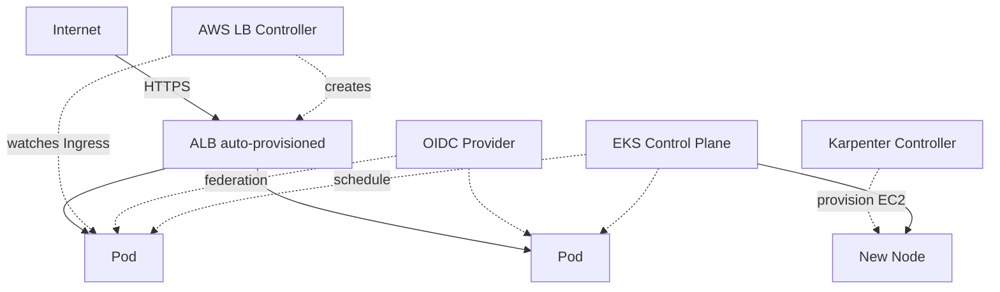

# J9: Kubernetes (EKS)

**TL;DR**: Deploy aplikasi container ke Kubernetes managed AWS. EKS handle control plane (etcd, API server, scheduler), kamu manage workload pakai `kubectl` biasa. Bedanya dari [J8 Fargate](/id/aws/journeys/j8-container): K8s untuk multi-service complex, ECS untuk single workload sederhana. Floci spin k3s cluster beneran di local.

Waktu estimasi: 50 menit.

## Apa yang kita bangun

Sama dengan J8 (Express API), tapi di Kubernetes. Fokus pada hal yang spesifik EKS:

1. EKS cluster + node group.
2. Deploy app via Deployment + Service.
3. Expose via Ingress dengan **AWS Load Balancer Controller** (auto-provision ALB).
4. **IRSA** (IAM Roles for Service Accounts), supaya pod terima IAM role tanpa naro credential.
5. **Karpenter** untuk auto-scale node (bonus, di akhir).

Asumsi: kamu sudah paham basic Kubernetes (pod, deployment, service, namespace, kubectl). Kalau belum, baca [kubernetes.io/docs/tutorials](https://kubernetes.io/docs/tutorials/) dulu.

## Arsitektur



Komponen unik EKS:
- **Control plane managed**: AWS jaga etcd, API server, scheduler. Kamu tidak akses langsung.
- **Worker node**: EC2 instance yang join cluster sebagai node. Atau Fargate (serverless pod).
- **AWS Load Balancer Controller**: deploy sebagai pod, baca resource `Ingress`, buat ALB beneran.
- **IRSA**: OIDC provider di EKS issue token ke service account. AWS STS verify, kasih credential IAM ke pod.
- **Karpenter**: alternative dari Cluster Autoscaler. Bikin EC2 instance baru on-demand sesuai pod yang pending.

### Kapan pakai EKS, bukan ECS?

| Faktor | ECS Fargate | EKS |
|---|---|---|
| Learning curve | rendah | tinggi (K8s sendiri kompleks) |
| Multi-cloud | tidak (AWS-only) | iya (K8s standar) |
| Ekosistem | terbatas | luas (Helm, Operators, ArgoCD, Istio, dll) |
| Service mesh | App Mesh | Istio, Linkerd, native EKS |
| Multi-tenancy | terbatas | namespace + RBAC + network policy |
| Cost control plane | gratis (Fargate) | $0.10/jam = $73/bulan |
| Cocok untuk | single workload, small team | multi-team, multi-service, polyglot |

Aturan praktis: kalau timeline pendek dan workload sederhana, pakai ECS Fargate. Kalau ada team K8s, atau workload kompleks dengan banyak service, EKS justified.

## Floci coverage

| Service | Status | Catatan |
|---|---|---|
| EKS | ✅ full | Spin real k3s cluster (Floci-exclusive vs LocalStack Free) |
| ECR | ✅ full | dari J8 |
| ELB v2 (ALB) | ✅ full | |
| IAM (IRSA OIDC) | ✅ full | |
| Auto Scaling | ✅ full | |
| Karpenter | ⚠️ partial | bisa install, scale logic terbatas di local |

k3s adalah distribusi Kubernetes ringan yang Floci pakai sebagai control plane. Semua resource K8s (pod, deployment, service, ingress) beneran jalan, `kubectl` standard works.

## Setup lokal

```bash
mkdir j9-kubernetes && cd j9-kubernetes
```

```yaml
# docker-compose.yml
services:
  floci:
    image: floci/floci:latest
    ports: ['4566:4566']
    volumes:
      - /var/run/docker.sock:/var/run/docker.sock
```

```bash
docker compose up -d
alias awsl='aws --endpoint-url=http://localhost:4566'
```

Install `kubectl` dan `eksctl` lokal kalau belum:

```bash
# kubectl
choco install kubernetes-cli   # Windows
brew install kubectl            # Mac

# eksctl (helper CLI dari AWS)
choco install eksctl
brew install eksctl
```

## Step build

### 1. Bikin EKS cluster

`eksctl` mempermudah setup (otomatis bikin VPC + node group + IAM role).

```bash
eksctl create cluster \
  --name demo-eks \
  --region us-east-1 \
  --version 1.30 \
  --nodes 2 \
  --node-type t3.medium \
  --managed
```

Di Floci, eksctl invoke API ke Floci endpoint. Setup cluster lebih cepat dari AWS asli (di AWS 10-15 menit, di Floci ~30 detik).

Pakai cara raw API kalau eksctl tidak support endpoint custom:

```bash
awsl eks create-cluster \
  --name demo-eks \
  --version 1.30 \
  --role-arn arn:aws:iam::000000000000:role/eks-cluster-role \
  --resources-vpc-config subnetIds=subnet-1,subnet-2

awsl eks wait cluster-active --name demo-eks
```

(Bikin role `eks-cluster-role` dulu dengan trust policy untuk `eks.amazonaws.com`, attach `AmazonEKSClusterPolicy`.)

### 2. Update kubeconfig

```bash
awsl eks update-kubeconfig --name demo-eks --region us-east-1
```

Verifikasi:

```bash
kubectl cluster-info
kubectl get nodes
```

Output: 2 node Ready (atau k3s node single di Floci).

### 3. Deploy app

Pakai image yang sudah di-push ke ECR di [J8](/id/aws/journeys/j8-container#4-build-image-dan-push-ke-ecr).

```yaml
# k8s/deployment.yaml
apiVersion: apps/v1
kind: Deployment
metadata:
  name: demo
  labels:
    app: demo
spec:
  replicas: 2
  selector:
    matchLabels:
      app: demo
  template:
    metadata:
      labels:
        app: demo
    spec:
      containers:
      - name: app
        image: 000000000000.dkr.ecr.us-east-1.amazonaws.com/fargate-demo:latest
        ports:
        - containerPort: 3000
        env:
        - name: PORT
          value: "3000"
        resources:
          requests: { cpu: 100m, memory: 128Mi }
          limits: { cpu: 500m, memory: 256Mi }
        readinessProbe:
          httpGet: { path: /health, port: 3000 }
          initialDelaySeconds: 5
          periodSeconds: 5
        livenessProbe:
          httpGet: { path: /health, port: 3000 }
          initialDelaySeconds: 15
          periodSeconds: 30
---
apiVersion: v1
kind: Service
metadata:
  name: demo
spec:
  type: ClusterIP
  selector:
    app: demo
  ports:
  - port: 80
    targetPort: 3000
```

```bash
kubectl apply -f k8s/deployment.yaml
kubectl get pods -l app=demo
kubectl logs -l app=demo --tail=20
```

Pod harus running. Test internal:

```bash
kubectl run debug --image=curlimages/curl --rm -it --restart=Never -- \
  curl -s http://demo/
```

Output JSON dari app, dipanggil via Service DNS internal cluster.

### 4. Install AWS Load Balancer Controller

Controller ini watch resource `Ingress` dan otomatis bikin ALB di AWS. Tanpa controller, Ingress cuma jadi config kosong.

Install via Helm:

```bash
helm repo add eks https://aws.github.io/eks-charts
helm repo update

helm install aws-load-balancer-controller eks/aws-load-balancer-controller \
  -n kube-system \
  --set clusterName=demo-eks \
  --set serviceAccount.create=true \
  --set serviceAccount.name=aws-load-balancer-controller
```

Verifikasi controller running:

```bash
kubectl get pods -n kube-system | grep aws-load-balancer
```

Di Floci, controller akan invoke API Floci untuk bikin ALB. Sama jalur dengan J8 step 10.

### 5. Bikin Ingress

```yaml
# k8s/ingress.yaml
apiVersion: networking.k8s.io/v1
kind: Ingress
metadata:
  name: demo
  annotations:
    kubernetes.io/ingress.class: alb
    alb.ingress.kubernetes.io/scheme: internet-facing
    alb.ingress.kubernetes.io/target-type: ip
    alb.ingress.kubernetes.io/healthcheck-path: /health
spec:
  rules:
  - http:
      paths:
      - path: /
        pathType: Prefix
        backend:
          service:
            name: demo
            port: { number: 80 }
```

```bash
kubectl apply -f k8s/ingress.yaml
kubectl get ingress demo
```

Tunggu beberapa detik. Field `ADDRESS` keluar URL ALB.

```bash
ALB_URL=$(kubectl get ingress demo -o jsonpath='{.status.loadBalancer.ingress[0].hostname}')
curl http://$ALB_URL/
```

Response dari pod, via ALB.

### 6. IRSA: pod akses S3 tanpa naro credential

Skenario: pod butuh baca file dari S3. Tradisional: naro access key di env var (insecure). Modern: IRSA.

Flow IRSA:
1. EKS cluster punya OIDC provider URL.
2. IAM kenal OIDC provider itu sebagai trusted issuer.
3. IAM role punya trust policy: "boleh di-assume oleh service account X di namespace Y di cluster ini".
4. Pod pakai service account itu, terima token JWT.
5. AWS SDK auto-pickup token, panggil STS AssumeRoleWithWebIdentity, terima credential temporary.

Setup:

```bash
# Bikin bucket S3 untuk test
awsl s3 mb s3://eks-irsa-demo
echo "hello from EKS" > sample.txt
awsl s3 cp sample.txt s3://eks-irsa-demo/

# OIDC provider URL dari cluster
OIDC_URL=$(awsl eks describe-cluster --name demo-eks \
  --query 'cluster.identity.oidc.issuer' --output text | sed 's|https://||')

# Bikin IAM role dengan trust ke OIDC
cat > irsa-trust.json << EOF
{
  "Version": "2012-10-17",
  "Statement": [{
    "Effect": "Allow",
    "Principal": { "Federated": "arn:aws:iam::000000000000:oidc-provider/$OIDC_URL" },
    "Action": "sts:AssumeRoleWithWebIdentity",
    "Condition": {
      "StringEquals": {
        "$OIDC_URL:sub": "system:serviceaccount:default:s3-reader",
        "$OIDC_URL:aud": "sts.amazonaws.com"
      }
    }
  }]
}
EOF

awsl iam create-role --role-name pod-s3-reader \
  --assume-role-policy-document file://irsa-trust.json

awsl iam attach-role-policy --role-name pod-s3-reader \
  --policy-arn arn:aws:iam::aws:policy/AmazonS3ReadOnlyAccess
```

Service account di K8s:

```yaml
# k8s/sa.yaml
apiVersion: v1
kind: ServiceAccount
metadata:
  name: s3-reader
  namespace: default
  annotations:
    eks.amazonaws.com/role-arn: arn:aws:iam::000000000000:role/pod-s3-reader
```

```bash
kubectl apply -f k8s/sa.yaml
```

Test pod yang pakai service account itu:

```bash
kubectl run s3-test --image=amazon/aws-cli --rm -it --restart=Never \
  --overrides='{ "spec": { "serviceAccountName": "s3-reader" } }' -- \
  s3 ls s3://eks-irsa-demo/
```

Pod tidak butuh access key. AWS SDK ambil credential lewat IRSA token.

Trust policy `sub: system:serviceaccount:<namespace>:<sa-name>` memastikan cuma SA spesifik yang boleh assume role. Pod lain tidak bisa pakai role ini walaupun di cluster yang sama.

### 7. Karpenter (bonus, opsional)

Cluster Autoscaler tradisional reaktif: scan node group, tambah node kalau pod pending. Karpenter lebih cepat dan fleksibel: provision instance type yang paling cocok untuk pod pending, tidak terikat node group fix.

Install:

```bash
helm install karpenter oci://public.ecr.aws/karpenter/karpenter \
  --version 0.32.0 \
  --namespace karpenter \
  --create-namespace \
  --set settings.clusterName=demo-eks
```

Bikin NodePool (Karpenter v1 API):

```yaml
apiVersion: karpenter.sh/v1
kind: NodePool
metadata:
  name: default
spec:
  template:
    spec:
      requirements:
      - key: karpenter.k8s.aws/instance-category
        operator: In
        values: ["c", "m", "r"]
      - key: karpenter.k8s.aws/instance-cpu
        operator: In
        values: ["2", "4", "8"]
      - key: kubernetes.io/arch
        operator: In
        values: ["amd64", "arm64"]
  limits:
    cpu: 100
  disruption:
    consolidationPolicy: WhenUnderutilized
```

Karpenter akan pilih instance type optimal saat ada pod pending. `consolidationPolicy: WhenUnderutilized` artinya bin-pack pod ke fewer node kalau cluster underutilized.

Di Floci, Karpenter tidak bisa provision EC2 beneran. Konfigurasi bisa di-apply, tapi node tidak berkembang. Test full di staging account.

## Deploy ke AWS asli

Perubahan dari pola lokal:

1. **Endpoint**: hapus alias `awsl`, pakai `aws` biasa.
2. **eksctl full setup**:
   ```bash
   eksctl create cluster --name prod-eks --region ap-southeast-3 \
     --version 1.30 --nodegroup-name workers \
     --node-type t3.medium --nodes 3 --nodes-min 2 --nodes-max 10 \
     --managed --with-oidc
   ```
   `--with-oidc` aktifkan OIDC provider untuk IRSA.
3. **Image pull permission**: node group role butuh `AmazonEC2ContainerRegistryReadOnly`.
4. **Setup HPA (Horizontal Pod Autoscaler)** untuk auto-scale pod berdasarkan CPU:
   ```bash
   kubectl autoscale deployment demo --cpu-percent=70 --min=2 --max=10
   ```
5. **Metrics Server** untuk HPA wajib di-install:
   ```bash
   kubectl apply -f https://github.com/kubernetes-sigs/metrics-server/releases/latest/download/components.yaml
   ```

## Gotcha

- **Control plane $73/bulan flat**: tidak peduli cluster idle. Untuk dev environment, pertimbangkan EKS Auto Mode (lebih murah) atau just pakai k3s/kind lokal untuk dev.
- **kubeconfig versioning**: AWS update CLI dan token format. Update kubectl + aws-cli ke versi compatible, atau kena `error: You must be logged in to the server`.
- **OIDC trust condition strict**: typo di `sub: system:serviceaccount:<ns>:<sa>` = AssumeRole gagal silent. Cek format persis (case sensitive).
- **Service account annotation tidak auto-apply**: pod yang sudah running tidak auto-pickup IRSA. Restart pod (rollout restart deployment) setelah update SA annotation.
- **VPC CNI IP exhaustion**: default Amazon VPC CNI assign 1 ENI + multiple IP per pod. Node t3.medium punya 3 ENI × 6 IP = 18 IP max. Pod density rendah. Pakai `WARM_ENI_TARGET` tuning atau pakai Cilium / Calico untuk overlay.
- **Cluster autoscaler reaktif lambat**: scan tiap 10 detik, terminate node empty butuh 10 menit. Karpenter jauh lebih cepat (sub-minute).
- **PodDisruptionBudget wajib untuk production**: tanpa PDB, node drain bisa ambil semua pod sekaligus. Set `minAvailable: 1` atau `maxUnavailable: 25%`.
- **ECR pull rate limit**: anonymous pull dibatasi. Pod yang restart sering bisa kena rate limit. Pakai ECR pull-through cache atau pre-pull image ke node.
- **Helm chart version drift**: Helm chart di-fetch dari repo, version bisa update tanpa kamu sadar. Pin version eksplisit (`--version`), atau pakai ArgoCD/Flux untuk GitOps.
- **EKS Fargate vs EC2 node**: bisa run pod di Fargate tanpa node EC2 (mirip ECS Fargate). Trade-off: lebih mahal per pod, tidak bisa DaemonSet, terbatas pod size.

## Cost (AWS asli)

Untuk cluster small production (3 node t3.medium, 2 pod app, ALB):

- EKS control plane: $0.10/hour = **$73/bulan flat** (mahal!).
- Node EC2 (3 × t3.medium on-demand): 3 × $0.0416 × 720 = **$90/bulan**.
- EBS root volume (3 × 20 GB gp3): **$5/bulan**.
- ALB: ~$16/bulan idle + traffic.
- Data transfer cross-AZ + egress: variabel.
- ECR storage: ~$0.10/GB/bulan.

Total minimum: **sekitar $185/bulan**, dominated by control plane + nodes.

Bandingkan dengan ECS Fargate (J8 setup): $35/bulan untuk workload setara. EKS bayar premium untuk fleksibilitas K8s.

Optimisasi:
- **Spot instance** untuk worker node: 70% diskon (cluster autoscaler atau Karpenter handle interruption).
- **Karpenter consolidation**: bin-pack pod, kurangi jumlah node.
- **Graviton (ARM)**: $0.0335/hour vs $0.0416/hour t4g.medium, 20% lebih murah.
- **Right-size**: monitor `kubectl top` untuk lihat utilization, kurangi requests yang over-provisioned.
- **EKS Auto Mode** (2024+): AWS manage node lifecycle, kamu cuma deploy workload. Lebih simpel, mungkin lebih murah untuk small cluster.

## Cleanup

```bash
docker compose down -v
```

AWS asli urutan:

```bash
# Hapus Ingress dulu (akan auto-hapus ALB)
kubectl delete -f k8s/ingress.yaml

# Hapus workload
kubectl delete -f k8s/

# Uninstall controller
helm uninstall aws-load-balancer-controller -n kube-system
helm uninstall karpenter -n karpenter

# Hapus cluster (lama, 10-15 menit)
eksctl delete cluster --name prod-eks --region ap-southeast-3

# Hapus role IAM
aws iam delete-role --role-name pod-s3-reader

# Hapus bucket
aws s3 rm s3://eks-irsa-demo --recursive
aws s3 rb s3://eks-irsa-demo
```

## Next step

- Mau full GitOps deploy (push manifest ke git, auto-sync ke cluster)? Pasang ArgoCD atau Flux.
- Mau service mesh (mTLS, retry, circuit breaker)? Istio atau Linkerd di atas EKS.
- Mau observability lebih dalam? Pasang Prometheus + Grafana + Loki via Helm chart `kube-prometheus-stack`.
- Mau cost visibility per namespace/pod? Pasang OpenCost (open-source) atau Kubecost.
- Mau scale ke 0 saat tidak ada traffic? KEDA (Kubernetes Event-Driven Autoscaling) bisa scale pod ke 0 berdasarkan SQS, Kafka, dll.
