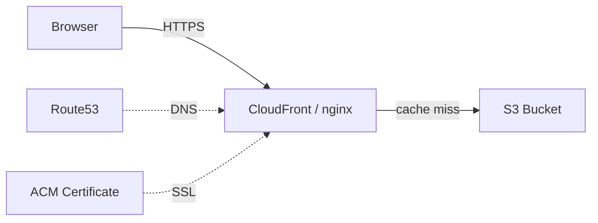

# J1: Static Site + Custom Domain

**TL;DR**: Deploy website statis (HTML, React build, Vue build) ke S3, percepat dengan CDN, pasang domain sendiri plus HTTPS. Semua jalan di laptop pakai Floci, tanpa kena tagihan AWS.

Waktu estimasi: 20 menit.

## Apa yang kita bangun

Sebuah situs portfolio sederhana di alamat `https://portfolio.local`, mengakses file dari S3 lewat CDN, dengan SSL. Setelah ini jalan, polanya sama persis untuk deploy ke domain asli di AWS.

Outcome konkret:
- Bucket S3 berisi file HTML
- CDN cache di depan S3
- Domain `portfolio.local` resolve ke CDN
- HTTPS aktif

## Arsitektur



Setiap kotak punya peran spesifik:
- **S3**: penyimpanan file. Murah, durable, tapi lambat untuk traffic global.
- **CloudFront**: cache di edge location, traffic user mampir ke node terdekat.
- **Route53**: nyambungkan domain ke CloudFront via DNS.
- **ACM**: terbitin sertifikat SSL gratis untuk domain.

## Floci coverage

| Service | Status | Catatan |
|---|---|---|
| S3 | ✅ full | bucket policy, website hosting, presigned URL |
| Route53 | ✅ full | hosted zone, record set |
| ACM | ✅ full | certificate request |
| CloudFront | ❌ gap | pakai nginx lokal sebagai cache+SSL terminator |

Polanya sama persis. Begitu kamu deploy ke AWS asli, nginx digantikan CloudFront tanpa ubah arsitektur.

## Setup lokal

Buat folder kerja baru:

```bash
mkdir j1-static-site && cd j1-static-site
```

### Docker compose

Bikin file `docker-compose.yml`:

```yaml
services:
  floci:
    image: floci/floci:latest
    ports: ['4566:4566']
    volumes:
      - /var/run/docker.sock:/var/run/docker.sock

  nginx:
    image: nginx:alpine
    ports:
      - '443:443'
    volumes:
      - ./nginx.conf:/etc/nginx/nginx.conf:ro
      - ./certs:/etc/nginx/certs:ro
    depends_on: [floci]
```

### Config nginx (sebagai CloudFront pengganti)

Bikin file `nginx.conf`:

```nginx
events {}

http {
  proxy_cache_path /tmp/cache levels=1:2 keys_zone=cdn:10m max_size=100m;

  server {
    listen 443 ssl;
    server_name portfolio.local;

    ssl_certificate     /etc/nginx/certs/portfolio.local.crt;
    ssl_certificate_key /etc/nginx/certs/portfolio.local.key;

    location / {
      proxy_pass http://host.docker.internal:4566/portfolio-bucket/;
      proxy_set_header Host portfolio-bucket.s3.localhost.localstack.cloud;
      proxy_cache cdn;
      proxy_cache_valid 200 1m;
      add_header X-Cache $upstream_cache_status;
    }
  }
}
```

### Sertifikat lokal

Pakai `mkcert` (install via `choco install mkcert` di Windows, atau `brew install mkcert` di Mac):

```bash
mkdir certs
mkcert -install
mkcert -cert-file certs/portfolio.local.crt -key-file certs/portfolio.local.key portfolio.local
```

### Edit hosts file

Tambah baris di `C:\Windows\System32\drivers\etc\hosts` (Windows) atau `/etc/hosts` (Linux/Mac):

```
127.0.0.1   portfolio.local
```

### Naikkan stack

```bash
docker compose up -d
```

Cek floci healthy: `curl http://localhost:4566/_localstack/health`.

## Step build

### 1. Bikin bucket S3

```bash
aws --endpoint-url=http://localhost:4566 s3 mb s3://portfolio-bucket
```

Set ke mode website hosting:

```bash
aws --endpoint-url=http://localhost:4566 s3 website s3://portfolio-bucket \
  --index-document index.html \
  --error-document 404.html
```

### 2. Bikin konten statis

```bash
mkdir site && cd site
cat > index.html << 'EOF'
<!DOCTYPE html>
<html lang="id">
<head>
  <meta charset="UTF-8">
  <title>Portfolio</title>
</head>
<body>
  <h1>Hello dari S3 via CDN</h1>
  <p>Build at <span id="t"></span></p>
  <script>document.getElementById('t').textContent = new Date().toISOString()</script>
</body>
</html>
EOF
cd ..
```

### 3. Upload ke bucket

```bash
aws --endpoint-url=http://localhost:4566 s3 sync site/ s3://portfolio-bucket
```

Verifikasi langsung ke S3 (bypass CDN):

```bash
curl http://localhost:4566/portfolio-bucket/index.html
```

Output: HTML tadi.

### 4. Akses via CDN dengan HTTPS

Buka browser ke `https://portfolio.local`. Halaman muncul.

Cek header response, akan ada `X-Cache: MISS` di request pertama, `HIT` di request berikutnya. Itu cache nginx kerja.

```bash
curl -k -I https://portfolio.local | grep X-Cache
```

### 5. Update konten, lihat cache

Ubah `site/index.html`, upload ulang:

```bash
aws --endpoint-url=http://localhost:4566 s3 sync site/ s3://portfolio-bucket
```

Reload browser. Konten LAMA masih muncul karena cache nginx 1 menit. Itu perilaku CDN asli. Tunggu 1 menit, reload, baru konten baru muncul.

Pelajaran: deploy file statis bukan cuma upload, tapi juga invalidate cache. Di CloudFront, ini lewat `aws cloudfront create-invalidation`.

## Deploy ke AWS asli

Polanya identik. Ganti tiga hal:

1. **Endpoint**: hapus flag `--endpoint-url=http://localhost:4566`.
2. **Bucket policy**: tambah public-read policy supaya CloudFront bisa baca.
3. **Setup CloudFront beneran**: pakai `aws cloudfront create-distribution` dengan origin ke bucket S3. Plus `aws acm request-certificate` untuk SSL, plus `aws route53 change-resource-record-sets` untuk DNS A record alias ke CloudFront.

Detail step-by-step deploy ke AWS asli ada di halaman service masing-masing ([S3](/id/services/s3), CloudFront, [Route53](/id/services/route53), ACM).

## Gotcha

- **S3 bucket name unik global**. Walau di lokal aman pakai `portfolio-bucket`, di AWS asli harus unik di seluruh dunia. Pakai prefix domain: `portfolio-supanova-2026`.
- **CloudFront propagation lambat**. Update distribution config di AWS asli butuh 15-30 menit propagate ke semua edge. Di lokal nginx instan, jangan kaget.
- **ACM cert harus di region us-east-1** kalau dipakai untuk CloudFront. Ini hard requirement AWS, bukan bug. Region lain untuk service lain.
- **SPA routing**: kalau site pakai React Router atau Vue Router, set `error-document` ke `index.html` juga, supaya `/about` direwrite ke root. Atau pakai CloudFront Function untuk handle.
- **Cache invalidation gratis 1000/bulan** di CloudFront. Lewat itu, $0.005 per path. Hindari invalidate file per-file, pakai versioned filename (Next.js export sudah otomatis hash).

## Cost (AWS asli, bukan lokal)

Untuk site portfolio dengan ~1000 visitor/bulan:
- S3 storage: 50 MB. Sekitar $0.001/bulan.
- S3 request: GET sekian ribu. Cents.
- CloudFront transfer: 500 MB. Free tier cover 1 TB/bulan untuk 12 bulan pertama.
- Route53 hosted zone: $0.50/bulan flat.
- ACM cert: gratis.

Total praktis: **kurang dari $1/bulan** untuk traffic kecil. Skala naik linear sama transfer egress CloudFront.

## Cleanup

```bash
docker compose down -v
```

Bucket dan resource di floci hilang otomatis karena ephemeral. Sertifikat lokal di `certs/` boleh dihapus.

Untuk AWS asli: hapus CloudFront distribution dulu (disable, tunggu propagate, baru delete), baru bucket, baru Route53 record. Urutan ini penting, distribution yang masih aktif tidak bisa lepas dari bucket.

## Next step

- Mau API endpoint juga? Lanjut ke [J2: REST API Serverless](/id/journeys/j2-rest-api).
- Mau form contact dengan email? Kombinasi J2 + SES.
- Mau analytics tanpa Google? Pasang Plausible di subdomain via journey yang sama.
