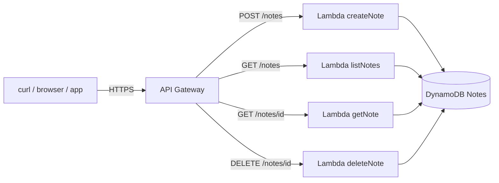

# J2: REST API Serverless

**TL;DR**: Bikin REST API untuk aplikasi catatan, full serverless. Tidak ada server yang harus kamu maintain, bayar per request bukan per jam, scale otomatis dari 0 ke jutaan. Semua jalan di laptop pakai Floci.

Waktu estimasi: 30 menit.

## Apa yang kita bangun

API untuk aplikasi `notes`, dengan 4 endpoint:

| Method | Path | Fungsi |
|---|---|---|
| POST | `/notes` | Bikin note baru |
| GET | `/notes` | List semua notes |
| GET | `/notes/{id}` | Detail satu note |
| DELETE | `/notes/{id}` | Hapus note |

Data tersimpan di DynamoDB. Setiap request dilayani Lambda function. API Gateway jadi pintu depan yang routing ke Lambda yang tepat.

## Arsitektur



Setiap kotak punya peran:
- **API Gateway**: terima HTTP request, routing ke Lambda yang sesuai berdasarkan path dan method.
- **Lambda**: code yang jalan sebentar, sekali per request. Cold start 100-500 ms di run pertama, hangat di run berikut.
- **DynamoDB**: NoSQL key-value, sub-10 ms latency untuk read/write tunggal.
- **IAM**: role yang ngasih izin Lambda akses DynamoDB. Tanpa ini, Lambda nggak bisa baca tulis ke tabel.

## Floci coverage

| Service | Status | Catatan |
|---|---|---|
| Lambda | ✅ full | Docker-native, jalanin code Node/Python beneran |
| API Gateway v2 | ✅ full | HTTP API + WebSocket |
| DynamoDB | ✅ full | streams, GSI, TTL |
| IAM | ✅ full | 68+ operasi |

Semua jalan di Floci, 1:1 sama AWS asli. Begitu deploy ke AWS, code dan policy yang sama bekerja tanpa modifikasi.

## Setup lokal

Folder kerja baru:

```bash
mkdir j2-rest-api && cd j2-rest-api
```

### Docker compose

```yaml
services:
  floci:
    image: floci/floci:latest
    ports: ['4566:4566']
    volumes:
      - /var/run/docker.sock:/var/run/docker.sock
```

```bash
docker compose up -d
```

### Alias untuk hemat ketikan

Endpoint Floci panjang. Bikin alias:

```bash
# bash / zsh
alias awsl='aws --endpoint-url=http://localhost:4566'

# PowerShell
function awsl { aws --endpoint-url=http://localhost:4566 @args }
```

Kalau pakai `awsl s3 ls` artinya `aws --endpoint-url=http://localhost:4566 s3 ls`. Lebih enak.

## Step build

### 1. Bikin DynamoDB table

Schema sederhana: partition key `id` (string). Tidak butuh sort key untuk use case ini.

```bash
awsl dynamodb create-table \
  --table-name Notes \
  --attribute-definitions AttributeName=id,AttributeType=S \
  --key-schema AttributeName=id,KeyType=HASH \
  --billing-mode PAY_PER_REQUEST
```

Verify:

```bash
awsl dynamodb list-tables
```

Output: `{ "TableNames": ["Notes"] }`.

### 2. Bikin IAM role untuk Lambda

Lambda butuh execution role dengan dua izin: write log ke CloudWatch, dan akses table DynamoDB.

Bikin trust policy:

```bash
cat > trust-policy.json << 'EOF'
{
  "Version": "2012-10-17",
  "Statement": [{
    "Effect": "Allow",
    "Principal": { "Service": "lambda.amazonaws.com" },
    "Action": "sts:AssumeRole"
  }]
}
EOF

awsl iam create-role \
  --role-name notes-lambda-role \
  --assume-role-policy-document file://trust-policy.json
```

Attach policy supaya bisa akses DynamoDB dan log:

```bash
awsl iam attach-role-policy \
  --role-name notes-lambda-role \
  --policy-arn arn:aws:iam::aws:policy/service-role/AWSLambdaBasicExecutionRole

awsl iam attach-role-policy \
  --role-name notes-lambda-role \
  --policy-arn arn:aws:iam::aws:policy/AmazonDynamoDBFullAccess
```

`DynamoDBFullAccess` enak untuk belajar, tapi untuk produksi pakai policy custom yang scope-nya cuma ke tabel Notes (lihat section Gotcha).

### 3. Tulis Lambda handler

Satu file Node.js yang handle keempat operasi via switch statement berdasarkan HTTP method dan path.

```js
// handler.js
const {
  DynamoDBClient
} = require('@aws-sdk/client-dynamodb')
const {
  DynamoDBDocumentClient,
  PutCommand, GetCommand, ScanCommand, DeleteCommand
} = require('@aws-sdk/lib-dynamodb')
const { randomUUID } = require('crypto')

const client = new DynamoDBClient({
  endpoint: process.env.AWS_ENDPOINT_URL,
  region: 'us-east-1'
})
const ddb = DynamoDBDocumentClient.from(client)
const TABLE = 'Notes'

exports.handler = async (event) => {
  const method = event.requestContext.http.method
  const id = event.pathParameters?.id

  try {
    if (method === 'POST') {
      const body = JSON.parse(event.body || '{}')
      const note = { id: randomUUID(), text: body.text, createdAt: Date.now() }
      await ddb.send(new PutCommand({ TableName: TABLE, Item: note }))
      return ok(201, note)
    }

    if (method === 'GET' && !id) {
      const res = await ddb.send(new ScanCommand({ TableName: TABLE }))
      return ok(200, res.Items)
    }

    if (method === 'GET' && id) {
      const res = await ddb.send(new GetCommand({ TableName: TABLE, Key: { id } }))
      if (!res.Item) return ok(404, { error: 'not found' })
      return ok(200, res.Item)
    }

    if (method === 'DELETE' && id) {
      await ddb.send(new DeleteCommand({ TableName: TABLE, Key: { id } }))
      return ok(204, null)
    }

    return ok(405, { error: 'method not allowed' })
  } catch (err) {
    return ok(500, { error: err.message })
  }
}

function ok(statusCode, body) {
  return {
    statusCode,
    headers: { 'Content-Type': 'application/json' },
    body: body === null ? '' : JSON.stringify(body)
  }
}
```

Package dependencies:

```bash
npm init -y
npm install @aws-sdk/client-dynamodb @aws-sdk/lib-dynamodb
```

Zip handler plus node_modules:

```bash
zip -r function.zip handler.js node_modules package.json
```

### 4. Deploy Lambda

```bash
awsl lambda create-function \
  --function-name notes-api \
  --runtime nodejs20.x \
  --handler handler.handler \
  --role arn:aws:iam::000000000000:role/notes-lambda-role \
  --zip-file fileb://function.zip \
  --environment Variables={AWS_ENDPOINT_URL=http://floci:4566}
```

Pakai `AWS_ENDPOINT_URL=http://floci:4566` bukan `localhost:4566`. Lambda di Floci jalan di container terpisah, harus akses Floci via service name docker.

Test invoke langsung tanpa API Gateway:

```bash
awsl lambda invoke \
  --function-name notes-api \
  --payload '{"requestContext":{"http":{"method":"POST"}},"body":"{\"text\":\"hello\"}"}' \
  --cli-binary-format raw-in-base64-out \
  response.json && cat response.json
```

Output: response dari handler. Status 201 plus note baru.

### 5. Bikin API Gateway HTTP API

Versi HTTP API (v2) lebih cepat, lebih murah, lebih sederhana dari REST API (v1). Pakai ini kecuali butuh fitur enterprise v1.

```bash
API_ID=$(awsl apigatewayv2 create-api \
  --name notes-api \
  --protocol-type HTTP \
  --target arn:aws:lambda:us-east-1:000000000000:function:notes-api \
  --query 'ApiId' --output text)

echo "API ID: $API_ID"
```

`--target` ke Lambda ARN bikin integration plus default route otomatis. Satu command, langsung jadi. Untuk control lebih granular pakai `create-integration` plus `create-route` terpisah.

Test endpoint:

```bash
API_URL="http://localhost:4566/restapis/$API_ID/local/_user_request_"

# POST
curl -X POST $API_URL/notes \
  -H 'Content-Type: application/json' \
  -d '{"text":"belajar serverless"}'

# LIST
curl $API_URL/notes

# GET by id (ganti $ID dengan id dari POST response)
curl $API_URL/notes/$ID

# DELETE
curl -X DELETE $API_URL/notes/$ID
```

Output POST: `{"id":"abc-123","text":"belajar serverless","createdAt":1716700000000}`.

URL format `_user_request_` itu konvensi Floci untuk routing API Gateway. Di AWS asli URL-nya `https://xxxxx.execute-api.us-east-1.amazonaws.com`.

## Iterate kode

Edit `handler.js`, repackage, update function:

```bash
zip -r function.zip handler.js node_modules package.json
awsl lambda update-function-code \
  --function-name notes-api \
  --zip-file fileb://function.zip
```

Untuk dev cycle lebih cepat, pakai framework seperti SAM CLI, Serverless Framework, atau SST. Tapi raw AWS CLI cukup untuk paham fundamental.

## Deploy ke AWS asli

Ganti 3 hal dari pola lokal:

1. **Endpoint**: hapus alias `awsl`, pakai `aws` biasa. Pastikan `aws configure` sudah set credentials.
2. **Account ID di ARN**: `000000000000` (placeholder Floci) ganti dengan account ID kamu. Cek via `aws sts get-caller-identity`.
3. **Environment variable**: hapus `AWS_ENDPOINT_URL`. SDK auto resolve ke endpoint AWS asli.

Detail per service ada di halaman service masing-masing ([Lambda](/id/services/lambda), API Gateway, [DynamoDB](/id/services/dynamodb), [IAM](/id/services/iam)).

## Gotcha

- **Cold start**: Lambda yang lama tidak dipanggil di-shutdown. Request pertama setelah idle 5-15 menit kena penalty 100-500 ms (Node) atau 1-3 detik (Java). Mitigasi: provisioned concurrency (bayar lebih), atau scheduled warming ping.
- **15 menit max execution**: Lambda hard limit. Job lebih lama pindah ke Step Functions, ECS, atau Batch.
- **Cold function size**: zip package + layers max 250 MB unzipped. Bundle tree-shaking penting kalau dependency banyak.
- **Region ARN format**: ARN tergantung region. `arn:aws:lambda:us-east-1:...` beda dari `arn:aws:lambda:ap-southeast-3:...`. Jakarta region adalah `ap-southeast-3`.
- **IAM policy terlalu lebar**: `DynamoDBFullAccess` enak untuk belajar, bahaya di produksi. Production pakai policy custom yang scope ke tabel spesifik dan action minimal (`GetItem`, `PutItem`, `DeleteItem`, `Scan` only).
- **DynamoDB Scan mahal dan lambat**: cocok untuk dataset kecil. Begitu data ribuan baris, pakai Query dengan partition key, atau bikin GSI.
- **API Gateway default timeout 30 detik**: kalau Lambda butuh lebih, request gateway timeout walau Lambda masih jalan. Sesuaikan via `--integration --timeout-in-millis`.
- **CORS perlu di-set eksplisit**: kalau API dipanggil dari browser, set `cors-configuration` di API Gateway. Lupa ini, request dari frontend kena CORS error.

## Cost (AWS asli, bukan lokal)

Untuk API dengan 100 ribu request/bulan, payload 1 KB:

- Lambda: 100k execution gratis (free tier permanen). Lewat itu, $0.20 per 1 juta request. Plus durasi: 100 ms average, 128 MB memory, sekitar $0.02.
- API Gateway HTTP API: $1.00 per 1 juta request. 100k = $0.10.
- DynamoDB PAY_PER_REQUEST: $0.25 per 1 juta write, $0.25 per 4 juta read. Dengan rasio 70% read 30% write, total beberapa cents.
- CloudWatch Logs: 5 GB gratis. Log Lambda biasanya sangat kecil per execution.

Total praktis: **kurang dari $1/bulan** untuk traffic 100 ribu request. Naik ke 10 juta request, masih sekitar $15/bulan.

Bandingkan dengan EC2 t3.small 24/7: $15/bulan tanpa peduli ada traffic atau tidak. Serverless menang untuk traffic spiky atau rendah.

## Cleanup

```bash
docker compose down -v
```

Di AWS asli, urutan delete:

```bash
aws apigatewayv2 delete-api --api-id $API_ID
aws lambda delete-function --function-name notes-api
aws dynamodb delete-table --table-name Notes
aws iam detach-role-policy --role-name notes-lambda-role \
  --policy-arn arn:aws:iam::aws:policy/AmazonDynamoDBFullAccess
aws iam detach-role-policy --role-name notes-lambda-role \
  --policy-arn arn:aws:iam::aws:policy/service-role/AWSLambdaBasicExecutionRole
aws iam delete-role --role-name notes-lambda-role
```

Role harus detach policy dulu sebelum bisa delete.

## Next step

- Mau frontend yang konsumsi API ini? Kombinasi [J1: Static Site](/id/journeys/j1-static-site) plus API endpoint dari journey ini.
- Mau login? Lanjut ke J3: Auth + User Management dengan Cognito.
- Mau API trigger pekerjaan async (kirim email, generate thumbnail)? Lanjut ke J5: Event-Driven Backend.
