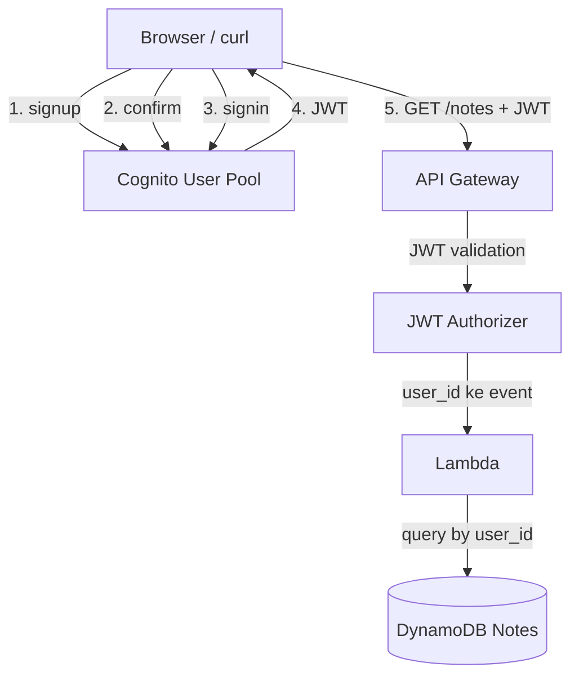

# J3: Auth & User Management

**TL;DR**: Bikin sistem login untuk aplikasi: signup, signin, JWT token, endpoint API yang cuma boleh diakses user yang sudah login. Pakai Cognito sebagai user registry, tanpa manage password sendiri. Semua jalan di Floci.

Waktu estimasi: 35 menit.

## Apa yang kita bangun

Aplikasi catatan dari [J2](/id/journeys/j2-rest-api) sekarang punya user. Setiap note milik user tertentu. Hanya pemilik yang bisa lihat dan hapus note miliknya.

Flow yang dibikin:

1. User signup dengan email + password.
2. User confirm email (di Floci, kode confirm di-print ke log).
3. User signin, menerima JWT token.
4. User panggil API dengan JWT di header. Lambda validate JWT, ekstrak user ID, return data milik user itu saja.

## Arsitektur



Konsep penting:
- **User Pool**: registry user. Berisi username, email, password (hashed). Issue JWT setelah signin.
- **App Client**: konfigurasi per aplikasi yang akses User Pool. Punya client ID, optional client secret.
- **JWT** (JSON Web Token): token base64-encoded berisi user info, di-sign Cognito. Lambda tinggal verify signature pakai public key Cognito.
- **JWT Authorizer**: feature API Gateway HTTP API yang otomatis validate JWT sebelum invoke Lambda. Tidak perlu code validation di Lambda.

## Floci coverage

| Service | Status | Catatan |
|---|---|---|
| Cognito | ✅ full | Floci-exclusive (LocalStack Free tidak punya), JSON 1.1 |
| Lambda + API Gateway | ✅ full | dari J2 |
| DynamoDB | ✅ full | dari J2 |
| IAM | ✅ full | dari J2 |

## Setup lokal

Folder baru:

```bash
mkdir j3-auth && cd j3-auth
```

`docker-compose.yml`:

```yaml
services:
  floci:
    image: floci/floci:latest
    ports: ['4566:4566']
    volumes:
      - /var/run/docker.sock:/var/run/docker.sock
```

```bash
docker compose up -d
alias awsl='aws --endpoint-url=http://localhost:4566'
```

## Step build

### 1. Bikin User Pool

```bash
USER_POOL_ID=$(awsl cognito-idp create-user-pool \
  --pool-name notes-users \
  --policies 'PasswordPolicy={MinimumLength=8,RequireUppercase=true,RequireLowercase=true,RequireNumbers=true}' \
  --auto-verified-attributes email \
  --username-attributes email \
  --query 'UserPool.Id' --output text)

echo "User Pool ID: $USER_POOL_ID"
```

`--username-attributes email` artinya user login pakai email, bukan username terpisah.
`--auto-verified-attributes email` artinya email perlu di-confirm (Floci tetap require ini).

### 2. Bikin App Client

App client adalah konfigurasi per aplikasi yang akses pool. Kita bikin tanpa client secret (cocok untuk frontend SPA, mobile app).

```bash
CLIENT_ID=$(awsl cognito-idp create-user-pool-client \
  --user-pool-id $USER_POOL_ID \
  --client-name notes-web \
  --no-generate-secret \
  --explicit-auth-flows ALLOW_USER_PASSWORD_AUTH ALLOW_REFRESH_TOKEN_AUTH \
  --query 'UserPoolClient.ClientId' --output text)

echo "Client ID: $CLIENT_ID"
```

`ALLOW_USER_PASSWORD_AUTH` enable signin dengan username + password langsung. Untuk produksi, prefer `ALLOW_USER_SRP_AUTH` (lebih aman, tidak kirim password mentah).

### 3. Signup user

```bash
awsl cognito-idp sign-up \
  --client-id $CLIENT_ID \
  --username alice@example.com \
  --password 'Passw0rd!' \
  --user-attributes Name=email,Value=alice@example.com
```

Output: `UserSub` (UUID untuk user ini). Simpan, ini yang nanti jadi `user_id` di DynamoDB.

### 4. Confirm signup

Di AWS asli, Cognito kirim email berisi 6-digit code ke alice@example.com. Di Floci, code tidak benar-benar dikirim. Pakai admin command untuk force-confirm:

```bash
awsl cognito-idp admin-confirm-sign-up \
  --user-pool-id $USER_POOL_ID \
  --username alice@example.com
```

Verifikasi user sudah confirmed:

```bash
awsl cognito-idp admin-get-user \
  --user-pool-id $USER_POOL_ID \
  --username alice@example.com \
  --query 'UserStatus'
```

Output: `"CONFIRMED"`.

### 5. Signin, terima JWT

```bash
TOKENS=$(awsl cognito-idp initiate-auth \
  --auth-flow USER_PASSWORD_AUTH \
  --client-id $CLIENT_ID \
  --auth-parameters USERNAME=alice@example.com,PASSWORD='Passw0rd!')

echo $TOKENS | jq '.AuthenticationResult'
```

Response berisi 3 token:
- **IdToken**: JWT berisi identitas user (sub, email). Buat authorize API.
- **AccessToken**: JWT untuk akses Cognito API (mis. ganti password). Bukan untuk authorize API kamu.
- **RefreshToken**: untuk refresh IdToken/AccessToken tanpa signin ulang. Berlaku 30 hari default.

Ekstrak IdToken:

```bash
ID_TOKEN=$(echo $TOKENS | jq -r '.AuthenticationResult.IdToken')
echo "Token (truncated): ${ID_TOKEN:0:50}..."
```

### 6. Decode JWT (untuk paham isinya)

JWT format: `header.payload.signature`, base64-encoded. Decode payload:

```bash
echo $ID_TOKEN | cut -d '.' -f 2 | base64 -d 2>/dev/null | jq
```

Output sample:

```json
{
  "sub": "abc-def-123",
  "email": "alice@example.com",
  "email_verified": true,
  "iss": "http://localhost:4566/ap-southeast-3_xxxxx",
  "aud": "client-id-xxxxx",
  "token_use": "id",
  "exp": 1716700000,
  "iat": 1716696400
}
```

`sub` adalah unique user ID yang stable. Pakai ini sebagai `user_id` di DynamoDB, bukan email (email bisa berubah).

### 7. Bikin DynamoDB table dengan user_id

Schema baru: partition key `user_id`, sort key `note_id`. User cuma bisa query notes miliknya.

```bash
awsl dynamodb create-table \
  --table-name NotesByUser \
  --attribute-definitions \
    AttributeName=user_id,AttributeType=S \
    AttributeName=note_id,AttributeType=S \
  --key-schema \
    AttributeName=user_id,KeyType=HASH \
    AttributeName=note_id,KeyType=RANGE \
  --billing-mode PAY_PER_REQUEST
```

### 8. Lambda handler dengan user_id dari JWT

API Gateway HTTP API dengan JWT authorizer otomatis validate token dan inject claim ke `event.requestContext.authorizer.jwt.claims`. Tidak perlu validate manual di Lambda.

```js
// handler.js
const {
  DynamoDBClient
} = require('@aws-sdk/client-dynamodb')
const {
  DynamoDBDocumentClient,
  PutCommand, QueryCommand, DeleteCommand
} = require('@aws-sdk/lib-dynamodb')
const { randomUUID } = require('crypto')

const client = new DynamoDBClient({
  endpoint: process.env.AWS_ENDPOINT_URL,
  region: 'us-east-1'
})
const ddb = DynamoDBDocumentClient.from(client)
const TABLE = 'NotesByUser'

exports.handler = async (event) => {
  const userId = event.requestContext.authorizer.jwt.claims.sub
  const method = event.requestContext.http.method
  const noteId = event.pathParameters?.id

  try {
    if (method === 'POST') {
      const body = JSON.parse(event.body || '{}')
      const note = {
        user_id: userId,
        note_id: randomUUID(),
        text: body.text,
        createdAt: Date.now()
      }
      await ddb.send(new PutCommand({ TableName: TABLE, Item: note }))
      return ok(201, note)
    }

    if (method === 'GET' && !noteId) {
      const res = await ddb.send(new QueryCommand({
        TableName: TABLE,
        KeyConditionExpression: 'user_id = :uid',
        ExpressionAttributeValues: { ':uid': userId }
      }))
      return ok(200, res.Items)
    }

    if (method === 'DELETE' && noteId) {
      await ddb.send(new DeleteCommand({
        TableName: TABLE,
        Key: { user_id: userId, note_id: noteId }
      }))
      return ok(204, null)
    }

    return ok(405, { error: 'method not allowed' })
  } catch (err) {
    return ok(500, { error: err.message })
  }
}

function ok(statusCode, body) {
  return {
    statusCode,
    headers: { 'Content-Type': 'application/json' },
    body: body === null ? '' : JSON.stringify(body)
  }
}
```

Yang berubah dari J2:
- `user_id` di-ekstrak dari `event.requestContext.authorizer.jwt.claims.sub`, bukan dari body request. User tidak bisa fake user lain.
- Query pakai `user_id` partition key. Otomatis cuma return data milik user itu.

### 9. Package dan deploy Lambda

```bash
npm init -y
npm install @aws-sdk/client-dynamodb @aws-sdk/lib-dynamodb
zip -r function.zip handler.js node_modules package.json

awsl lambda create-function \
  --function-name notes-api-auth \
  --runtime nodejs20.x \
  --handler handler.handler \
  --role arn:aws:iam::000000000000:role/notes-lambda-role \
  --zip-file fileb://function.zip \
  --environment Variables={AWS_ENDPOINT_URL=http://floci:4566}
```

Pakai role dari J2 (`notes-lambda-role`). Tambah policy untuk akses table baru:

```bash
awsl iam attach-role-policy \
  --role-name notes-lambda-role \
  --policy-arn arn:aws:iam::aws:policy/AmazonDynamoDBFullAccess
```

(Sudah di-attach kalau dari J2.)

### 10. Bikin API Gateway dengan JWT Authorizer

```bash
ISSUER="http://localhost:4566/$USER_POOL_ID"

API_ID=$(awsl apigatewayv2 create-api \
  --name notes-auth-api \
  --protocol-type HTTP \
  --query 'ApiId' --output text)

# Bikin JWT authorizer
AUTHORIZER_ID=$(awsl apigatewayv2 create-authorizer \
  --api-id $API_ID \
  --name cognito-jwt \
  --authorizer-type JWT \
  --identity-source '$request.header.Authorization' \
  --jwt-configuration "Issuer=$ISSUER,Audience=$CLIENT_ID" \
  --query 'AuthorizerId' --output text)

# Bikin integration ke Lambda
INTEGRATION_ID=$(awsl apigatewayv2 create-integration \
  --api-id $API_ID \
  --integration-type AWS_PROXY \
  --integration-uri "arn:aws:lambda:us-east-1:000000000000:function:notes-api-auth" \
  --payload-format-version 2.0 \
  --query 'IntegrationId' --output text)

# Bikin route dengan authorizer
awsl apigatewayv2 create-route \
  --api-id $API_ID \
  --route-key 'ANY /notes/{id+}' \
  --target "integrations/$INTEGRATION_ID" \
  --authorization-type JWT \
  --authorizer-id $AUTHORIZER_ID
```

`/{id+}` adalah greedy path parameter, match `/notes`, `/notes/abc`, dan seterusnya.

### 11. Test full flow

```bash
API_URL="http://localhost:4566/restapis/$API_ID/local/_user_request_"

# Tanpa token, harus 401
curl -i $API_URL/notes

# Dengan token, harus 200
curl -i $API_URL/notes -H "Authorization: Bearer $ID_TOKEN"

# Bikin note
curl -X POST $API_URL/notes \
  -H "Authorization: Bearer $ID_TOKEN" \
  -H 'Content-Type: application/json' \
  -d '{"text":"note pertama alice"}'

# List, cuma milik alice
curl $API_URL/notes -H "Authorization: Bearer $ID_TOKEN"
```

Coba user kedua (signup + signin user bob), pastikan bob tidak bisa lihat note alice.

## Deploy ke AWS asli

Sama seperti J2, ganti 3 hal: endpoint, account ID di ARN, env variable.

Plus di Cognito asli:
- Email verification beneran kirim email. Test pakai email valid.
- App client untuk web SPA: enable CORS allowed origins di Cognito settings.
- Hosted UI: Cognito provide login page jadi (`https://your-domain.auth.us-east-1.amazoncognito.com`), tinggal style. Tidak ada di Floci.

Detail Cognito per fitur ada di halaman [Cognito](/id/services/cognito) (segera).

## Gotcha

- **IdToken vs AccessToken**: untuk authorize API kamu sendiri, pakai IdToken. AccessToken cuma untuk panggil Cognito API. Confused ini sering bikin auth error mysterious.
- **JWT expiry default 1 jam**. Browser harus refresh token sebelum expire. Pakai RefreshToken untuk get IdToken baru tanpa user re-signin.
- **Email verification susah di-test lokal**. Floci tidak kirim email. Pakai `admin-confirm-sign-up` untuk bypass.
- **Password policy locked setelah pool dibuat**. Mau ubah dari 8 ke 12 character minimum? Bikin pool baru. Migrasi user butuh export-import.
- **Cognito attribute schema immutable**. Tambah custom attribute setelah pool live = bikin pool baru. Rancang attribute dari awal.
- **JWT signature verification butuh JWKS**. Lambda biasa harus fetch `https://cognito-idp.region.amazonaws.com/POOL_ID/.well-known/jwks.json`, cache, verify signature. API Gateway JWT authorizer handle ini otomatis, makanya prefer pakai authorizer.
- **Hosted UI cuma di AWS asli**. Untuk dev lokal, build login form sendiri yang panggil `cognito-idp initiate-auth`.
- **Lambda authorizer vs JWT authorizer**: JWT authorizer (built-in) lebih simpel dan cepat. Lambda authorizer (custom code) lebih fleksibel tapi tambah cold start dan biaya. Pakai JWT authorizer kecuali butuh logic custom.

## Cost (AWS asli)

Untuk app dengan 5000 monthly active user (MAU):

- Cognito User Pool: 10.000 MAU gratis selamanya. Lewat itu $0.0055 per MAU. 5000 MAU = $0.
- Lambda + API Gateway + DynamoDB: sama seperti J2, sekitar $1/bulan.
- SMS MFA: $0.06 per SMS (kalau enable MFA via SMS). Pakai TOTP gratis sebagai alternatif.

Total untuk 5k MAU: **kurang dari $2/bulan**. Cognito free tier MAU 10k adalah salah satu free tier paling generous AWS.

## Cleanup

```bash
docker compose down -v
```

AWS asli:

```bash
aws cognito-idp delete-user-pool --user-pool-id $USER_POOL_ID
aws apigatewayv2 delete-api --api-id $API_ID
aws lambda delete-function --function-name notes-api-auth
aws dynamodb delete-table --table-name NotesByUser
```

## Next step

- Mau social login (Google, Facebook, Apple)? Tambah Identity Provider di Cognito User Pool, konsumsi sama IdToken.
- Mau role-based access (admin vs user)? Pakai Cognito Group, group muncul di JWT claim `cognito:groups`. Lambda check group untuk authorize action.
- Mau upload file per user? Lanjut ke J4: File Upload Pipeline dengan S3 presigned URL plus authorize via JWT.
