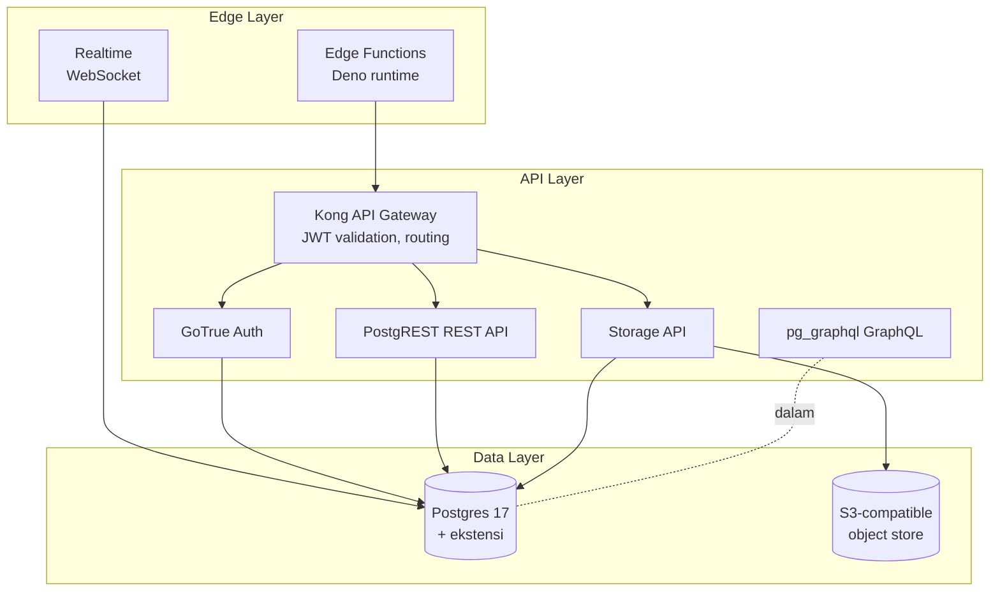

# Fondasi Supabase

Konsep dasar Supabase: cara service-service di-organize, scope project, billing, dan istilah yang sering muncul. Kalau kamu baru ngeliat Supabase pertama kali, mulai dari sini. Kalau udah hands-on di journey, balik ke halaman ini saat butuh klarifikasi konseptual.

## Apa itu Supabase

Backend-as-a-service open-source di atas Postgres. Bukan satu service, tapi stack yang gabungin Postgres + Auth + Storage + Edge Function + Realtime + Vector dalam satu project dengan tight integration di tiap layer.

Karakter utama yang bedain dari BaaS lain (Firebase, AWS Amplify):

- **Postgres adalah data plane**. Bukan NoSQL proprietary. Schema relational, SQL standard, semua ekstensi Postgres available.
- **RLS adalah authorization plane**. Bukan IAM atau policy di middleware. Per-row security enforced di database, otomatis apply ke REST API, Realtime, dan Storage.
- **PostgREST auto-generate REST API** dari schema. Tidak perlu code endpoint manual untuk CRUD biasa.
- **Lokal dev jalan via Docker** (`supabase start`). Mirror production, tidak ada gap "works in cloud, broken locally".

## Mental model tiga layer

- **Data layer**: Postgres (data + metadata + auth user + storage metadata) plus S3-compatible object backend untuk file.
- **API layer**: Kong gateway yang validate JWT dan routing ke service-service belakang. PostgREST, GoTrue, Storage, pg_graphql semua di balik Kong.
- **Edge layer**: Edge Functions (compute serverless) dan Realtime (WebSocket push). Klien biasanya hit edge layer untuk operasi yang tidak fit di REST CRUD.

## Where to start (per persona)

### Baru kenal cloud / Postgres
1. Baca [Project model](/id/supabase/foundation/project-model): pahami scope 1 project.
2. Pasang CLI dan jalanin local stack: [Tools / Install](/id/supabase/tools).
3. Ikuti [S1 Journey: Auth + CRUD](/id/supabase/journeys/s1-auth-crud) untuk feel pertama.

### Backend dev yang udah kenal Postgres
1. Skip foundation, langsung [Database service](/id/supabase/services/database) untuk konfirm RLS pattern dan ekstensi.
2. Lanjut journey yang spesifik (S4 untuk serverless, S5 untuk RAG, dll).

### Frontend dev migrate dari Firebase
1. [Project model](/id/supabase/foundation/project-model) untuk mapping konsep Firebase ke Supabase.
2. [Auth service](/id/supabase/services/auth) untuk perbedaan dengan Firebase Auth.
3. [Glossary](/id/supabase/foundation/glossary) untuk istilah yang beda nama tapi sama konsep.

### Architect evaluasi vs AWS
1. [Project model](/id/supabase/foundation/project-model): scope per project, billing implication.
2. Tiap service deep page punya **Cross-provider** section dengan matriks vs AWS / Azure / GCP.
3. [Billing](/id/supabase/foundation/billing) untuk pricing comparison gabungan.

## Topik fondasi

- [Project model](/id/supabase/foundation/project-model): apa itu "1 project Supabase", relasi project vs organization vs environment, region.
- [Billing](/id/supabase/foundation/billing): dimensi cost lintas service, decision plan Free vs Pro, surprise yang sering bikin tagihan naik.
- [Glossary](/id/supabase/foundation/glossary): istilah Supabase-specific dan padanannya di ekosistem lain.

## Yang fondasi ini tidak cover

- Setup CLI dan local stack: [Tools / Install](/id/supabase/tools).
- Implementasi journey konkret: [Use-Case Journey](/id/supabase/journeys).
- Detail per service: [Service Reference](/id/supabase/services).
- Konsep umum cloud (Region, VPC, IAM dll) yang bukan Supabase-specific: [Foundation AWS](/id/aws/foundation) untuk reference cross-provider.
