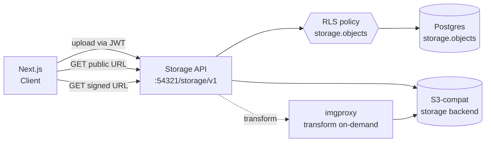

# S2: Upload File dengan Storage

Tambahin upload file ke notes app dari [S1](/id/supabase/journeys/s1-auth-crud): avatar user (public, di-resize on-demand) dan lampiran per-note (private, akses via signed URL). Pakai Supabase Storage yang S3-compatible plus imgproxy untuk transform image tanpa server-side processing manual.

## Kenapa journey ini relevan

Pola "user upload file ke server" sering dilakukan dengan tiga ribet:

1. **Bucket S3 setup terpisah dari DB**: IAM policy, presigned URL Lambda, CORS, ribet sinkron lifecycle.
2. **Image resize**: Lambda + sharp atau API third-party (Cloudinary, imgix). Tambah service.
3. **Akses control**: enforcement di middleware kode aplikasi, mudah miss edge case.

Supabase Storage gabungin ketiganya:

- Bucket metadata di Postgres yang sama, RLS policy lewat `storage.objects` table.
- Image transform built-in via imgproxy, on-demand resize lewat URL parameter.
- Signed URL native, expiry time + transform option dalam satu API call.

## Skenario

User di notes app sekarang punya:

- **Avatar** (single image per user, public bucket, di-display di header dengan ukuran 40x40 atau 200x200 tergantung context)
- **Lampiran per-note** (max 3 file per note, private bucket, akses lewat signed URL temporary)

End state: user upload avatar lewat form, semua tab refresh muncul avatar terbaru. User attach file ke note, klik download trigger signed URL, file ke-download tanpa user lain bisa akses link sembarangan.

## Arsitektur



Komponen:

- **Storage API**: REST layer Supabase, validasi JWT, enforce RLS, proxy ke S3-compat backend.
- **storage.objects** table di Postgres: metadata tiap file (path, bucket, owner, MIME, size, dll). Inilah yang policy SQL filter.
- **imgproxy**: container terpisah, terima URL dengan parameter `width=200&height=200`, fetch dari S3 backend, transform, serve.
- **S3-compat backend**: di lokal jalan via SeaweedFS/minio container di balik storage. Di production = AWS S3 sebenarnya.

## Setup lokal

Asumsi: notes-app dari S1 sudah jalan, `supabase start` aktif. Kalau belum, ikuti [S1 Step 1-2](/id/supabase/journeys/s1-auth-crud#step-1-schema--rls-migrasi).

Verify storage container hidup:

```bash
docker ps --filter "name=supabase_storage_"
```

Status output `supabase status` ada `Storage URL`. Default endpoint `http://127.0.0.1:54321/storage/v1`.

## Step 1: Schema profile + attachment table

Bikin migrasi:

```bash
supabase migration new add_profile_and_attachment
```

Isi:

```sql
-- 1. Profile table (1-to-1 dengan auth.users)
create table profiles (
  id uuid primary key references auth.users(id) on delete cascade,
  display_name text,
  avatar_path text,  -- path file di bucket 'avatars'
  updated_at timestamptz default now()
);

alter table profiles enable row level security;

create policy "anyone read profile" on profiles for select
  using (true);

create policy "user update own profile" on profiles for update to authenticated
  using ((select auth.uid()) = id)
  with check ((select auth.uid()) = id);

create policy "user insert own profile" on profiles for insert to authenticated
  with check ((select auth.uid()) = id);

-- Trigger: auto-create profile row saat user signup
create or replace function public.handle_new_user()
returns trigger
set search_path = ''
language plpgsql
security definer
as $$
begin
  insert into public.profiles (id)
  values (new.id);
  return new;
end;
$$;

create trigger on_auth_user_created
  after insert on auth.users
  for each row execute function public.handle_new_user();

-- 2. Attachment table (note -> file)
create table note_attachments (
  id uuid primary key default gen_random_uuid(),
  note_id uuid not null references notes(id) on delete cascade,
  user_id uuid not null references auth.users(id) on delete cascade,
  storage_path text not null,  -- path di bucket 'attachments'
  file_name text not null,
  mime_type text,
  size_bytes bigint,
  created_at timestamptz default now()
);

create index note_attachments_note_id_idx on note_attachments(note_id);
create index note_attachments_user_id_idx on note_attachments(user_id);

alter table note_attachments enable row level security;

create policy "user see own attachments" on note_attachments for select to authenticated
  using ((select auth.uid()) = user_id);

create policy "user insert own attachments" on note_attachments for insert to authenticated
  with check ((select auth.uid()) = user_id);

create policy "user delete own attachments" on note_attachments for delete to authenticated
  using ((select auth.uid()) = user_id);
```

Apply:

```bash
supabase db reset
```

Trigger `on_auth_user_created` bikin row di `profiles` tiap kali user signup. Existing user (dari test S1) tidak ke-cover, perlu manual seed kalau testing dari awal.

## Step 2: Bikin bucket

Dua pendekatan: lewat `config.toml` (declarative, di-versioned) atau lewat SDK/Studio (imperative).

### Declarative via config.toml

Edit `supabase/config.toml`:

```toml
[storage.buckets.avatars]
public = true
file_size_limit = "2MiB"
allowed_mime_types = ["image/png", "image/jpeg", "image/webp"]

[storage.buckets.attachments]
public = false
file_size_limit = "10MiB"
# allowed_mime_types kosong = semua MIME bolehrr
```

Restart stack supaya bucket created:

```bash
supabase stop && supabase start
```

### Imperative via SDK (alternative)

Kalau prefer creation di kode (mis. one-shot setup script):

```ts
await supabase.storage.createBucket('avatars', {
  public: true,
  fileSizeLimit: '2MB',
  allowedMimeTypes: ['image/png', 'image/jpeg', 'image/webp']
})

await supabase.storage.createBucket('attachments', {
  public: false,
  fileSizeLimit: '10MB'
})
```

Tapi tidak versioned di Git. Untuk team setting, declarative via config.toml lebih sustain.

## Step 3: Storage RLS policy

Bucket created tidak otomatis bikin policy. Default semua operasi DENY untuk role `authenticated`. Tulis policy via migrasi:

```bash
supabase migration new add_storage_policies
```

Isi:

```sql
-- AVATARS bucket
-- Path convention: <user_id>/<filename>
-- Contoh: 11111111-.../avatar.png

create policy "anyone view avatars" on storage.objects for select
  using (bucket_id = 'avatars');

create policy "user upload own avatar" on storage.objects for insert to authenticated
  with check (
    bucket_id = 'avatars'
    and (storage.foldername(name))[1] = (select auth.uid()::text)
  );

create policy "user update own avatar" on storage.objects for update to authenticated
  using (
    bucket_id = 'avatars'
    and (storage.foldername(name))[1] = (select auth.uid()::text)
  );

create policy "user delete own avatar" on storage.objects for delete to authenticated
  using (
    bucket_id = 'avatars'
    and (storage.foldername(name))[1] = (select auth.uid()::text)
  );

-- ATTACHMENTS bucket
-- Path convention: <user_id>/<note_id>/<filename>

create policy "user view own attachments" on storage.objects for select to authenticated
  using (
    bucket_id = 'attachments'
    and (storage.foldername(name))[1] = (select auth.uid()::text)
  );

create policy "user upload own attachments" on storage.objects for insert to authenticated
  with check (
    bucket_id = 'attachments'
    and (storage.foldername(name))[1] = (select auth.uid()::text)
  );

create policy "user delete own attachments" on storage.objects for delete to authenticated
  using (
    bucket_id = 'attachments'
    and (storage.foldername(name))[1] = (select auth.uid()::text)
  );
```

Apply: `supabase db reset`.

### Pattern penting: path naming = security

Storage tidak punya kolom `user_id`. Per-user isolation enforce via convention nama file. Helper `storage.foldername(name)` parse path jadi array. Untuk path `abc-123/avatar.png`, return `{'abc-123'}`. Kita check element pertama match dengan `auth.uid()`.

Ini convention, bukan enforcement otomatis. Kalau kamu salah naro file (path bukan diawali user_id), policy tidak protect. Selalu generate path di server atau strict-validate di client sebelum upload.

## Step 4: Upload avatar dari Next.js

Komponen client untuk upload + preview:

```tsx
// web/components/avatar-uploader.tsx
'use client'

import { createClient } from '@/lib/supabase/client'
import { useState, useTransition } from 'react'
import { updateProfile } from '@/app/profile/actions'

export function AvatarUploader({ userId, currentPath }: { userId: string; currentPath?: string }) {
  const supabase = createClient()
  const [uploading, setUploading] = useState(false)
  const [, startTransition] = useTransition()
  const [error, setError] = useState<string | null>(null)

  async function handleUpload(e: React.ChangeEvent<HTMLInputElement>) {
    const file = e.target.files?.[0]
    if (!file) return

    setError(null)
    setUploading(true)

    try {
      const ext = file.name.split('.').pop()
      const path = `${userId}/avatar.${ext}`

      // Upsert: replace kalau sudah ada
      const { error: uploadError } = await supabase.storage
        .from('avatars')
        .upload(path, file, { upsert: true, contentType: file.type })

      if (uploadError) throw uploadError

      // Update profile.avatar_path di DB
      startTransition(() => updateProfile(path))
    } catch (err) {
      setError((err as Error).message)
    } finally {
      setUploading(false)
    }
  }

  const publicUrl = currentPath
    ? supabase.storage.from('avatars').getPublicUrl(currentPath, {
        transform: { width: 200, height: 200, resize: 'cover' }
      }).data.publicUrl
    : null

  return (
    <div className="flex items-center gap-4">
      {publicUrl ? (
        
      ) : (
        <div className="w-20 h-20 rounded-full bg-gray-200" />
      )}
      <div>
        <input
          type="file"
          accept="image/png,image/jpeg,image/webp"
          onChange={handleUpload}
          disabled={uploading}
        />
        {uploading && <p className="text-sm">Uploading...</p>}
        {error && <p className="text-sm text-red-600">{error}</p>}
      </div>
    </div>
  )
}
```

Server action untuk update profile:

```ts
// web/app/profile/actions.ts
'use server'

import { createClient } from '@/lib/supabase/server'
import { redirect } from 'next/navigation'
import { revalidatePath } from 'next/cache'

export async function updateProfile(avatarPath: string) {
  const supabase = await createClient()
  const { data: { user } } = await supabase.auth.getUser()
  if (!user) redirect('/login')

  await supabase
    .from('profiles')
    .update({ avatar_path: avatarPath, updated_at: new Date().toISOString() })
    .eq('id', user.id)

  revalidatePath('/notes')
  revalidatePath('/profile')
}
```

Halaman profile yang pakai uploader:

```tsx
// web/app/profile/page.tsx
import { createClient } from '@/lib/supabase/server'
import { AvatarUploader } from '@/components/avatar-uploader'
import { redirect } from 'next/navigation'

export default async function ProfilePage() {
  const supabase = await createClient()
  const { data: { user } } = await supabase.auth.getUser()
  if (!user) redirect('/login')

  const { data: profile } = await supabase
    .from('profiles')
    .select('avatar_path, display_name')
    .eq('id', user.id)
    .single()

  return (
    <main className="max-w-xl mx-auto mt-10 p-4 space-y-6">
      <h1 className="text-2xl font-bold">Profile</h1>
      <AvatarUploader userId={user.id} currentPath={profile?.avatar_path ?? undefined} />
    </main>
  )
}
```

### Image transform via URL parameter

Note di `AvatarUploader.tsx`:

```ts
supabase.storage.from('avatars').getPublicUrl(currentPath, {
  transform: { width: 200, height: 200, resize: 'cover' }
})
```

URL yang dihasilkan:

```
http://127.0.0.1:54321/storage/v1/render/image/public/avatars/<user-id>/avatar.png?width=200&height=200&resize=cover
```

imgproxy intercept request, fetch file asli, resize, return. Browser dapat WebP atau JPEG sesuai header `Accept`.

Resize option:

- `cover`: maintain aspect ratio, crop biar fill dimension (default thumbnail)
- `contain`: maintain aspect ratio, letterbox biar fit dimension
- `fill`: stretch ke dimension (jelek untuk foto)

Untuk display di tempat lain (mis. navbar 40x40), tinggal request URL beda dimension. Tidak perlu pre-generate banyak ukuran.

## Step 5: Upload attachment dari Next.js (private bucket)

Komponen + Server Action gabung di satu halaman note detail:

```tsx
// web/app/notes/[id]/page.tsx
import { createClient } from '@/lib/supabase/server'
import { redirect } from 'next/navigation'
import { revalidatePath } from 'next/cache'

async function uploadAttachment(formData: FormData) {
  'use server'
  const file = formData.get('file') as File
  const noteId = formData.get('noteId') as string
  if (!file || !noteId) return

  const supabase = await createClient()
  const { data: { user } } = await supabase.auth.getUser()
  if (!user) redirect('/login')

  const path = `${user.id}/${noteId}/${Date.now()}-${file.name}`

  // Upload ke storage
  const arrayBuffer = await file.arrayBuffer()
  const { error: uploadError } = await supabase.storage
    .from('attachments')
    .upload(path, arrayBuffer, { contentType: file.type })

  if (uploadError) throw uploadError

  // Catat metadata di note_attachments
  await supabase.from('note_attachments').insert({
    note_id: noteId,
    user_id: user.id,
    storage_path: path,
    file_name: file.name,
    mime_type: file.type,
    size_bytes: file.size
  })

  revalidatePath(`/notes/${noteId}`)
}

export default async function NoteDetailPage({ params }: { params: Promise<{ id: string }> }) {
  const { id } = await params
  const supabase = await createClient()
  const { data: { user } } = await supabase.auth.getUser()
  if (!user) redirect('/login')

  const { data: note } = await supabase
    .from('notes')
    .select('id, content, created_at')
    .eq('id', id)
    .single()

  if (!note) return <p>Not found.</p>

  const { data: attachments } = await supabase
    .from('note_attachments')
    .select('id, storage_path, file_name, size_bytes')
    .eq('note_id', id)

  // Generate signed URL untuk tiap attachment (60 detik)
  const attachmentsWithUrl = await Promise.all(
    (attachments ?? []).map(async (a) => {
      const { data } = await supabase.storage
        .from('attachments')
        .createSignedUrl(a.storage_path, 60)
      return { ...a, signedUrl: data?.signedUrl }
    })
  )

  return (
    <main className="max-w-2xl mx-auto mt-10 p-4 space-y-6">
      <h1 className="text-xl font-bold">{note.content}</h1>

      <section>
        <h2 className="font-semibold mb-2">Lampiran</h2>
        <ul className="space-y-2">
          {attachmentsWithUrl.map((a) => (
            <li key={a.id} className="flex justify-between p-2 border rounded">
              <a href={a.signedUrl} target="_blank" rel="noreferrer" className="underline">
                {a.file_name}
              </a>
              <span className="text-sm text-gray-500">
                {(a.size_bytes / 1024).toFixed(0)} KB
              </span>
            </li>
          ))}
        </ul>
      </section>

      <form action={uploadAttachment} encType="multipart/form-data" className="flex gap-2">
        <input type="hidden" name="noteId" value={note.id} />
        <input type="file" name="file" required className="flex-1" />
        <button className="bg-black text-white px-4 rounded">Upload</button>
      </form>
    </main>
  )
}
```

`createSignedUrl(path, expiresIn)` generate URL temporary yang valid `expiresIn` detik. Hit URL itu return file, no JWT needed. Habis expire, URL 401.

### Signed URL dengan transform

Bisa juga signed URL ke image transform (mis. preview image attachment di mini-size):

```ts
const { data } = await supabase.storage
  .from('attachments')
  .createSignedUrl(path, 60, {
    transform: { width: 100, height: 100 }
  })
```

URL hasilnya valid 60 detik, dapat thumbnail. Cocok untuk gallery preview.

## Step 6: Test

```bash
cd web
npm run dev
```

1. Login user A.
2. Buka `/profile`. Upload avatar (PNG/JPEG/WebP < 2MB). Avatar muncul di halaman.
3. Buka `/notes`. Klik salah satu note untuk masuk detail (`/notes/<id>`).
4. Upload file lampiran. Refresh, file muncul di list dengan signed URL klikable.
5. Logout, login user B. Buka URL note user A langsung (`/notes/<id-user-A>`):
   - Note konten tidak muncul (RLS notes block).
   - Walau URL signed attachment di-share antar user, tetap valid sampai expire. Setelah expire, 401. (Inilah trade-off signed URL: aman dari listing tapi tidak aman dari sharing-sengaja.)

### Test edge case

**Upload file di luar folder sendiri**:

Coba langsung via SDK saat login user A:

```ts
await supabase.storage
  .from('avatars')
  .upload('22222222-aaaa-...../sneak.png', file)
```

Hasil: error `new row violates row-level security policy`. Policy `with check (... = (select auth.uid()::text))` block ini.

**Upload file > size limit**:

```ts
const big = new File([new ArrayBuffer(5 * 1024 * 1024)], 'big.png', { type: 'image/png' })
await supabase.storage.from('avatars').upload('user-id/big.png', big)
```

Hasil: error `Payload too large`. Storage validate sebelum write.

**Upload MIME tidak diizinkan**:

```ts
const exe = new File([...], 'malware.exe', { type: 'application/x-msdownload' })
await supabase.storage.from('avatars').upload('user-id/m.exe', exe)
```

Hasil: error `mime type not supported`. `allowedMimeTypes` enforce.

## Deploy ke production

Sama flow dengan S1:

```bash
supabase db push
```

Tambah: bucket yang declare di `config.toml` tidak auto-create di production. Bikin manual:

- Lewat Dashboard: Storage > New bucket.
- Lewat SDK script one-shot (`createBucket`).
- Lewat `supabase storage create` CLI (di versi CLI yang support).

Pastikan storage policy migrasi sudah push. Cek di Studio production: Storage > Policies, semua policy listed.

## Gotcha

### File besar tidak bisa upload via Server Action default

Next.js Server Action limit body 1 MB default. Untuk attachment > 1MB, tweak `next.config.mjs`:

```js
export default {
  experimental: {
    serverActions: {
      bodySizeLimit: '10mb'
    }
  }
}
```

Untuk file > 50MB, pakai direct upload (`upload()` dari client) atau resumable upload (TUS protocol), bukan via Server Action.

### Resumable upload untuk file besar

Untuk file > 50 MB atau koneksi tidak stabil:

```ts
const { error } = await supabase.storage
  .from('attachments')
  .uploadToSignedUrl(uploadUrl, token, file)
```

Resumable bisa di-pause + lanjut tanpa restart upload dari nol. Detail di Storage docs official.

### Signed URL tidak revoke setelah delete file

Kalau kamu generate signed URL valid 1 jam, lalu delete file, signed URL **tetap valid** sampai expire (return 404 karena file tidak ada, tapi URL itself bukan revoked). Untuk content sensitive, expiry pendek (60-300 detik) + regenerate per request.

### Path naming critical untuk RLS

`storage.foldername(name)[1]` return string. Kalau path adalah `<user_id>/file.png`, return `user_id` string. Tapi kalau path `file.png` (tanpa folder), return NULL. Pastikan generate path selalu pakai folder convention. Validate di server sebelum upload.

### Image transform pakai compute

Tiap request transform jadi cache miss yang bikin imgproxy compute. Di production, request high-traffic ke unique transform combination bisa bikin cost compute. Strategi:

- Cache CDN di depan storage URL.
- Generate transform URL yang fixed per use-case (mis. cuma `200x200` dan `40x40`, bukan dinamis).
- Pre-generate thumbnail di server saat upload, simpan terpisah.

### Bucket public masih butuh INSERT policy

Bucket public = anyone bisa download. Tapi UPLOAD selalu butuh policy. Kalau bikin bucket public tanpa policy INSERT, user tidak bisa upload meskipun expected "public".

### Storage tidak auto-cleanup orphan file

Hapus row `note_attachments` tidak auto-hapus file di Storage. Setup cron job atau lifecycle policy:

```sql
-- Cron job hapus file orphan tiap malam
select cron.schedule('cleanup-orphan-storage', '0 2 * * *', $$
  delete from storage.objects
  where bucket_id = 'attachments'
  and id not in (
    select substring(storage_path from '[^/]+$')::uuid
    from public.note_attachments
  )
$$);
```

Atau pakai trigger `on delete cascade` dari note_attachments yang panggil `storage.delete()`.

### MAU + Storage size billing terpisah

Storage size limit (500 MB Free, 8 GB Pro) terpisah dari DB storage. Image transform request dihitung di bandwidth, bukan compute. Audit secara periodik via Dashboard > Project Settings > Usage.

## Pricing mental model

| Dimensi | Free | Pro | Beyond |
|---|---|---|---|
| Storage size | 1 GB | 100 GB | $0.021/GB-month |
| Bandwidth | 5 GB egress | 250 GB egress | $0.09/GB |
| Image transform | unlimited (subject to bandwidth) | unlimited | unlimited |
| Request | unlimited | unlimited | unlimited |

Yang sering naik bill: **bandwidth**, bukan storage. Image avatar 50KB diakses ribuan kali per hari = bandwidth gede. Pasang CDN di depan (Cloudflare, Vercel) atau caching aggressive di app untuk asset static.

Image transform "unlimited" maksudnya tidak ada surcharge per transform request, tapi tiap response counted di bandwidth.

## Cross-provider

| Capability | Supabase Storage | AWS S3 | Azure Blob | GCP Cloud Storage |
|---|---|---|---|---|
| Object store | S3-compatible API | S3 native | Blob Storage | Cloud Storage |
| Access control | RLS via storage.objects | IAM policy + presigned URL | RBAC + SAS | IAM + signed URL |
| Image transform | imgproxy built-in | Lambda@Edge / CloudFront Functions | Logic Apps / Function | Cloud Functions |
| Signed URL | createSignedUrl + transform | presigned URL (no transform) | SAS token (no transform) | signed URL (no transform) |
| Resumable upload | TUS protocol | multipart upload | block blob | resumable upload |
| Webhook on upload | trigger DB | S3 event > SNS/SQS/Lambda | Event Grid | Cloud Pub/Sub |
| Public access | bucket setting + policy | bucket policy + ACL | container access level | IAM Allusers |
| Local dev | container via supabase start | LocalStack / MinIO | Azurite | gcloud emulator |

Positioning: Supabase Storage low-friction untuk app yang udah pakai Supabase Auth + DB. Image transform built-in jadi differentiator vs S3 native (S3 butuh CloudFront Functions atau Lambda@Edge tambahan). Untuk workload object storage skala besar (petabyte, lifecycle complex), S3 atau GCS lebih mature dan murah at scale.

## Anti-pattern

- **Upload langsung dari client tanpa path validation di server**. Walau RLS protect dari sisi DB, log audit lebih sulit kalau path tidak controlled.
- **Public bucket untuk content sensitive**. Public = anyone dengan URL bisa akses. Pakai private bucket + signed URL untuk content yang user-specific atau time-bound.
- **Signed URL expiry 7 hari**. Mengurangi security benefit. Default ke 60-300 detik, generate ulang per request.
- **Store file path di kolom DB dengan format `https://...`**. Path harusnya relative (`<user-id>/avatar.png`). URL absolut bisa berubah saat ganti project atau region. Generate URL on-demand pakai SDK.
- **Tidak pasang `allowedMimeTypes` di bucket**. Bucket terbuka terima apa saja, termasuk executable. Selalu restrict ke MIME yang expected.
- **Pre-generate puluhan ukuran thumbnail**. Dengan image transform on-demand, cukup simpan original. Generate ukuran yang dibutuhkan via URL parameter. Hemat storage.

## Setelah ini

- Service deep page: **Storage** (work in progress), bakal cover bucket types, lifecycle policy, S3-protocol compatibility, dan tuning untuk skala besar.
- Track storage RLS sebagai code: [RLS Workflow](/id/supabase/tools/rls-workflow) cover juga policy di `storage.objects`.
- Next journey: **S3 Realtime subscription** (work in progress), pakai Postgres CDC untuk push notification atau collaboration.
