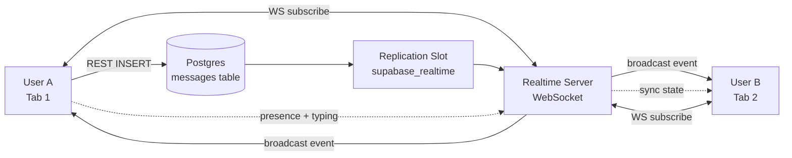

# S3: Live Chat Room dengan Realtime

Bikin chat room multi-user: user join room, kirim message dengan delivery real-time ke semua online, lihat siapa lagi online (presence), dan typing indicator. Pakai tiga mode Supabase Realtime sekaligus: **Postgres Changes** untuk persistent message, **Presence** untuk online state, **Broadcast** untuk ephemeral signal. Lokal pakai `supabase start`.

## Kenapa journey ini sintesis tiga fitur

Banyak aplikasi modern butuh kombinasi:

- **Persistent + immediate**: message harus disimpan permanent dan muncul di client lain dalam ratusan milidetik (chat, notification, live dashboard)
- **Ephemeral state**: siapa online sekarang, di mana cursor mereka, sedang ngetik atau tidak (collaboration, multiplayer)
- **Signal broadcast**: pub/sub event antar client tanpa simpan ke DB (typing indicator, "user X reacted", live cheer)

Supabase Realtime gabungin ketiganya di satu channel. Bukan pakai service pub/sub terpisah (SNS+SQS atau Pub/Sub atau Pusher). Plus dia listen Postgres replication slot langsung, jadi any client yang udah subscribe channel langsung dapat event saat row baru INSERT, tanpa kamu kirim notif manual dari kode aplikasi.

## Skenario

Notes app dari S1+S2 punya fitur kolaborasi baru: **chat room**.

- User bisa create room, atau join room yang udah ada.
- Di dalam room, lihat semua message yang udah pernah dikirim.
- Kirim message: semua user lain yang lagi buka room itu langsung lihat.
- Header room nampilin "5 online" dan list user yang online.
- Saat user ngetik, user lain lihat "user X sedang mengetik..." selama 3 detik setelah keystroke terakhir.

End state: dua tab browser dengan user beda, sama-sama buka room. Ngetik di satu tab, tab lain lihat typing indicator. Kirim message, tab lain langsung dapat tanpa refresh.

## Arsitektur



Komponen:

- **WebSocket connection** dari client ke Realtime server. Satu connection bisa multiplex banyak channel.
- **Postgres replication slot** `supabase_realtime`: publication yang Realtime server tail terus-menerus. Tiap INSERT/UPDATE/DELETE di table yang masuk publication = event di-broadcast.
- **Presence state**: in-memory di Realtime server, di-sync ke semua subscriber channel. Tidak disimpan ke DB.
- **Broadcast event**: pub/sub ephemeral. Sender publish, semua subscriber dapat. Tidak disimpan, tidak ada history.

## Setup lokal

Asumsi: project notes-app dari S1+S2 udah jalan. Kalau belum, ikuti [S1 Step 1-2](/id/supabase/journeys/s1-auth-crud#step-1-schema--rls-migrasi).

Realtime container default hidup. Verify:

```bash
docker ps --filter "name=supabase_realtime_"
```

## Step 1: Schema chat + RLS

```bash
supabase migration new add_chat_rooms
```

Isi:

```sql
-- 1. Rooms
create table rooms (
  id uuid primary key default gen_random_uuid(),
  name text not null,
  created_by uuid not null references auth.users(id) on delete cascade,
  created_at timestamptz default now()
);

alter table rooms enable row level security;

-- 2. Membership: tracking siapa anggota room mana
create table room_members (
  room_id uuid not null references rooms(id) on delete cascade,
  user_id uuid not null references auth.users(id) on delete cascade,
  joined_at timestamptz default now(),
  primary key (room_id, user_id)
);
create index room_members_user_id_idx on room_members(user_id);

alter table room_members enable row level security;

-- 3. Messages
create table messages (
  id uuid primary key default gen_random_uuid(),
  room_id uuid not null references rooms(id) on delete cascade,
  user_id uuid not null references auth.users(id) on delete cascade,
  content text not null check (length(content) > 0 and length(content) <= 1000),
  created_at timestamptz default now()
);
create index messages_room_id_idx on messages(room_id, created_at);

alter table messages enable row level security;

-- Helper SECURITY DEFINER: cek user ini member room ini atau tidak
create schema if not exists private;

create or replace function private.is_room_member(p_room_id uuid, p_user_id uuid)
returns boolean
set search_path = ''
language sql
security definer
stable
as $$
  select exists (
    select 1 from public.room_members
    where room_id = p_room_id and user_id = p_user_id
  );
$$;

-- Policies room
create policy "anyone authenticated can see public rooms" on rooms for select to authenticated
  using (true);

create policy "authenticated can create room" on rooms for insert to authenticated
  with check ((select auth.uid()) = created_by);

create policy "creator can delete room" on rooms for delete to authenticated
  using ((select auth.uid()) = created_by);

-- Policies room_members
create policy "members see members of same room" on room_members for select to authenticated
  using (private.is_room_member(room_id, (select auth.uid())));

create policy "user join room as self" on room_members for insert to authenticated
  with check ((select auth.uid()) = user_id);

create policy "user leave own membership" on room_members for delete to authenticated
  using ((select auth.uid()) = user_id);

-- Policies messages
create policy "members read messages" on messages for select to authenticated
  using (private.is_room_member(room_id, (select auth.uid())));

create policy "members write own messages" on messages for insert to authenticated
  with check (
    (select auth.uid()) = user_id
    and private.is_room_member(room_id, (select auth.uid()))
  );

create policy "user delete own messages" on messages for delete to authenticated
  using ((select auth.uid()) = user_id);
```

Apply: `supabase db reset`.

## Step 2: Enable Postgres replication

Realtime butuh table didaftarkan ke publication `supabase_realtime` supaya tail-able:

```bash
supabase migration new enable_realtime_messages
```

```sql
alter publication supabase_realtime add table messages;
```

Apply: `supabase db reset`.

Verify di Studio: Database > Publications > `supabase_realtime` > listed tables. `messages` ada.

Catatan: hanya tabel yang **butuh** di-tail yang masuk publication. Tabel internal app yang tidak perlu real-time (mis. user audit log) jangan dimasukin, mubazir bandwidth dan compute Realtime server.

## Step 3: Subscribe + send via React hook

Tiga concern di satu hook biar reusable. Bikin `web/hooks/use-room.ts`:

```ts
'use client'

import { createClient } from '@/lib/supabase/client'
import { useEffect, useRef, useState } from 'react'
import type { RealtimeChannel } from '@supabase/supabase-js'

type Message = {
  id: string
  room_id: string
  user_id: string
  content: string
  created_at: string
}

type PresenceUser = { user_id: string; email: string; online_at: string }

export function useRoom(roomId: string, currentUser: { id: string; email: string }) {
  const supabase = createClient()
  const [messages, setMessages] = useState<Message[]>([])
  const [online, setOnline] = useState<PresenceUser[]>([])
  const [typingUsers, setTypingUsers] = useState<string[]>([])
  const channelRef = useRef<RealtimeChannel | null>(null)
  const typingTimeoutRef = useRef<NodeJS.Timeout | null>(null)

  // Initial load + subscribe
  useEffect(() => {
    let cancelled = false

    async function init() {
      // Initial: load 50 message terakhir
      const { data } = await supabase
        .from('messages')
        .select('*')
        .eq('room_id', roomId)
        .order('created_at', { ascending: true })
        .limit(50)

      if (cancelled) return
      setMessages(data ?? [])

      // Single channel untuk room ini, multiplex semua event
      const channel = supabase.channel(`room:${roomId}`, {
        config: { presence: { key: currentUser.id } }
      })

      // 1. Postgres Changes: INSERT messages di room ini
      channel.on(
        'postgres_changes',
        {
          event: 'INSERT',
          schema: 'public',
          table: 'messages',
          filter: `room_id=eq.${roomId}`
        },
        (payload) => {
          setMessages((prev) => [...prev, payload.new as Message])
        }
      )

      // 2. Presence: track online users
      channel.on('presence', { event: 'sync' }, () => {
        const state = channel.presenceState<PresenceUser>()
        // state berbentuk { [presence_key]: PresenceUser[] }
        const users = Object.values(state).flat()
        setOnline(users)
      })

      // 3. Broadcast: typing indicator
      channel.on('broadcast', { event: 'typing' }, (payload) => {
        const userId = payload.payload?.user_id
        if (!userId || userId === currentUser.id) return
        setTypingUsers((prev) =>
          prev.includes(userId) ? prev : [...prev, userId]
        )
        // Auto-remove setelah 3 detik
        setTimeout(() => {
          setTypingUsers((prev) => prev.filter((id) => id !== userId))
        }, 3000)
      })

      channel.subscribe(async (status) => {
        if (status === 'SUBSCRIBED') {
          // Track presence saat subscribed
          await channel.track({
            user_id: currentUser.id,
            email: currentUser.email,
            online_at: new Date().toISOString()
          })
        }
      })

      channelRef.current = channel
    }

    init()

    return () => {
      cancelled = true
      if (channelRef.current) {
        channelRef.current.untrack()
        supabase.removeChannel(channelRef.current)
        channelRef.current = null
      }
      if (typingTimeoutRef.current) {
        clearTimeout(typingTimeoutRef.current)
      }
    }
  }, [roomId, currentUser.id, currentUser.email])

  async function sendMessage(content: string) {
    await supabase.from('messages').insert({
      room_id: roomId,
      user_id: currentUser.id,
      content
    })
    // Tidak perlu update state lokal: postgres_changes listener bakal terima INSERT
  }

  function emitTyping() {
    if (!channelRef.current) return
    channelRef.current.send({
      type: 'broadcast',
      event: 'typing',
      payload: { user_id: currentUser.id }
    })
  }

  return { messages, online, typingUsers, sendMessage, emitTyping }
}
```

Tiga listener di satu channel. Pattern penting: cleanup di useEffect return. Tanpa cleanup, navigate keluar room WebSocket tetap subscribed, bocor memory dan presence ghost.

## Step 4: Halaman room

```tsx
// web/app/rooms/[id]/page.tsx
import { createClient } from '@/lib/supabase/server'
import { redirect } from 'next/navigation'
import { RoomChat } from './room-chat'

export default async function RoomPage({ params }: { params: Promise<{ id: string }> }) {
  const { id: roomId } = await params
  const supabase = await createClient()
  const { data: { user } } = await supabase.auth.getUser()
  if (!user) redirect('/login')

  const { data: room } = await supabase
    .from('rooms')
    .select('id, name')
    .eq('id', roomId)
    .single()

  if (!room) return <p className="p-8">Room tidak ditemukan.</p>

  // Auto-join member (idempotent via primary key conflict)
  await supabase
    .from('room_members')
    .upsert({ room_id: roomId, user_id: user.id }, { onConflict: 'room_id,user_id' })

  return <RoomChat roomId={roomId} roomName={room.name} currentUser={{ id: user.id, email: user.email! }} />
}
```

```tsx
// web/app/rooms/[id]/room-chat.tsx
'use client'

import { useRoom } from '@/hooks/use-room'
import { useState, useEffect, useRef } from 'react'

export function RoomChat({
  roomId,
  roomName,
  currentUser
}: {
  roomId: string
  roomName: string
  currentUser: { id: string; email: string }
}) {
  const { messages, online, typingUsers, sendMessage, emitTyping } = useRoom(roomId, currentUser)
  const [draft, setDraft] = useState('')
  const scrollRef = useRef<HTMLDivElement>(null)

  // Auto-scroll ke bottom saat message baru masuk
  useEffect(() => {
    scrollRef.current?.scrollTo({ top: scrollRef.current.scrollHeight, behavior: 'smooth' })
  }, [messages.length])

  function handleChange(e: React.ChangeEvent<HTMLInputElement>) {
    setDraft(e.target.value)
    emitTyping()
  }

  async function handleSend(e: React.FormEvent) {
    e.preventDefault()
    if (!draft.trim()) return
    await sendMessage(draft.trim())
    setDraft('')
  }

  const typingEmails = online
    .filter((u) => typingUsers.includes(u.user_id))
    .map((u) => u.email)

  return (
    <main className="max-w-3xl mx-auto h-screen flex flex-col p-4">
      <header className="border-b pb-3">
        <h1 className="text-xl font-bold">{roomName}</h1>
        <p className="text-sm text-gray-600">
          {online.length} online: {online.map((u) => u.email).join(', ')}
        </p>
      </header>

      <div ref={scrollRef} className="flex-1 overflow-y-auto space-y-2 py-4">
        {messages.map((m) => (
          <div key={m.id} className={m.user_id === currentUser.id ? 'text-right' : 'text-left'}>
            <p className="text-xs text-gray-500">
              {online.find((u) => u.user_id === m.user_id)?.email ?? 'unknown'}
            </p>
            <p className="inline-block bg-gray-100 px-3 py-1 rounded">{m.content}</p>
          </div>
        ))}
      </div>

      {typingEmails.length > 0 && (
        <p className="text-sm text-gray-500 italic px-2">
          {typingEmails.join(', ')} sedang mengetik...
        </p>
      )}

      <form onSubmit={handleSend} className="flex gap-2 border-t pt-3">
        <input
          value={draft}
          onChange={handleChange}
          placeholder="Tulis pesan..."
          className="flex-1 p-2 border rounded"
        />
        <button type="submit" className="bg-black text-white px-4 rounded">
          Kirim
        </button>
      </form>
    </main>
  )
}
```

## Step 5: Halaman daftar room

```tsx
// web/app/rooms/page.tsx
import { createClient } from '@/lib/supabase/server'
import { revalidatePath } from 'next/cache'
import Link from 'next/link'
import { redirect } from 'next/navigation'

async function createRoom(formData: FormData) {
  'use server'
  const name = formData.get('name') as string
  if (!name?.trim()) return

  const supabase = await createClient()
  const { data: { user } } = await supabase.auth.getUser()
  if (!user) redirect('/login')

  const { data: room } = await supabase
    .from('rooms')
    .insert({ name: name.trim(), created_by: user.id })
    .select('id')
    .single()

  if (room) {
    await supabase.from('room_members').insert({ room_id: room.id, user_id: user.id })
    redirect(`/rooms/${room.id}`)
  }
}

export default async function RoomsListPage() {
  const supabase = await createClient()
  const { data: { user } } = await supabase.auth.getUser()
  if (!user) redirect('/login')

  const { data: rooms } = await supabase
    .from('rooms')
    .select('id, name, created_at')
    .order('created_at', { ascending: false })

  return (
    <main className="max-w-xl mx-auto mt-10 p-4 space-y-6">
      <h1 className="text-2xl font-bold">Rooms</h1>

      <form action={createRoom} className="flex gap-2">
        <input name="name" placeholder="Nama room baru" required className="flex-1 p-2 border rounded" />
        <button className="bg-black text-white px-4 rounded">Create</button>
      </form>

      <ul className="space-y-2">
        {rooms?.map((r) => (
          <li key={r.id}>
            <Link href={`/rooms/${r.id}`} className="block p-3 border rounded hover:bg-gray-50">
              {r.name}
            </Link>
          </li>
        ))}
      </ul>
    </main>
  )
}
```

## Step 6: Test multi-tab

```bash
npm run dev
```

1. **Tab 1**: login user A, buka `/rooms`, create room "Test Room", auto-redirect ke detail.
2. **Tab 2** (incognito atau browser lain): login user B, buka `/rooms`, click "Test Room".
3. **Tab 1**: ngetik di textarea. Tab 2 muncul `<email A> sedang mengetik...` selama 3 detik.
4. **Tab 1**: send message. Tab 2 langsung terima tanpa refresh.
5. **Tab 2**: send balasan. Tab 1 langsung terima.
6. **Header room**: tampilin `2 online: <email A>, <email B>`.
7. **Tab 2**: tutup. Tab 1 setelah ~10 detik header update jadi "1 online" (presence detect leave).

### Test edge case

**Subscribe ke room yang bukan member**: coba akses `/rooms/<id-room-yang-tidak-di-join>` langsung. Page load (rooms select bisa, public), tapi messages query return kosong (RLS block, `is_room_member` false). Postgres Changes listener subscribe tapi tidak akan terima event (RLS filter di replication slot).

**Send message ke room bukan member** (via API direct):

```ts
await supabase.from('messages').insert({ room_id: '<other-room>', user_id, content: 'sneak' })
```

Hasil: RLS error `new row violates policy`. Policy `with check (private.is_room_member(...))` block.

**Replication slot saturasi**: kalau message volume sangat tinggi (>10K/detik), replication slot Postgres ngebebanin compute. Untuk skala segini, pakai broadcast murni (tanpa simpan ke DB) atau queue terpisah.

## Deploy ke production

Sama dengan journey sebelumnya:

```bash
supabase db push
```

Tambah: publikasi `supabase_realtime` di production sudah ada. Migrasi `alter publication ... add table messages` di-apply otomatis via push.

Cek Realtime active di Dashboard: Database > Replication > toggle untuk table yang mau real-time. Atau confirm via SQL: `select * from pg_publication_tables where pubname = 'supabase_realtime'`.

## Mode broadcast murni (no Postgres)

Untuk event ephemeral tinggi (cursor position, multiplayer game state, live reaction "🎉"), jangan simpan ke DB. Pakai broadcast murni:

```ts
// Sender
channel.send({
  type: 'broadcast',
  event: 'cursor',
  payload: { x: 100, y: 200, color: 'red' }
})

// Receiver
channel.on('broadcast', { event: 'cursor' }, ({ payload }) => {
  // update cursor di canvas
})
```

Tidak butuh `alter publication`, tidak hit Postgres. Latency lebih rendah dari Postgres Changes. Trade-off: tidak persistent, joining client tidak dapat history.

Mode mana yang dipakai jadi keputusan per use-case:

| Use-case | Mode |
|---|---|
| Chat message (perlu history) | Postgres Changes |
| Like / reaction yang persistent | Postgres Changes |
| Live notification ke specific user | Postgres Changes filter user_id |
| Typing indicator | Broadcast |
| Cursor / mouse position | Broadcast |
| Live cheer / emoji react ephemeral | Broadcast |
| Who's online | Presence |
| Active editing locks | Presence + Broadcast |

## Broadcast dari database (trigger pattern)

Sometimes kamu mau insert ke table tanpa kirim ke Realtime channel, tapi tetap kirim event broadcast spesifik. Pakai trigger + `realtime.broadcast_changes()`:

```sql
create or replace function public.broadcast_message_event()
returns trigger
set search_path = ''
language plpgsql
security definer
as $$
begin
  perform realtime.broadcast_changes(
    'room:' || new.room_id::text,  -- topic
    'new_message',                  -- event name
    'INSERT',                       -- operation
    'messages',                     -- table
    'public',                       -- schema
    new,
    null  -- old (untuk INSERT, null)
  );
  return new;
end;
$$;

create trigger broadcast_new_message
  after insert on messages
  for each row execute function public.broadcast_message_event();
```

Sekarang, client bisa subscribe ke `room:<room-id>` dan listen event `new_message` via broadcast (bukan postgres_changes). Manfaat: lebih cepat, payload lebih custom (kamu format di SQL), tidak ngebebanin replication slot.

Trade-off: kamu manage trigger sendiri (insert ke table tertentu tidak otomatis trigger broadcast, sampai trigger dipasang).

## Gotcha

- **Channel name unique per "topic"**: dua channel dengan name sama di project sama akan di-merge state-nya. Convention: `<resource>:<id>` (mis. `room:abc-123`, `note:xyz-789`).
- **Filter postgres_changes server-side limit**: filter di `.on('postgres_changes', { filter })` di-evaluate di Realtime server, bukan client. Tapi ada limit kompleksitas filter (mis. `or` tidak didukung di filter). Untuk filter complex, terima semua event lalu filter di client.
- **RLS bisa block Realtime event**: kalau user tidak match policy SELECT, INSERT event tidak akan dia terima walau subscribed. Ini fitur (security), bukan bug.
- **Presence butuh `track()` setelah `SUBSCRIBED`**: panggil `channel.track(...)` di dalam callback `subscribe((status) => { if (status === 'SUBSCRIBED') ... })`. Track sebelum subscribed = silent no-op.
- **Presence detect leave ada delay 5-15 detik**: tidak instant. WebSocket heartbeat interval. Untuk indikator yang harus instant, kombinasi presence + broadcast "explicit leave" event.
- **Browser tab idle bikin WebSocket idle**: Chrome aggressive throttle WebSocket di background tab. User yang switch tab, presence bisa drop. Solusi: setup heartbeat ping di app code.
- **Channel limit per connection**: satu WebSocket connection bisa multiplex banyak channel, tapi ada batas (~100 channel per connection di Pro). Untuk app yang join banyak room sekaligus, pertimbangkan multi-connection atau lazy subscribe (cuma room yang active).
- **Replication slot fill di high volume**: kalau Postgres write throughput jauh dari yang Realtime server consume, slot makin gede, eat disk. Monitor via `pg_stat_replication`. Pakai broadcast murni untuk event high-volume.
- **`unsubscribe` vs `removeChannel`**: `unsubscribe` stop listening tapi channel object masih ada. `removeChannel` hapus full. Untuk cleanup React, `removeChannel`.
- **Server Component tidak bisa subscribe Realtime**: Realtime butuh persistent connection, tidak compatible dengan rendering serverless one-shot. Subscribe selalu di Client Component.

## Pricing mental model

| Dimensi | Free | Pro | Beyond |
|---|---|---|---|
| Concurrent peak connections | 200 | 500 | add-on |
| Messages (event/bulan) | 2 juta | 5 juta | $2.5/M event |
| Channel | unlimited | unlimited | unlimited |
| Presence sync | unlimited | unlimited | unlimited |

"Messages" hitung tiap event broadcast (Postgres Changes + Broadcast + Presence sync). Aplikasi chat aktif dengan 100 user online + 5 message/menit per user = ~250 event/menit per user = 14M event/bulan. Pro plan habis di skala segini, perlu add-on atau optimisasi (filter aggressive, broadcast vs persistent).

Yang sering miss: presence sync. Tiap user join/leave/state change = sync event ke semua subscriber. 100 user join channel = 100 sync ke tiap user = 10K event sekali. Untuk channel besar, jangan track presence kalau tidak kepake.

## Cross-provider

| Capability | Supabase Realtime | AWS | Azure | GCP | Self-host |
|---|---|---|---|---|---|
| Postgres CDC | built-in via supabase_realtime publication | DMS / DBLog manual | Logic Apps trigger | Datastream | Debezium |
| Pub/sub broadcast | built-in | SNS+SQS, AppSync subscriptions | Web PubSub, Event Grid | Pub/Sub | Redis pub/sub, NATS |
| Presence | built-in | AppSync custom + Lambda | SignalR | Firestore listeners | Custom on Redis |
| WebSocket server | Realtime server (Elixir/Phoenix) | API Gateway WebSocket + Lambda | SignalR | Cloud Run | Socket.io / ws server |
| Setup effort | satu API client | banyak service + IAM | beberapa service | beberapa service | manual deploy |
| Latency typical | 50-200ms global | tergantung region wiring | tergantung wiring | tergantung wiring | tergantung infra |

Positioning: Supabase Realtime tight integration. CDC + broadcast + presence di satu channel jadi differentiator. AWS perlu wire SNS + AppSync + DynamoDB Streams + Lambda untuk equivalent. Untuk skala enterprise yang butuh customisasi WebSocket layer atau on-prem, pertimbangkan Socket.io custom atau Phoenix self-host.

## Anti-pattern

- **Track presence di semua channel app**, walau bukan join screen. Bikin sync event banyak. Track cuma di screen yang user aware tentang online state.
- **Postgres Changes untuk high-volume ephemeral event** (mis. cursor position). Replication slot saturasi. Pakai broadcast murni.
- **Tidak cleanup channel di useEffect return**. WebSocket connection bocor, presence ghost, memory leak. Selalu `removeChannel` di cleanup.
- **Filter postgres_changes di client setelah terima event**. Lebih banyak event lewat WebSocket = bandwidth + cost. Filter di server-side via `.filter` parameter dulu, baru client.
- **Channel name yang sama untuk semua user di app**. Kalau channel name `room`, semua user app ngebebanin satu channel besar. Pakai `room:<id>` per resource.
- **Subscribe ke `*` event saat cuma butuh INSERT**. Bandwidth + parse cost lebih tinggi. Specify event yang dibutuhin.

## Setelah ini

- Service deep page: **Realtime** (work in progress), bakal cover replication slot tuning, presence backend, broadcast limits.
- Track RLS yang dipakai di chat schema: [RLS Workflow](/id/supabase/tools/rls-workflow), pattern multi-tenant via membership table.
- Next journey: **S4 Edge Function + Webhook** (work in progress), Deno runtime untuk integrasi external API.
