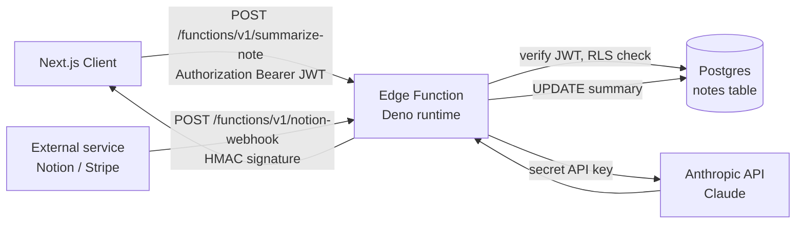

# S4: Edge Function untuk AI Summary + Webhook

Tambahin fitur "Summarize" ke notes app: user klik button di note detail, Edge Function panggil Claude (Anthropic) untuk ringkas isi note, simpan summary ke DB. API key Anthropic disembunyi di server, tidak pernah ke client. Plus sidebar pattern: webhook receiver untuk integrasi external (Stripe, Notion, GitHub). Lokal jalan via container Deno yang Supabase bundle.

## Kenapa pakai Edge Function

Tiga keadaan typical butuh server-side code di Supabase project:

1. **Akses ke secret key**: API key Anthropic, Stripe, AWS, dll. Kalau ditaruh di client, bocor. Harus di-server.
2. **Compute yang tidak fit di Postgres function**: panggil HTTP eksternal, parse PDF, image processing complex. Postgres function bisa pakai `pg_net` untuk HTTP, tapi limited dan blocking.
3. **Webhook receiver**: endpoint publik untuk Stripe / Notion / GitHub / WhatsApp Business webhook. Tidak butuh JWT, butuh HMAC signature verification.

Edge Function jalan di Deno runtime di global edge network Supabase (production) atau container lokal (dev). Beda dengan AWS Lambda:

- Deno runtime, bukan Node. Tidak ada `require`, tidak ada `node_modules`. Import via URL atau JSR.
- Cold start ~50-100ms typical, lebih cepat dari Lambda zip besar.
- Built-in Deno standard library (no AWS SDK boilerplate).
- Tight integration dengan Supabase: `SUPABASE_URL` + `SUPABASE_SERVICE_ROLE_KEY` auto-inject ke env, gampang query DB dari function.

## Skenario

Note dari S1 sekarang punya:

- Kolom `summary` (text nullable).
- Button "Summarize" di halaman detail note.
- Click memanggil Edge Function `/functions/v1/summarize-note` dengan body `{ note_id }`.
- Function: verify JWT user, fetch note (RLS check via user's JWT), call Claude API, simpan summary ke kolom DB, return summary.

Plus pattern kedua di section akhir: webhook receiver `/functions/v1/notion-webhook` yang Notion (atau service apa pun) hit saat trigger. No JWT, verify HMAC signature pakai shared secret.

## Arsitektur



## Setup lokal

Asumsi: project notes-app dari S1 udah jalan. Anthropic API key (atau OpenAI / Hugging Face) buat di [console.anthropic.com](https://console.anthropic.com). Free tier ada untuk test.

Edge Runtime container default hidup setelah `supabase start`. Verify:

```bash
docker ps --filter "name=supabase_edge_runtime_"
```

## Step 1: Schema, tambah kolom summary

```bash
supabase migration new add_note_summary
```

```sql
alter table notes
  add column summary text,
  add column summarized_at timestamptz;
```

Apply: `supabase db reset`.

RLS yang udah ada (`users see own notes`, dll) otomatis cover kolom baru. Tidak perlu policy tambahan.

## Step 2: Bikin Edge Function

```bash
supabase functions new summarize-note
```

Hasilnya `supabase/functions/summarize-note/index.ts` dengan template default. Replace isinya:

```ts
// supabase/functions/summarize-note/index.ts
import { createClient } from 'jsr:@supabase/supabase-js@2'

const corsHeaders = {
  'Access-Control-Allow-Origin': '*',
  'Access-Control-Allow-Headers': 'authorization, x-client-info, apikey, content-type'
}

Deno.serve(async (req) => {
  // CORS preflight
  if (req.method === 'OPTIONS') {
    return new Response('ok', { headers: corsHeaders })
  }

  try {
    // 1. Parse request
    const { note_id } = await req.json()
    if (!note_id) {
      return Response.json({ error: 'note_id required' }, { status: 400, headers: corsHeaders })
    }

    // 2. Verify user JWT
    const authHeader = req.headers.get('Authorization')
    if (!authHeader) {
      return Response.json({ error: 'missing auth' }, { status: 401, headers: corsHeaders })
    }

    // Bikin client pakai anon key + Authorization header user, jadi RLS aktif
    const supabase = createClient(
      Deno.env.get('SUPABASE_URL')!,
      Deno.env.get('SUPABASE_ANON_KEY')!,
      { global: { headers: { Authorization: authHeader } } }
    )

    const { data: { user } } = await supabase.auth.getUser()
    if (!user) {
      return Response.json({ error: 'invalid token' }, { status: 401, headers: corsHeaders })
    }

    // 3. Fetch note (RLS auto-check, return null kalau bukan milik user)
    const { data: note, error: fetchError } = await supabase
      .from('notes')
      .select('id, content')
      .eq('id', note_id)
      .single()

    if (fetchError || !note) {
      return Response.json({ error: 'note not found or no access' }, { status: 404, headers: corsHeaders })
    }

    // 4. Call Anthropic Claude
    const anthropicKey = Deno.env.get('ANTHROPIC_API_KEY')
    if (!anthropicKey) {
      return Response.json({ error: 'server misconfigured' }, { status: 500, headers: corsHeaders })
    }

    const claudeResp = await fetch('https://api.anthropic.com/v1/messages', {
      method: 'POST',
      headers: {
        'Content-Type': 'application/json',
        'x-api-key': anthropicKey,
        'anthropic-version': '2023-06-01'
      },
      body: JSON.stringify({
        model: 'claude-haiku-4-5-20251001',
        max_tokens: 200,
        messages: [
          {
            role: 'user',
            content: `Ringkas catatan berikut dalam 1-2 kalimat Bahasa Indonesia:\n\n${note.content}`
          }
        ]
      })
    })

    if (!claudeResp.ok) {
      const err = await claudeResp.text()
      return Response.json({ error: 'AI provider error', detail: err }, { status: 502, headers: corsHeaders })
    }

    const claudeData = await claudeResp.json()
    const summary = claudeData.content?.[0]?.text?.trim() ?? ''

    if (!summary) {
      return Response.json({ error: 'empty summary' }, { status: 502, headers: corsHeaders })
    }

    // 5. Save back to DB (RLS allow karena user owner)
    await supabase
      .from('notes')
      .update({
        summary,
        summarized_at: new Date().toISOString()
      })
      .eq('id', note_id)

    // 6. Return ke client
    return Response.json({ summary }, { headers: corsHeaders })
  } catch (err) {
    return Response.json(
      { error: 'internal error', detail: (err as Error).message },
      { status: 500, headers: corsHeaders }
    )
  }
})
```

### Kunci pola

- **Auth via user JWT, bukan service_role**: kita import `Authorization` header user dan inject ke client. Query DB lewat RLS biasa. Function tidak punya akses lebih dari user yang manggil. Aman dari "function bypass RLS" trap.
- **Verify dengan `getUser()`**: bukan `getSession()`. `getUser()` cek ke auth server, valid sampai dipotong.
- **CORS preflight**: Edge Function di-call dari browser, CORS wajib. Tanpa preflight handler, browser block request POST dengan Authorization header.
- **Error response konsisten**: selalu Response.json dengan status code. Jangan throw untuk handled case.

## Step 3: Set secret untuk Anthropic API key

Lokal (file `supabase/functions/.env`):

```bash
echo "ANTHROPIC_API_KEY=sk-ant-..." > supabase/functions/.env
```

Tambah `.env` ke `.gitignore` kalau belum.

Jalankan function lokal:

```bash
supabase functions serve --env-file supabase/functions/.env
```

Function jalan di `http://127.0.0.1:54321/functions/v1/summarize-note`. Hot-reload aktif: edit file, function re-load otomatis.

## Step 4: Test dari curl

Get anon key dan user JWT dulu. Untuk dapat user JWT, login lewat app dulu, lalu di browser dev tools:

```js
const { data } = await supabase.auth.getSession()
console.log(data.session.access_token)
```

Atau pakai service_role untuk testing (skip auth):

```bash
ACCESS_TOKEN="<paste-user-jwt-here>"
NOTE_ID="<paste-note-id-here>"

curl -i -X POST http://127.0.0.1:54321/functions/v1/summarize-note \
  -H "Authorization: Bearer $ACCESS_TOKEN" \
  -H "Content-Type: application/json" \
  -d "{\"note_id\":\"$NOTE_ID\"}"
```

Response sukses:

```json
{ "summary": "Catatan tentang plan meeting hari Senin dengan agenda budget Q2." }
```

Cek di DB: `select id, content, summary, summarized_at from notes where id = '<note-id>'`. Summary ada.

### Test edge case

**JWT tidak ada**:

```bash
curl -X POST http://127.0.0.1:54321/functions/v1/summarize-note \
  -H "Content-Type: application/json" \
  -d '{"note_id":"<id>"}'
```

Response: `401 missing auth`. (Note: default Edge Function reject anonymous, function code juga validate.)

**Note milik user lain**: pakai JWT user A tapi note_id milik user B:

```bash
curl ... -d '{"note_id":"<id-user-b>"}'
```

Response: `404 note not found or no access`. RLS block fetch, function return 404 (bukan 403, biar tidak bocor existence).

**JWT expired**:

Response: `401 invalid token`. `getUser()` reject.

## Step 5: Integrate di UI

Update halaman note detail:

```tsx
// web/app/notes/[id]/page.tsx (extends from S2)
import { createClient } from '@/lib/supabase/server'
import { redirect } from 'next/navigation'
import { SummarizeButton } from './summarize-button'

export default async function NoteDetailPage({ params }: { params: Promise<{ id: string }> }) {
  const { id } = await params
  const supabase = await createClient()
  const { data: { user } } = await supabase.auth.getUser()
  if (!user) redirect('/login')

  const { data: note } = await supabase
    .from('notes')
    .select('id, content, summary, summarized_at')
    .eq('id', id)
    .single()

  if (!note) return <p>Not found.</p>

  return (
    <main className="max-w-2xl mx-auto mt-10 p-4 space-y-6">
      <h1 className="text-xl font-bold">{note.content}</h1>

      <section className="space-y-2">
        <div className="flex items-center justify-between">
          <h2 className="font-semibold">Summary</h2>
          <SummarizeButton noteId={note.id} hasSummary={!!note.summary} />
        </div>
        {note.summary ? (
          <div className="p-3 bg-yellow-50 rounded text-sm">
            <p>{note.summary}</p>
            <p className="text-xs text-gray-500 mt-1">
              Generated {new Date(note.summarized_at!).toLocaleString()}
            </p>
          </div>
        ) : (
          <p className="text-sm text-gray-500">Belum ada summary.</p>
        )}
      </section>
    </main>
  )
}
```

```tsx
// web/app/notes/[id]/summarize-button.tsx
'use client'

import { createClient } from '@/lib/supabase/client'
import { useRouter } from 'next/navigation'
import { useState } from 'react'

export function SummarizeButton({ noteId, hasSummary }: { noteId: string; hasSummary: boolean }) {
  const supabase = createClient()
  const router = useRouter()
  const [loading, setLoading] = useState(false)
  const [error, setError] = useState<string | null>(null)

  async function handleClick() {
    setLoading(true)
    setError(null)

    try {
      // Invoke Edge Function (auto-inject Authorization dari session)
      const { error: fnError } = await supabase.functions.invoke('summarize-note', {
        body: { note_id: noteId }
      })

      if (fnError) {
        setError(fnError.message)
        return
      }

      router.refresh()
    } catch (err) {
      setError((err as Error).message)
    } finally {
      setLoading(false)
    }
  }

  return (
    <button
      onClick={handleClick}
      disabled={loading}
      className="text-sm bg-black text-white px-3 py-1 rounded disabled:opacity-50"
    >
      {loading ? 'Summarizing...' : hasSummary ? 'Regenerate' : 'Summarize'}
    </button>
  )
}
```

`supabase.functions.invoke()` auto-include user JWT dari session, dan auto-handle CORS. Lebih bersih dari `fetch()` manual.

Test di browser: buka note detail, klik "Summarize". Wait beberapa detik (Claude latency), summary muncul. Klik lagi "Regenerate" overwrite summary lama.

## Step 6: Deploy ke production

Set secret di production:

```bash
supabase secrets set ANTHROPIC_API_KEY=sk-ant-...
# Atau dari file:
supabase secrets set --env-file supabase/functions/.env
```

Deploy function:

```bash
supabase functions deploy summarize-note
```

Default deploy require JWT. Karena function kita memang butuh JWT (untuk RLS), ini benar.

Verify production:

```bash
curl -i -X POST https://<project-ref>.supabase.co/functions/v1/summarize-note \
  -H "Authorization: Bearer <user-jwt-prod>" \
  -H "Content-Type: application/json" \
  -d '{"note_id":"<id>"}'
```

List function yang sudah deploy:

```bash
supabase functions list
```

Cek logs:

```bash
supabase functions logs summarize-note
```

Atau live tail di Dashboard: Edge Functions > summarize-note > Logs.

## Webhook receiver pattern

Pattern kedua: function di-trigger external service. Tidak ada JWT user, butuh verification cara lain.

### Skenario: terima webhook Notion

Notion punya database. Saat row di-update, Notion kirim POST ke webhook URL kita. Function update mirror table di Supabase.

```bash
supabase functions new notion-webhook
```

```ts
// supabase/functions/notion-webhook/index.ts
import { createClient } from 'jsr:@supabase/supabase-js@2'
import { crypto } from 'jsr:@std/crypto'

const webhookSecret = Deno.env.get('NOTION_WEBHOOK_SECRET')!

// Service role karena trigger external, tidak ada user context
const supabase = createClient(
  Deno.env.get('SUPABASE_URL')!,
  Deno.env.get('SUPABASE_SERVICE_ROLE_KEY')!
)

Deno.serve(async (req) => {
  // 1. Read raw body untuk signature verification
  const rawBody = await req.text()
  const signature = req.headers.get('x-notion-signature') ?? ''

  // 2. Compute HMAC SHA-256 of body using secret
  const encoder = new TextEncoder()
  const key = await crypto.subtle.importKey(
    'raw',
    encoder.encode(webhookSecret),
    { name: 'HMAC', hash: 'SHA-256' },
    false,
    ['sign']
  )
  const sigBuffer = await crypto.subtle.sign('HMAC', key, encoder.encode(rawBody))
  const expectedSig = Array.from(new Uint8Array(sigBuffer))
    .map((b) => b.toString(16).padStart(2, '0'))
    .join('')

  // 3. Constant-time compare (avoid timing attack)
  if (signature !== expectedSig) {
    return new Response('invalid signature', { status: 401 })
  }

  // 4. Parse and process payload
  const payload = JSON.parse(rawBody)
  // your business logic
  await supabase.from('notion_mirror').upsert({
    notion_id: payload.id,
    title: payload.properties.title,
    updated_at: payload.last_edited_time
  })

  return new Response('ok')
})
```

Deploy dengan flag `--no-verify-jwt` karena Notion tidak punya JWT:

```bash
supabase functions deploy notion-webhook --no-verify-jwt
supabase secrets set NOTION_WEBHOOK_SECRET=<secret-dari-notion>
```

URL endpoint yang dikasih ke Notion: `https://<project-ref>.supabase.co/functions/v1/notion-webhook`.

### Pattern signature verification untuk service lain

| Service | Header | Algoritma |
|---|---|---|
| Stripe | `stripe-signature` | HMAC SHA-256 dengan timestamp |
| GitHub | `x-hub-signature-256` | HMAC SHA-256 |
| Notion | `x-notion-signature` | HMAC SHA-256 |
| Twilio | `x-twilio-signature` | HMAC SHA-1 |
| WhatsApp (Meta) | `x-hub-signature-256` | HMAC SHA-256 |

Stripe punya library Deno-compatible `npm:stripe`, pakai itu untuk Stripe (lebih aman, handle timestamp tolerance). Untuk service lain, pakai pattern manual di atas.

### Anti-pattern webhook

- **Skip signature verification "karena cuma untuk testing"**. Lupa enable di production = anyone bisa hit URL dan inject data palsu.
- **Compare signature dengan `==` plain**. Timing attack vulnerable. Sebenarnya Deno's `===` untuk string ga vulnerable seperti C, tapi untuk paranoid, pakai `crypto.timingSafeEqual` kalau Deno support.
- **Return 200 sebelum verify**. Beberapa service retry kalau bukan 200. Verify dulu, baru proses dan return.
- **Body parsing sebelum verify**. Harus verify pakai raw body, bukan parsed JSON. Re-serialize JSON bisa berbeda byte-for-byte.

## Edge Function dengan database trigger

Pattern ketiga: trigger Edge Function dari Postgres event. Kebalikan webhook, ini "DB call function".

Pakai ekstensi `pg_net` untuk HTTP request dari Postgres:

```sql
create extension if not exists pg_net;

-- Trigger: tiap insert notes, panggil function /summarize-note untuk auto-summarize
create or replace function trigger_summarize() returns trigger
language plpgsql security definer
as $$
declare
  function_url text := 'http://kong:8000/functions/v1/summarize-note';
  service_key text := current_setting('app.service_role_key', true);
begin
  perform net.http_post(
    url := function_url,
    headers := jsonb_build_object(
      'Content-Type', 'application/json',
      'Authorization', 'Bearer ' || service_key
    ),
    body := jsonb_build_object('note_id', new.id)
  );
  return new;
end;
$$;

create trigger after_insert_note
  after insert on notes
  for each row execute function trigger_summarize();
```

Production URL: `https://<project-ref>.supabase.co/functions/v1/summarize-note`. Service key set via `alter database postgres set app.service_role_key = '<key>'` atau dari Vault.

Catatan: ini async fire-and-forget. Function gagal, insert tetap sukses, summary tidak ke-update. Untuk pattern lebih reliable, pakai pgmq queue + cron worker yang call function.

## Gotcha

### Deno, bukan Node

- Tidak ada `require()`. Pakai `import` dari URL atau JSR.
- Tidak ada `package.json` atau `node_modules`. Dependency declare inline di import path.
- Beberapa npm package compatible via `import from 'npm:<name>'`. Tapi tidak semua. `npm:stripe` works, `npm:sharp` tidak (native binding).
- Web Standard API (fetch, Response, Request, crypto.subtle) tersedia default.

### Cold start latency

Function di production cold start ~50-100ms (tergantung size). Kalau dipanggil sering, hot. Kalau dipanggil sekali sehari, cold setiap kali.

Untuk endpoint sensitive latency, pre-warm dengan cron yang ping `/health` tiap 5 menit. Tapi pertimbangkan dulu apakah memang butuh: latency 100ms biasanya OK untuk user-facing action.

### Local function tidak auto-reload setelah `supabase start`

`supabase start` jalanin Edge Runtime container, tapi function code TIDAK di-load otomatis. Harus `supabase functions serve` di terminal terpisah.

Workflow lokal:

```bash
# Terminal 1
supabase start

# Terminal 2
supabase functions serve --env-file supabase/functions/.env
```

Function tab 2 hot-reload tiap save file.

### Body request stream sekali

`await req.json()` consume body. Panggil lagi = error. Untuk webhook yang butuh raw body untuk signature verify, pakai `await req.text()` dulu, lalu parse manual.

```ts
const rawBody = await req.text()
// verify signature using rawBody
const payload = JSON.parse(rawBody)
```

### Secret tidak auto-rotate

Set secret pakai `supabase secrets set`, secret persist sampai di-rotate manual. Tidak ada native lifecycle. Untuk rotation, automate via CI atau cron job yang call `supabase secrets set`.

### Tidak ada filesystem persisten

Function ephemeral. Tulis ke `/tmp` allowed dalam request lifecycle, tapi tidak persist antar request. Untuk file processing, baca dari Storage / external, proses dalam memori, upload balik.

### Limit waktu eksekusi

- Default: 150 detik untuk Pro plan, 25 detik Free.
- Untuk job lebih lama, pakai background task (`EdgeRuntime.waitUntil`) atau pisah jadi multiple invocation via queue.

### CORS lupa setup

Function di-call dari browser tanpa CORS preflight handler = browser block. Selalu handle `OPTIONS` request:

```ts
if (req.method === 'OPTIONS') {
  return new Response('ok', { headers: corsHeaders })
}
```

`supabase.functions.invoke()` dari SDK auto-handle CORS, tapi raw `fetch()` butuh manual.

### Logs tidak include console.log di production

Default production logging level INFO. `console.log` masuk, tapi search di Dashboard sulit untuk volume tinggi. Untuk observability serius, struktur log JSON dan ship ke logging service.

### Service role key bocor lewat error message

```ts
catch (err) {
  return Response.json({ error: err.message }, { status: 500 })
}
```

Kalau error dari Supabase SDK include URL dengan service_role token di header, log bisa expose. Sanitize sebelum return:

```ts
catch (err) {
  console.error(err)  // log lengkap di server
  return Response.json({ error: 'internal error' }, { status: 500 })  // generic ke client
}
```

## Pricing mental model

| Dimensi | Free | Pro | Beyond |
|---|---|---|---|
| Invocations | 500K/bulan | 2M/bulan | $2/M invocation |
| CPU time | included | included | metered untuk over-quota |
| Egress (response body) | hitung di Bandwidth | hitung di Bandwidth | hitung di Bandwidth |
| Max execution | 25 detik | 150 detik | sama |

Yang sering miss: invocation yang dipanggil via DB trigger (`pg_net`) hitung sama dengan client invocation. Jangan loop trigger yang tidak perlu.

External API cost (Anthropic, Stripe, dll) terpisah dari Supabase. Tagihan langsung ke provider.

## Cross-provider

| Capability | Supabase Edge Function | AWS Lambda | Cloudflare Worker | Vercel Function | Deno Deploy |
|---|---|---|---|---|---|
| Runtime | Deno 2 | Node, Python, Go, Java, custom | V8 isolate | Node, Edge | Deno |
| Cold start | 50-100ms | 100-3000ms (zip size) | under 5ms | 100-500ms | 50-100ms |
| Max execution | 150s (Pro) | 15 min | 30s (paid) | 300s | 60s default |
| Dependency model | URL / JSR / npm | layer + zip | bundled | npm | URL / JSR |
| Native binding | tidak | ya (zip) | tidak | terbatas | tidak |
| Secret management | `supabase secrets` | Secrets Manager / SSM | Wrangler secrets | Vercel env | Deno KV / env |
| Local emulator | `functions serve` | SAM Local / LocalStack | Wrangler dev | `vercel dev` | `deno run` |
| Tight DB integration | auto-inject SUPABASE_* | manual SDK + IAM | manual | manual | manual |

Positioning: Edge Function low-friction untuk Supabase project. Tight integration dengan Auth + DB jadi differentiator. Untuk workload yang butuh native binding (image processing dengan sharp, ML inference dengan onnxruntime), Lambda atau Vercel Function lebih cocok. Untuk latency sub-10ms global, Cloudflare Worker.

## Anti-pattern

- **Pakai service_role untuk semua function**, walau bisa pakai user JWT. Service role bypass RLS, hilang security benefit. Pakai user JWT kecuali memang butuh elevated access (admin task, webhook).
- **Hardcode secret di kode function**. Pakai `Deno.env.get()` + `supabase secrets set`. Jangan commit secret.
- **Function panggil function panggil function**. Latency add up, tracing susah. Refactor jadi satu function dengan logic linear.
- **Tidak handle CORS**. Browser block, debugging bingung. Selalu set CORS preflight.
- **Return error detail ke client production**. Bocor info internal. Sanitize, log full error di server.
- **Lupa rate limit**. Anyone bisa spam endpoint = bill AI provider naik. Implement rate limit di function (pakai Redis / Postgres) atau via Kong layer.
- **Body parsing sebelum signature verify** (webhook). Re-serialize JSON byte mismatch, signature fail.

## Setelah ini

- Service deep page: **Edge Functions** (work in progress), bakal cover background tasks, WebSocket, file processing, custom domain.
- Track function deployment as code dengan CI: di [Tools/Workflow](/id/supabase/tools/workflow#supabase-functions-deploy).
- Next journey: **S5 RAG dengan pgvector** (work in progress), pakai Edge Function untuk embed + retrieve.
