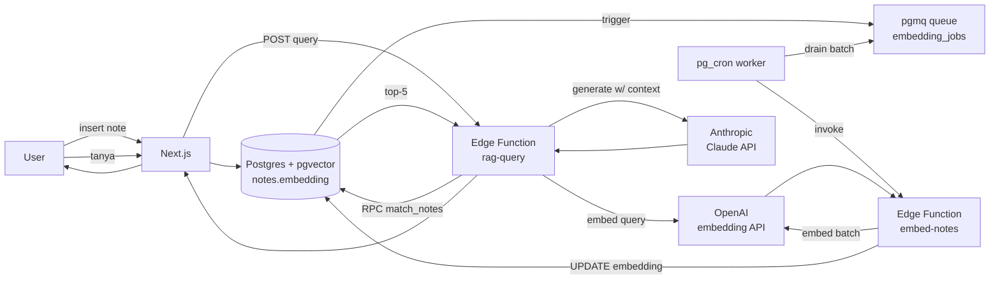

# S5: Semantic Search + RAG dengan pgvector

Tambahin "tanya jawab AI" ke notes app. User ngetik pertanyaan natural language, app cari note relevan via embedding similarity, lalu kasih jawaban dari Claude/GPT pakai note yang ketemu sebagai context. Pola RAG (Retrieval-Augmented Generation) klasik, semua di Supabase plus Edge Function untuk LLM call. Stack: pgvector untuk vector storage + similarity, pgmq + pg_cron untuk async embedding generation, Edge Function untuk inference.

## Kenapa pgvector di Postgres, bukan vector DB terpisah

Banyak project pakai vector DB terpisah (Pinecone, Weaviate, Qdrant). Trade-off:

- **Vector DB terpisah**: spesialis, scale lebih jauh (miliar vector), filter complex via metadata.
- **pgvector di Postgres**: data dan vector di tabel yang sama, JOIN ke kolom lain biasa, transaction guarantee, RLS langsung apply ke vector query.

Untuk skala project Supabase typical (puluhan ribu sampai jutaan embedding), pgvector cukup dan jauh lebih simple. Tidak ada sinkron antara DB dan vector store, tidak ada layer infrastruktur tambahan. RLS otomatis filter vector match berdasarkan user yang query.

Vector DB terpisah justify saat: >10 juta embedding, query throughput >100 RPS, atau butuh filter metadata dimensi yang tidak masuk relational model.

## Skenario

Notes app dari journey sebelumnya sekarang punya:

- Embedding 1536-dim untuk tiap note (generated dari OpenAI text-embedding-3-small).
- Search bar di top: ketik pertanyaan, hasil top-5 note relevan muncul + ringkasan jawaban dari AI.
- Embedding di-generate async via pgmq queue + pg_cron worker, tidak blocking insert.
- LLM inference via Edge Function panggil Claude (Anthropic) dengan top-5 note sebagai context.

End state: user nulis 50 note tentang topik beragam. Ketik "kapan deadline project Q2?" di search bar. App cari note yang related (via similarity), Claude jawab berdasarkan note itu plus kutip note sumber. Bukan keyword match, full semantic.

## Arsitektur



Dua jalur terpisah:

- **Jalur ingest** (asinkron): note insert/update → enqueue → cron drain → embed → update DB
- **Jalur query** (sinkron): user tanya → embed query → similarity search → LLM generate → return

## Setup lokal

Asumsi: project notes-app dari S1-S4 udah jalan. Punya API key OpenAI (`sk-...`) untuk embedding dan Anthropic (`sk-ant-...`) untuk LLM. Embedding API OpenAI murah: ~$0.02 per 1M token, cukup pakai mode hybrid (cuma embed yang berubah).

## Step 1: Enable pgvector + pgmq + pg_cron + pg_net

```bash
supabase migration new enable_rag_extensions
```

```sql
create extension if not exists vector with schema extensions;
create extension if not exists pgmq;
create extension if not exists pg_cron;
create extension if not exists pg_net;
```

Apply: `supabase db reset`.

Verify: `select * from pg_extension where extname in ('vector', 'pgmq', 'pg_cron', 'pg_net')`. Empat row.

## Step 2: Schema, tambah kolom embedding + queue

```bash
supabase migration new add_note_embedding
```

```sql
-- Tambah kolom embedding dimensi 1536 (text-embedding-3-small)
alter table notes
  add column embedding vector(1536),
  add column embedding_updated_at timestamptz;

-- Bikin queue untuk job embedding
select pgmq.create('embedding_jobs');

-- Trigger: tiap insert/update notes (content berubah), enqueue
create or replace function enqueue_embedding_job() returns trigger
language plpgsql
as $$
begin
  -- Skip kalau cuma update kolom lain (mis. summary), bukan content
  if tg_op = 'UPDATE' and old.content = new.content then
    return new;
  end if;

  perform pgmq.send(
    'embedding_jobs',
    jsonb_build_object('note_id', new.id, 'content', new.content)
  );
  return new;
end;
$$;

create trigger after_note_change
  after insert or update on notes
  for each row execute function enqueue_embedding_job();

-- Index HNSW untuk fast similarity search
-- Pakai cosine distance (<=>) operator
create index notes_embedding_idx on notes
  using hnsw (embedding vector_cosine_ops);
```

Apply: `supabase db reset`.

### Pilihan dimensi embedding

OpenAI text-embedding-3-small = 1536 dim default. Bisa di-shrink lewat parameter `dimensions: 512` saat call API. Trade-off:

- 1536 dim: akurasi lebih tinggi, storage + compute lebih besar (~6KB per vector).
- 512 dim: akurasi sedikit turun (5-10%), storage 1/3, query lebih cepat.

Untuk note app skala kecil-menengah, 1536 cukup. Untuk skala besar atau cost-sensitive, 512.

Gunakan dimensi yang sama di schema (`vector(1536)`) dan saat panggil API. Mismatch = error.

### HNSW vs IVFFlat index

Dua tipe index pgvector:

- **HNSW** (Hierarchical Navigable Small World): build slow, query super cepat, akurasi tinggi. Index size besar. Best untuk static atau slow-changing dataset.
- **IVFFlat**: build lebih cepat, query lebih lambat dari HNSW, butuh re-train index periodik kalau dataset banyak berubah.

Untuk app interaktif yang query latency matters, **HNSW**. Pakai operator class sesuai distance:

- `vector_cosine_ops`: cosine similarity (paling umum untuk text embedding)
- `vector_l2_ops`: Euclidean distance
- `vector_ip_ops`: inner product

OpenAI/Anthropic embedding normalized, jadi cosine ≡ inner product hasilnya, tapi pakai cosine paling clear secara intent.

## Step 3: Edge Function embed-notes

Cron job bakal panggil function ini. Function drain queue batch, embed, update DB.

```bash
supabase functions new embed-notes
```

```ts
// supabase/functions/embed-notes/index.ts
import { createClient } from 'jsr:@supabase/supabase-js@2'

const supabase = createClient(
  Deno.env.get('SUPABASE_URL')!,
  Deno.env.get('SUPABASE_SERVICE_ROLE_KEY')!
)

const OPENAI_API_KEY = Deno.env.get('OPENAI_API_KEY')!
const BATCH_SIZE = 10

Deno.serve(async (req) => {
  // Internal trigger, no JWT verification
  // Tapi cek shared secret untuk hindari abuse
  const internalSecret = req.headers.get('x-internal-secret')
  if (internalSecret !== Deno.env.get('INTERNAL_SECRET')) {
    return new Response('forbidden', { status: 403 })
  }

  // 1. Drain queue (sampai BATCH_SIZE)
  const { data: msgs } = await supabase.rpc('pgmq_read', {
    queue_name: 'embedding_jobs',
    vt: 60,
    qty: BATCH_SIZE
  })

  if (!msgs || msgs.length === 0) {
    return Response.json({ processed: 0 })
  }

  const contents = msgs.map((m: any) => m.message.content)
  const noteIds = msgs.map((m: any) => m.message.note_id)
  const msgIds = msgs.map((m: any) => m.msg_id)

  // 2. Batch call OpenAI embedding API
  const embedResp = await fetch('https://api.openai.com/v1/embeddings', {
    method: 'POST',
    headers: {
      'Authorization': `Bearer ${OPENAI_API_KEY}`,
      'Content-Type': 'application/json'
    },
    body: JSON.stringify({
      model: 'text-embedding-3-small',
      input: contents
    })
  })

  if (!embedResp.ok) {
    const err = await embedResp.text()
    console.error('OpenAI error:', err)
    // Tidak delete msg, biar di-retry
    return Response.json({ error: 'embedding failed' }, { status: 502 })
  }

  const embedData = await embedResp.json()
  const embeddings: number[][] = embedData.data.map((d: any) => d.embedding)

  // 3. Update notes di DB
  for (let i = 0; i < noteIds.length; i++) {
    await supabase
      .from('notes')
      .update({
        embedding: embeddings[i],
        embedding_updated_at: new Date().toISOString()
      })
      .eq('id', noteIds[i])
  }

  // 4. Archive msgs dari queue (sukses, jangan diproses ulang)
  for (const msgId of msgIds) {
    await supabase.rpc('pgmq_archive', {
      queue_name: 'embedding_jobs',
      msg_id: msgId
    })
  }

  return Response.json({ processed: noteIds.length })
})
```

Deploy + secret:

```bash
supabase secrets set OPENAI_API_KEY=sk-...
supabase secrets set INTERNAL_SECRET=$(openssl rand -hex 32)
supabase functions deploy embed-notes --no-verify-jwt
```

`--no-verify-jwt` karena di-trigger cron internal, pakai internal secret untuk gatekeep.

## Step 4: pgmq RPC wrapper + pg_cron job

`pgmq_read` dan `pgmq_archive` perlu di-expose sebagai RPC supaya bisa di-call dari Edge Function:

```bash
supabase migration new pgmq_rpc_wrappers
```

```sql
-- Wrapper RPC supaya bisa call dari supabase-js
create or replace function public.pgmq_read(
  queue_name text,
  vt integer,
  qty integer
)
returns setof pgmq.message_record
language sql
set search_path = ''
as $$
  select * from pgmq.read(queue_name, vt, qty);
$$;

create or replace function public.pgmq_archive(
  queue_name text,
  msg_id bigint
)
returns boolean
language sql
set search_path = ''
as $$
  select pgmq.archive(queue_name, msg_id);
$$;

-- Schedule cron: tiap menit panggil embed-notes Edge Function
select cron.schedule(
  'drain-embedding-queue',
  '* * * * *',
  $$
  select net.http_post(
    url := 'http://kong:8000/functions/v1/embed-notes',
    headers := jsonb_build_object(
      'Content-Type', 'application/json',
      'x-internal-secret', current_setting('app.internal_secret', true)
    ),
    body := '{}'::jsonb
  );
  $$
);
```

Set internal secret jadi session setting (sekali setup):

```sql
alter database postgres set app.internal_secret = '<paste-internal-secret-yang-dipakai-di-edge-function>';
```

Apply: `supabase db reset`. Verify cron job exist:

```sql
select * from cron.job;
```

Untuk production: set via Vault, lihat [Database service / Schema convention](/id/supabase/services/database#schema-convention).

## Step 5: RPC untuk similarity search

```bash
supabase migration new match_notes_rpc
```

```sql
create or replace function match_notes(
  query_embedding extensions.vector(1536),
  match_threshold float default 0.7,
  match_count int default 5
)
returns table (
  id uuid,
  content text,
  similarity float
)
language sql stable
security invoker  -- penting: jalan di context user, RLS apply
set search_path = ''
as $$
  select
    n.id,
    n.content,
    1 - (n.embedding <=> query_embedding) as similarity
  from public.notes n
  where n.embedding is not null
    and 1 - (n.embedding <=> query_embedding) > match_threshold
  order by n.embedding <=> query_embedding asc
  limit least(match_count, 50);
$$;
```

Apply: `supabase db reset`.

### Catatan penting: SECURITY INVOKER

`security invoker` (bukan `definer`) berarti function jalan dengan permission user yang panggil. RLS notes auto apply: user A query tidak akan return note user B walaupun similarity tinggi.

Kalau pakai `security definer`, function bypass RLS, semua note ke-search. Gunakan invoker untuk per-user search, definer untuk admin/global search.

## Step 6: Edge Function RAG query

```bash
supabase functions new rag-query
```

```ts
// supabase/functions/rag-query/index.ts
import { createClient } from 'jsr:@supabase/supabase-js@2'

const corsHeaders = {
  'Access-Control-Allow-Origin': '*',
  'Access-Control-Allow-Headers': 'authorization, x-client-info, apikey, content-type'
}

Deno.serve(async (req) => {
  if (req.method === 'OPTIONS') {
    return new Response('ok', { headers: corsHeaders })
  }

  try {
    const { query } = await req.json()
    if (!query || typeof query !== 'string') {
      return Response.json({ error: 'query required' }, { status: 400, headers: corsHeaders })
    }

    const authHeader = req.headers.get('Authorization')
    if (!authHeader) {
      return Response.json({ error: 'missing auth' }, { status: 401, headers: corsHeaders })
    }

    // User-context client biar RLS aktif
    const supabase = createClient(
      Deno.env.get('SUPABASE_URL')!,
      Deno.env.get('SUPABASE_ANON_KEY')!,
      { global: { headers: { Authorization: authHeader } } }
    )

    const { data: { user } } = await supabase.auth.getUser()
    if (!user) {
      return Response.json({ error: 'invalid token' }, { status: 401, headers: corsHeaders })
    }

    // 1. Embed query
    const embedResp = await fetch('https://api.openai.com/v1/embeddings', {
      method: 'POST',
      headers: {
        'Authorization': `Bearer ${Deno.env.get('OPENAI_API_KEY')}`,
        'Content-Type': 'application/json'
      },
      body: JSON.stringify({
        model: 'text-embedding-3-small',
        input: query
      })
    })

    if (!embedResp.ok) {
      return Response.json({ error: 'embedding failed' }, { status: 502, headers: corsHeaders })
    }

    const { data: [{ embedding }] } = await embedResp.json()

    // 2. Similarity search via RPC (RLS auto-filter ke notes user)
    const { data: matches, error: searchError } = await supabase.rpc('match_notes', {
      query_embedding: embedding,
      match_threshold: 0.65,
      match_count: 5
    })

    if (searchError) {
      return Response.json({ error: searchError.message }, { status: 500, headers: corsHeaders })
    }

    if (!matches || matches.length === 0) {
      return Response.json({
        answer: 'Tidak ada catatan relevan ditemukan.',
        sources: []
      }, { headers: corsHeaders })
    }

    // 3. Generate jawaban pakai Claude dengan context
    const contextStr = matches
      .map((m: any, i: number) => `[${i + 1}] ${m.content}`)
      .join('\n\n')

    const claudeResp = await fetch('https://api.anthropic.com/v1/messages', {
      method: 'POST',
      headers: {
        'Content-Type': 'application/json',
        'x-api-key': Deno.env.get('ANTHROPIC_API_KEY')!,
        'anthropic-version': '2023-06-01'
      },
      body: JSON.stringify({
        model: 'claude-haiku-4-5-20251001',
        max_tokens: 500,
        messages: [
          {
            role: 'user',
            content: `Berdasarkan catatan berikut, jawab pertanyaan user dalam Bahasa Indonesia. Kutip nomor catatan saat menyebut info spesifik. Kalau catatan tidak punya info untuk menjawab, bilang terus terang.

Catatan:
${contextStr}

Pertanyaan: ${query}`
          }
        ]
      })
    })

    if (!claudeResp.ok) {
      return Response.json({ error: 'LLM failed' }, { status: 502, headers: corsHeaders })
    }

    const claudeData = await claudeResp.json()
    const answer = claudeData.content?.[0]?.text?.trim() ?? ''

    return Response.json({
      answer,
      sources: matches.map((m: any) => ({
        id: m.id,
        content: m.content,
        similarity: m.similarity
      }))
    }, { headers: corsHeaders })
  } catch (err) {
    console.error(err)
    return Response.json({ error: 'internal error' }, { status: 500, headers: corsHeaders })
  }
})
```

Deploy:

```bash
supabase functions deploy rag-query
# JWT verification on (default), karena ini user-facing
```

## Step 7: UI search bar + result

```tsx
// web/app/notes/page.tsx (extend dari S1)
import { AskBar } from './ask-bar'
// ... existing imports

export default async function NotesPage() {
  // ... existing fetch user + notes

  return (
    <main className="max-w-2xl mx-auto mt-10 p-4 space-y-6">
      <header className="flex justify-between items-center">
        <h1 className="text-2xl font-bold">Notes</h1>
        {/* ... existing logout, profile */}
      </header>

      <AskBar />

      {/* ... existing create form + list */}
    </main>
  )
}
```

```tsx
// web/app/notes/ask-bar.tsx
'use client'

import { createClient } from '@/lib/supabase/client'
import { useState } from 'react'

type Source = { id: string; content: string; similarity: number }

export function AskBar() {
  const supabase = createClient()
  const [query, setQuery] = useState('')
  const [loading, setLoading] = useState(false)
  const [answer, setAnswer] = useState<string | null>(null)
  const [sources, setSources] = useState<Source[]>([])

  async function handleSubmit(e: React.FormEvent) {
    e.preventDefault()
    if (!query.trim()) return
    setLoading(true)
    setAnswer(null)
    setSources([])

    const { data, error } = await supabase.functions.invoke('rag-query', {
      body: { query: query.trim() }
    })

    setLoading(false)
    if (error) {
      setAnswer(`Error: ${error.message}`)
      return
    }

    setAnswer(data.answer)
    setSources(data.sources ?? [])
  }

  return (
    <section className="space-y-3">
      <form onSubmit={handleSubmit} className="flex gap-2">
        <input
          value={query}
          onChange={(e) => setQuery(e.target.value)}
          placeholder="Tanya tentang catatan kamu..."
          className="flex-1 p-2 border rounded"
        />
        <button
          type="submit"
          disabled={loading}
          className="bg-black text-white px-4 rounded disabled:opacity-50"
        >
          {loading ? 'Mencari...' : 'Tanya'}
        </button>
      </form>

      {answer && (
        <div className="space-y-3 p-3 bg-blue-50 rounded">
          <p className="whitespace-pre-wrap">{answer}</p>
          {sources.length > 0 && (
            <details className="text-sm">
              <summary className="cursor-pointer text-gray-600">
                Sumber ({sources.length})
              </summary>
              <ul className="mt-2 space-y-1">
                {sources.map((s, i) => (
                  <li key={s.id} className="border-l-2 border-blue-300 pl-2">
                    <span className="text-xs text-gray-500">
                      [{i + 1}] similarity {(s.similarity * 100).toFixed(1)}%
                    </span>
                    <p>{s.content}</p>
                  </li>
                ))}
              </ul>
            </details>
          )}
        </div>
      )}
    </section>
  )
}
```

## Step 8: Test end-to-end

```bash
npm run dev
```

1. Login user A.
2. Buka `/notes`, bikin 3-5 note dengan konten beragam, contoh:
   - "Meeting Q2 budget review hari Selasa minggu depan, jam 10"
   - "Belanja: kopi, susu, telur, roti"
   - "Project Falcon deadline tanggal 15 Juli, demo ke client"
3. Tunggu ~60 detik supaya cron drain queue, embed tergenerate. Verify di DB:
   ```sql
   select id, content, embedding_updated_at from notes where embedding is not null;
   ```
4. Di search bar, ketik: "Kapan deadline Falcon?"
5. Tunggu 2-3 detik (embed + LLM). Jawaban muncul: "Project Falcon deadline 15 Juli, ada demo ke client. [3]"
6. Expand "Sumber", lihat 3-5 note dengan similarity. Note Falcon harusnya top dengan ~85%+.

### Test edge case

**Query yang tidak related**: "Resep nasi goreng?". Sources tetap return top-5 (mungkin similarity rendah), Claude jawab "Tidak ada catatan relevan untuk pertanyaan ini." karena context tidak relevan.

**Cross-user RLS**: Login user B, tanya "deadline Falcon". User B tidak punya note Falcon. RLS block, RPC return zero match. Jawaban: "Tidak ada catatan relevan ditemukan."

**Note baru belum di-embed**: Insert note, langsung tanya sebelum cron jalan (60 detik). Note baru tidak ke-include. Workaround dev: trigger function manual:

```bash
curl -X POST http://127.0.0.1:54321/functions/v1/embed-notes \
  -H "x-internal-secret: <secret>"
```

## Manage cost

Biaya embedding (OpenAI text-embedding-3-small):

- $0.02 per 1M token (~750K kata).
- Note panjang 200 kata = ~300 token = $0.000006 per embed.
- 10K note = $0.06 sekali.
- Update embedding tiap edit content = duplicate cost.

Strategi hemat:

1. **Tidak re-embed kalau content tidak berubah**: trigger di Step 2 sudah skip kalau `old.content = new.content`.
2. **Batch embedding API call**: Edge Function di atas pakai batch 10 sekaligus. OpenAI charge per token, batch tidak hemat token tapi hemat HTTP overhead.
3. **Dimensi 512** kalau akurasi 5-10% drop acceptable: 1/3 storage + faster query.

Biaya LLM (Anthropic Claude Haiku 4.5):

- ~$1 input / $5 output per 1M token.
- Query 1 user 1x: ~200 token input (context 5 note + question), 100 token output = $0.0007.
- 1000 query/bulan = $0.70.

Murah sekali untuk RAG di skala notes app personal. Kalau jadi B2B SaaS dengan 1000 user x 50 query/bulan = 50K query x $0.0007 = $35/bulan untuk LLM saja. Manageable.

## Gotcha

### Dimensi mismatch

Embedding 1536 dim ditaruh ke kolom `vector(512)` = error `expected 512 dimensions, not 1536`. Pastikan dimensi schema match dengan model:

| Model | Default dim | Min via `dimensions` parameter |
|---|---|---|
| text-embedding-3-small | 1536 | 512 |
| text-embedding-3-large | 3072 | 256 |
| text-embedding-ada-002 (legacy) | 1536 | fixed |

Ganti model = harus re-embed semua. Migrasi schema ubah dimensi vector tidak preserve data.

### Cosine vs L2 vs inner product

Operator distance:
- `<=>` cosine distance (1 - cosine similarity), range [0, 2]
- `<->` Euclidean (L2)
- `<#>` negative inner product

Untuk text embedding OpenAI/Anthropic yang normalized (length=1), tiga ini ekuivalen ranking, tapi nilainya beda. Konvensi: cosine.

Similarity (semakin tinggi semakin mirip) = `1 - distance`. Cosine similarity range [-1, 1], untuk text embedding biasanya [0, 1].

### Threshold tuning

`match_threshold` di RPC default 0.7. Threshold tinggi (di atas 0.8) = strict, sedikit match tapi precise. Threshold rendah (di bawah 0.5) = banyak match, banyak noise.

Tuning: bikin 10 query sample yang punya jawaban known. Coba threshold 0.5, 0.65, 0.75, 0.85. Pick yang balance: cukup match relevant tapi tidak banyak noise.

Untuk RAG yang lalu di-LLM, threshold lebih rendah OK karena LLM filter lagi di prompt. Untuk display langsung ke user, threshold lebih tinggi.

### HNSW index build slow

HNSW build 1M vector bisa makan beberapa jam. Untuk migrasi data lama, build index AFTER bulk insert:

```sql
-- Bulk insert tanpa index
copy notes (id, content, embedding) from '/tmp/data.csv';

-- Build index setelahnya
create index notes_embedding_idx on notes
  using hnsw (embedding vector_cosine_ops);
```

Atau pakai partial index untuk subset:

```sql
create index recent_notes_embedding_idx on notes
  using hnsw (embedding vector_cosine_ops)
  where created_at > now() - interval '30 days';
```

### Embedding stale setelah update content

Trigger di Step 2 enqueue saat content change, tapi update embedding async via cron. Window 60 detik antara update content dan embedding refresh, query bisa miss update.

Untuk app yang butuh near-real-time, trigger Edge Function langsung dari app code setelah update note, jangan tunggu cron.

### Queue tidak drain (pgmq stuck)

Kalau Edge Function fail di-tengah dan tidak archive msg, msg balik ke queue setelah `vt` (visibility timeout) habis. Kalau function always-fail (bug, API down), msg loop terus.

Solusi: dead letter queue. Tiap msg track retry count, kalau >3x, move ke dead letter queue, alert admin.

### LLM hallucinate

LLM bisa generate jawaban yang tidak ada di context. Mitigasi:

- Prompt explicit: "Cuma jawab dari catatan. Kalau tidak ada, bilang tidak tahu."
- Verify: ekstrak claim spesifik (tanggal, angka) dari jawaban, cek ada di sources.
- Lower temperature di API call (0 atau 0.3) untuk less creative.

### Filter user via metadata tambahan

Kalau pakai `security definer` RPC, kamu kontrol filter manual:

```sql
create or replace function match_notes_admin(
  p_user_id uuid,
  query_embedding vector(1536),
  ...
)
returns table (...)
language sql
security definer
as $$
  select * from notes
  where user_id = p_user_id
  and ...
$$;
```

Pakai untuk admin tool yang search across user (mis. moderation), bukan untuk regular user.

### Embedding sebagai vektor di JSON kirim cost

Kalau kirim embedding lewat REST (mis. dari Edge Function ke supabase-js update), 1536 float = ~30KB per record JSON. Untuk batch 100, request body 3MB. Pakai bulk update via single RPC call atau direct connection, hindari per-record REST.

## Pricing mental model

Beberapa dimensi cost ke-stack:

| Item | Cost |
|---|---|
| Embedding API (OpenAI) | $0.02/1M token (text-embedding-3-small) |
| LLM API (Anthropic Haiku 4.5) | $1 in / $5 out per 1M token |
| Postgres storage | hitung dengan Database storage (kolom vector ~6KB/row di 1536 dim) |
| Edge Function invocation | hitung di Edge Function quota |
| pg_cron job | free, jalan di Postgres |

Embedding sekali generate, tidak re-generate kalau content stabil. LLM tiap query baru. Untuk app dengan banyak query dan jarang ingest, dominan LLM cost. Untuk app ingest-heavy (mis. crawler), dominan embedding cost.

## Cross-provider

| Capability | Supabase (pgvector) | AWS | Azure | GCP | Vector DB Dedicated |
|---|---|---|---|---|---|
| Vector storage | Postgres column | RDS PG + pgvector / Bedrock KB / OpenSearch | DB for PG + pgvector / AI Search | Cloud SQL PG + pgvector / Vertex Matching Engine | Pinecone / Weaviate / Qdrant |
| Similarity search | SQL RPC dengan `<=>` | manual SQL / OpenSearch query / Bedrock KB API | SQL / AI Search query | SQL / Vertex query | API dedicated |
| Index type | HNSW / IVFFlat | sama kalau pgvector / proprietary di OpenSearch | sama | sama | HNSW (varies) |
| Embedding API | external (OpenAI/Voyage/Cohere) | Bedrock built-in (Titan/Cohere/Mistral) | Azure OpenAI | Vertex Embeddings | external |
| Hybrid (vector + text) | full-text search Postgres + vector | OpenSearch / Bedrock KB built-in | AI Search hybrid | Vertex Search | beberapa support |
| Setup effort | satu RPC + index | banyak service | beberapa service | beberapa service | provision DB terpisah |
| RLS-aware filter | otomatis via security invoker RPC | IAM policy manual | RLS DB / RBAC AI Search | RBAC manual | tidak (filter di app) |

Positioning: Supabase pgvector menang di simplicity dan tight integration. Vector di tabel yang sama dengan data lain, RLS otomatis filter. Untuk skala besar (>50M embedding) atau hybrid search advanced, vector DB dedicated atau Bedrock KB lebih cocok.

AWS Bedrock Knowledge Bases bagus kalau udah di AWS ecosystem dan butuh "out of the box" RAG dengan minimal code. Trade-off: cost lebih tinggi, lock-in.

## Anti-pattern

- **Embed full document tanpa chunking**: dokumen panjang (>5K kata) di-embed sebagai satu vector. Embedding generic, similarity miss spesifik. Chunk dulu jadi 500-1000 token, embed per chunk.
- **Skip update embedding setelah edit content**: query return embedding lama, tidak match. Trigger di Step 2 handle ini.
- **Threshold static across queries**: query dengan domain berbeda butuh threshold beda. Tuning per query type kalau ada.
- **Tidak filter `embedding is not null` di RPC**: row yang belum di-embed (baru insert, cron belum jalan) ikut di-search, similarity NaN. RPC di Step 5 sudah handle.
- **Pakai `security definer` untuk RPC user-facing**: bypass RLS, semua data search-able. Pakai `security invoker` untuk user-context.
- **Pre-compute LLM response untuk semua query**: cache RAG response kalau query benar-benar identical, tapi jangan asumsi semantic match query yang text beda. Per-query fresh.
- **Pakai LLM untuk decide threshold atau ranking**: lebih mahal dari pgvector built-in. LLM untuk generation, pgvector untuk retrieval.

## Setelah ini

- Service deep page: **Vector (pgvector)** (work in progress), bakal cover hybrid search (vector + full-text), filter via metadata, dan tuning index.
- Track Edge Function deployment as code: [Tools/Workflow](/id/supabase/tools/workflow#edge-function).
- Track RLS yang dipakai security invoker RPC: [RLS Workflow](/id/supabase/tools/rls-workflow).
- Foundation / setup overview: [Tools / Local Stack](/id/supabase/tools/local-stack).
