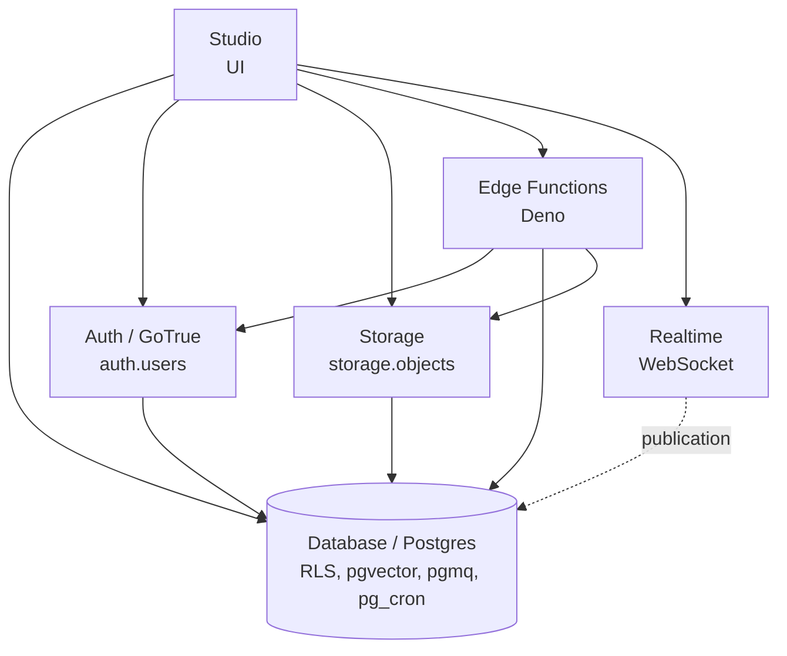

# Service Reference Supabase

Tujuh service inti Supabase, masing-masing punya deep page dengan template: TL;DR, analogi, perfect use-case, anti use-case, pricing mental model, local emulator, hello-world, pattern detail, gotcha, dan cross-provider mapping.

## Service

| Service | Fokus | Deep page |
|---|---|---|
| **Database** | Postgres 17 + ekstensi (pgvector, pgmq, pg_cron, dll), RLS pattern library, PostgREST auto-REST, pg_graphql | [Database](/id/supabase/services/database) |
| **Auth** | GoTrue: email/password, OAuth, MFA TOTP+phone, magic link, anonymous, hook, JWT signing keys | [Auth](/id/supabase/services/auth) |
| **Storage** | S3-compatible object store, image transform via imgproxy, TUS resumable upload | [Storage](/id/supabase/services/storage) |
| **Edge Functions** | Deno runtime, JWT/no-JWT modes, secret management, background task, WebSocket | [Edge Functions](/id/supabase/services/edge-functions) |
| **Realtime** | WebSocket dengan tiga mode: Postgres Changes, Broadcast, Presence | [Realtime](/id/supabase/services/realtime) |
| **Vector (pgvector)** | Vector storage + similarity search, HNSW/IVFFlat index, hybrid search, RLS-aware | [Vector](/id/supabase/services/vector) |
| **Studio** | Dashboard untuk eksplorasi data, SQL editor, user manager, log viewer | [Studio](/id/supabase/services/studio) |

## Cross-provider mapping

| Capability | Supabase | AWS | Azure | GCP |
|---|---|---|---|---|
| Managed Postgres | Database | RDS PG / Aurora PG | DB for PG | Cloud SQL PG |
| Per-row authorization | RLS native | IAM + Lambda authorizer | RLS native | Firestore rules |
| Object storage | Storage | S3 | Blob Storage | Cloud Storage |
| Image transform | imgproxy bundled | Lambda@Edge / CloudFront | Function | Cloud Function |
| Serverless function | Edge Functions (Deno) | Lambda | Functions | Cloud Run / Functions |
| Auth | GoTrue (built-in) | Cognito | Entra ID B2C | Identity Platform |
| Realtime CDC | publication bundled | DMS, AppSync subscription | Stream Analytics | Datastream |
| Pub/sub realtime | Broadcast bundled | SNS+SQS, AppSync | Web PubSub, Event Grid | Pub/Sub |
| Presence | bundled | AppSync custom + Lambda | SignalR groups | Firestore listener |
| Vector search | pgvector bundled | RDS PG + pgvector / OpenSearch / Bedrock KB | DB for PG + pgvector / AI Search | Cloud SQL + pgvector / Vertex Matching |
| Auto REST API | PostgREST bundled | tidak (perlu API GW + Lambda) | tidak | tidak |
| Auto GraphQL | pg_graphql bundled | AppSync (managed) | tidak | tidak |

Positioning umum: Supabase tight integration di project tingkat (semua service share auth + DB + RLS), low-friction setup. AWS lebih fleksibel feature per-service tapi setup butuh wiring banyak service.

## Bagaimana service-service ini connect

Postgres di tengah, tiap service punya schema (auth, storage, realtime) atau ekstensi (vector) atau metadata table. RLS di Postgres jadi mekanisme authorization umum untuk Database, Realtime (filter event), dan Storage (storage.objects policy).

## Lihat juga

- [Journey list](/id/supabase/journeys): pakai service-service di skenario nyata
- [Tools](/id/supabase/tools): setup local dev + workflow migrasi + CLI
- [Foundation](/id/supabase/foundation): konsep dasar (work in progress)
